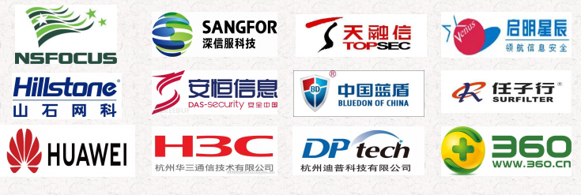
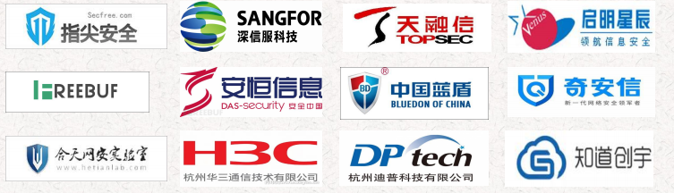
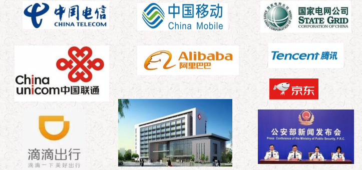
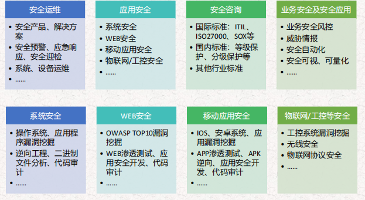

# 角色
黑帽 黑客 
白帽 安全厂商
灰帽 兴趣爱好的安全大牛
红帽  爱国正义的安全大牛
# 动机 
非法利益/安全评估/兴趣爱好
# 黑产链
上游 黑产基础服务 中游 账号生成销售 下游 犯罪/不道德团伙

# 安全厂商（防火墙waf ips ids 态势感知 网闸 上网行为管理）

# 安全服务（安全服务，渠道公司）


# 甲方（招标项目）


# 岗位

## 安全运维
```
岗位职责： 
1. 负责运维平台的建设与日常维护工作 
2. 负责办公网及互联网业务的安全规划、建设与运维工作 
3. 负责安全系统的安全管理与规范制订、落地 
4. 制定并落实执行开发、运维相关安全规范 
5. 参与信息安全评估工作和安全加固工作 
6. 研究各种安全技术，熟练使用安全测试的攻击工具、防御工具和分析工具。 
资格要求： 
1、统招本科及以上学历；五年以上工作经验，三年以上信息安全领域工作经验 
2、熟悉风险评估、应急响应、渗透测试、安全加固等安全服务；熟悉常见黑客攻防方法； 
3、熟悉常见信息安全产品或工具，如防火墙、VPN、IDS/IPS、防病毒、漏洞检测等主流的安全技术与产品； 
4、熟悉常用安全工具，如：AppScan、wvs、Burp suite、owasp zap、Sqlmap等 
5、熟悉Apache、Tomcat、Jboss、Nginx等Web中间件，了解相关安全漏洞或入侵手段，掌握常见的Web漏洞 入侵与防范方法； 
6、至少熟练掌握一种脚本语言，能编写相应的入侵工具或漏洞利用程序 
7、熟悉渗透测试的步骤、方法、流程，熟练掌握各种渗透测试(黑客入侵)工具； 
8、熟悉系统的各种安全设置，对操作系统安全日志、安全设备日志分析有深入了解； 
9、主动性强，具有良好的沟通、协调和组织能力，富有团队精神，有较强的文档编写能力，抗压能力强，能 承受较强工作压力
```

## 安全服务
```
职位职责: 
1. 负责公司风险评估、渗透测试、应急响应等安全服务项目的对接实施工作； 
2. 完成上级领导布置的临时任务。 
职位要求: 
1. 交流沟通水平良好，思路清晰； 
2. 熟悉风险评估、渗透测试、应急响应等安全服务项目的实施流程； 
3. 熟悉主流的Web安全攻防技术,包括SQL注入、XSS、CSRF等OWASP TOP 10安全风险；熟悉国内外主流 安全产品工具,如：Nessus、AWVS、Appscan、Burp、webInspect、kali等,能够独立进行Web渗透测试； 
4. 熟悉网络设备、防火墙、入侵检测、日志审计等安全设备的配置管理； 
5. 熟悉Windows/Linux不同发行版的使用、配置与管理，熟悉数据库（Oracle、MySQL）、中间件(IIS、 Apache、Tomcat)的配置操作； 
6. 具备良好的文档材料编写能力,能独立撰写各类安全服务报告、实施方案； 
7. 具有乙方安服经验的人员优先
```
## 渗透测试
```
岗位职责： 
1.对最新安全威胁进行跟踪和研究； 
2.专注Web应用程序安全漏洞研究发掘； 3.安全服务项目实施。 
任职要求： 
1.至少精通一门脚本语言，可编写漏洞POC或EXP； 
2.熟悉各种Web安全攻防技术，具有丰富的实战经验可独立完成渗透测试工作； 
3.深入理解OWASP TOP 10 Web漏洞的原理及加固方法，能够进行测试、讲解、培训工作； 
4.熟悉主流中间件的常见安全隐患及加固方式； 
5.熟悉主流数据库（Mysql、Oracle、Mssql）语句，以及SQL注入漏洞手工注入测试及绕过方式； 
6.熟练使用Nessus、Burpsuit、sqlmap、appscan、AWVS、nmap、MSF等工具； 
7.熟悉常见黑客攻击手法、原理、防护、绕过方法，包括但不限于：跨站/文件包含/命令执行等； 
8.对Web安全有浓厚的兴趣和较强的独自钻研能力，有良好的团队精神。
```
## 售前工程师
```
职位描述 
1、负责技术支持工作，配合销售人员参与投标项目，完成整个投标过程； 
2、与用户进行现场交流，包括初次交流、具体项目交流和投标交流； 
3、为用户在项目启动前撰写和提供相关的技术文件，包括公司资料、技术建议书、长期规划建议等； 
4、参与投标项目，负责撰写投标方案技术文件部分和过程中的技术应答文件； 
5、负责和参与对用户的短期培训和讲座； 
任职要求： 
1、计算机或相关专业本科以上学历（能力突出者学历和专业不限）； 
2、熟悉主流安全技术和流行安全产品（防火墙、防毒、入侵检测、漏洞扫描等）的应用部署方案； 
3、形象良好、语言表达和思维逻辑清晰、性格乐观较外向、书面表达能力强； 
4、通过培训，能够独立完成各种系统（主机、网络、数据库等系统）的安全评估和加固； 
5、敬业、正直、诚实和良好的团队精神； 
6、喜欢学习新知识、乐于接受新事物； 
7、良好的心理素质和学习能力，对安全技术有浓厚的兴趣。
```

 # 方向
 
 
 # 项目种类
 
 风险评估 l 渗透测试 l 安全加固 l 代码审计 l 应急响应 l 安全运维 l 等保测评
 

