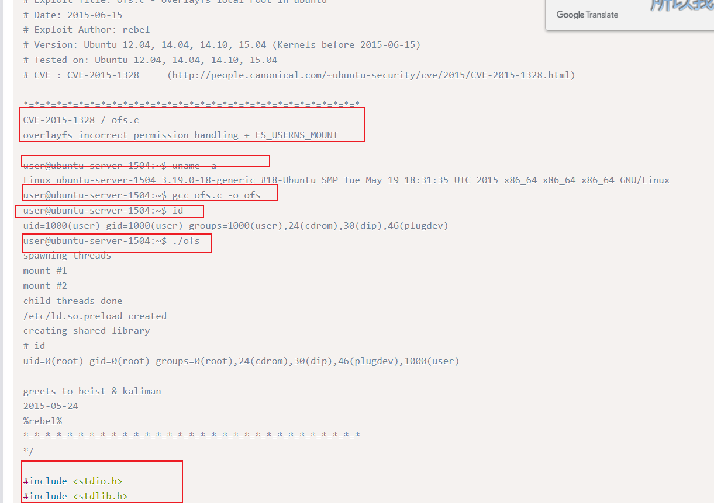
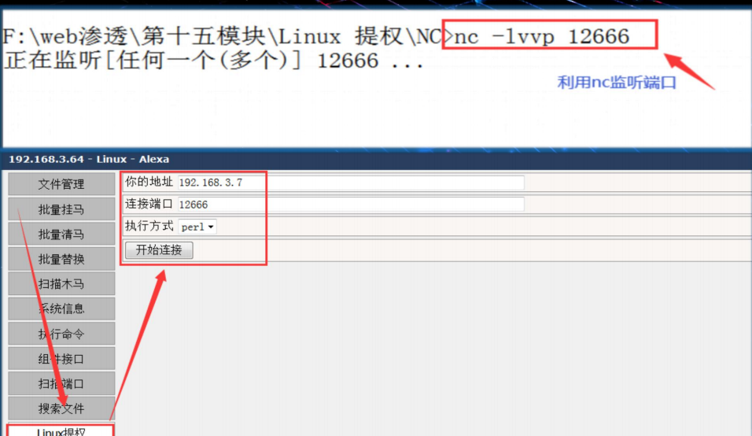
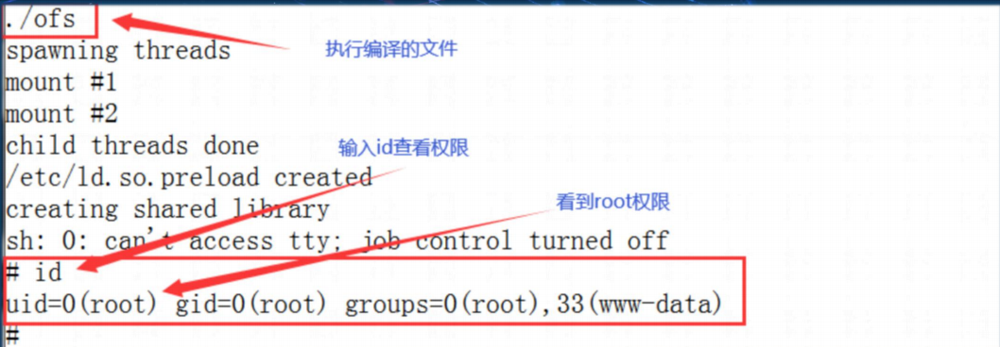
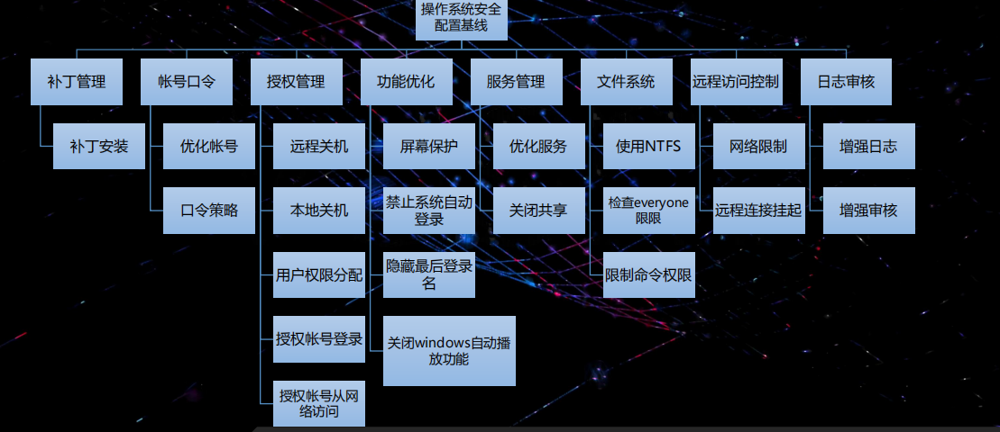
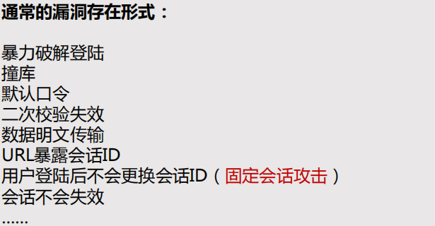
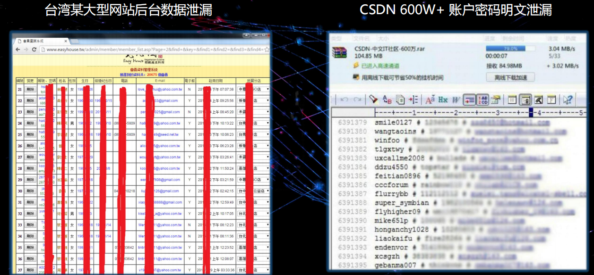
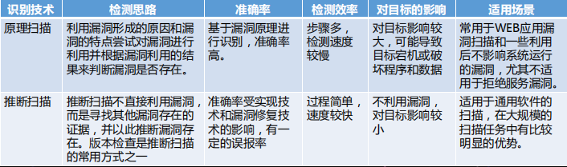

# linux 提权
• 1.获取操作系统版本号 • 2.搜索exp • 3.反弹shell • 4.尝试利用

提权只是一瞬间
联合webshell 和netcat 反弹shell
再利用这个提权c文件提权

提权

# 中间件提权
apache 路径穿越提取

# windows 安全系统加固
• 安全基线，即系统必需达到的最低的安全标准。 • 一般通过检查各安全配置参数是否符合标准来度量。

## 系统审查
查看系统的详细版本号
• 命令：ver 
查看系统的服务补丁包（Service Pack），1个SP版本包含了该系统一段时间系统补丁和服务更 新的集合。 
如：windows 7 SP0、windows 7 SP1 
命令：wmic os get ServicePackMajorVersion
• 查看系统的补丁安装情况 •
命令：wmic qfe get hotfixid,InstalledOn Ø 
查看主机名 Ø 命令：hostname
• 查看系统信息，包括主机信息，注册ID，处理器，内存，BIOS，域，补丁，网卡等信息。 
• 命令：systeminfo

查看开放端口 • 命令：netstat -ano | find /i "445"
• 查看路由表 • 命令：route print

查看网络配置 Ø 命令：ipconfig/all
## 漏洞修复

漏洞修复——补丁安装 • 微软官方补丁管理 • 官网补丁下载网址： http://www.catalog.update.microsoft.com/home.aspx

漏洞修复——端口封禁 • 端口封禁是漏洞修复的临时解决办法。 • 漏洞能被利用，是因为漏洞所在服务依赖端口开放访问，如果将端口封禁，那么漏洞便无法成功利 用。 • 如：ms17-010漏洞所在服务是文件共享服务smb，依赖端口为135,139,445。 ms12-020漏洞所在服务是远程桌面服务RDP，依赖端口为3389。 • 封禁端口的方法：在组策略中创建IP安全策略。

漏洞修复——端口封禁 • windows 高危端口加固实践——封禁135端口对外开放 • 1、运行gpedit.msc进入组策略配置

• windows 高危端口加固实践——封禁135端口对外开放 • 2、依次点击进入计算机配置Windows设置安全设置IP安全策略。 • 3、在空白处右键，创建IP安全策略
• windows 高危端口加固实践——封禁135端口对外开放 • 4、进入IP安全策略设置向导。 • 5、设置IP安全策略名称
• windows 高危端口加固实践——封禁135端口对外开放 • 6、去除“激活默认响应规则”。 • 7、点击完成，并进入编辑属性。
• windows 高危端口加固实践——封禁135端口对外开放 • 8、去除“使用添加向导”复选框，点击“添加”进入IP筛选列表配置。 • 9、去除“使用添加向导”复选框，点击“添加”进入IP筛选器配置。
• windows 高危端口加固实践——封禁135端口对外开放 • 10、地址选项卡，源地址选择“任何IP地址”，目标地址选择“我的IP地址”，去掉“镜像”。 • 11、协议选项卡，协议类型选择“TCP”，设置从任意端口，到此端口填写135，点“确定”。
• windows 高危端口加固实践——封禁135端口对外开放 • 如果需要添加屏蔽端口，可再次点击添加，无需添加则点击“确定”。
• windows 高危端口加固实践——封禁135端口对外开放 • 12、在筛选器操作选项卡，点击“添加”，添加一个新筛选器操作“阻止”。
• windows 高危端口加固实践——封禁135端口对外开放 • 13、选中新建的IP筛选列表和筛选器操作，点击“应用”。
• windows 高危端口加固实践——封禁135端口对外开放 • 14、右键新IP安全策略，点击“分配”，指派新建的IP安全策略。
• windows 高危端口加固实践——封禁135端口对外开放 • 验证端口已被阻塞。
## 安全配置加固——账号口令
• 账号优化：目的是为了梳理系统中的账号以及口令，避免默认账号及弱口令的存在。 • 查看账号方式： • 1.开始运行compmgmt.msc（进入计算机管理）本地用户和组。 • 2.开始运行cmdnet user。
• 账号优化：目的是为了梳理系统中的账号以及口令，避免默认账号及弱口令的存在。 • 删除无用账号，如删除“Test_123”账号。 • 锁定/禁用无用账号，如锁定“Guest”账号
• 口令策略：增强密码复杂度，防止用户长期使用同一个账号，以及账号锁定策略等，降低系统账 号被暴力破解的可能性。 • 配置方式：开始运行运行secpol.msc（本地安全策略）安全设置。
• 口令策略：增强密码复杂度，防止用户长期使用同一个账号，以及账号锁定策略等，降低系统账 号被暴力破解的可能性。 • 账户策略密码策略（建议加固值）密码必须符合复杂性要求：即密码必须是同时包含数字、字母大小写和特殊符号的组合。 Ø 密码最常使用期限：防止用户长期不更换密码。 Ø 设置密码最短使用期限和强制密码历史：防止更换密码时再次更换回原密码。 Ø 用可还原的加密来存储密码：即密码必须是加密存储且加密算法不可逆。
口令策略：增强密码复杂度，防止用户长期使用同一个账号，以及账号锁定策略等，降低系统账 号被暴力破解的可能性。 • 账户策略账户锁定策略（建议加固值）
账户锁定阈值为5次：即5次失效登陆后，账户会锁定一段时间。
• 授权账号登陆：目的是设置允许从本地或者远程登陆的账号。 • 配置操作：开始运行secpol.msc安全设置本地策略用户权限分配
# OWASP与常见WEB漏洞讲解
• OWASP TOP 10 与常见漏洞讲解 • A1：2017 注入 • A2：2017 失效的身份认证 • A3：2017 敏感数据泄漏 • A4：2017 XML外部实体 • A5 : 2017 失效的访问控制 • A6：2017 安全配置错误 • A7：2017 跨站请求脚本（XSS） • A8：2013 跨站请求伪造（CSRF） • A8：2017 不安全的反序列化 • A9：2017 使用含有已知漏洞的组件

OWASP是一个开源的、非盈利的全球性安全组织，致 力于应用软件的安全研究。 OWASP的使命是使应用软件 更加安全，使企业和组织能够对应用安全风险作出更清晰 的决策。目前OWASP全球拥有140个分会近四万名会员， 共同推动了安全标准、安全测试工具、安全指导手册等应 用安全技术的发展。
## A1 注入-SQL注入攻击

eg
Eg：西南交通大学峨眉校区SQL注入漏洞 • http://zzb.em.swjtu.edu.cn/html/zugong.aspx?ZugongID=1751

2017 注入-命令注入攻击
## A2：2017 失效的身份认证(业务逻辑漏洞)
因为各种代码或者逻辑缺陷，导致绕过登陆或者匿名顶替登陆等 通常，通过错误使用应用程序的身份认证和会话管理功能，攻击者能够破译密码、密钥或会话令牌，或者利 用其它开发缺陷来暂时性或永久性冒充其他用户的身份。

Eg：失效的身份认证-绕过验证-任意密码重置

## A3：2017 敏感数据泄漏

许多Web应用程序和API都无法正确保护敏感数据，例如：财务数据、医疗数据 和PII数据。攻击者可以通过窃取或修改未加密的数据来实施信用卡诈骗、身份盗 窃或其他犯罪行为。未加密的敏感数据容易受到破坏，
eg

## A4：2017 XML 外部实体（XXE）
许多较早的或配置错误的XML处理器评估了XML文件中的外部实体引用。攻击者 可以利用外部实体窃取使用URI文件处理器的内部文件和共享文件、监听内部扫 描端口、执行远程代码和实施拒绝服务攻击。

http://10.10.10.30/xml/example1.php?xml=<test>这个位置填写的是XML标签</test>
## A5：2017失效的访问控制(业务逻辑漏洞)
失效的访问控制就是越权访问漏洞

未对通过身份验证的用户实施恰当的访问控制。攻击者可以利用这些缺陷访问未经授权的功能或数据，例如 ：访问其他用户的帐户、查看敏感文件、修改其他用户的数据、更改访问权限等。

垂直越权： 低权限用户可以访问更高权限用户才能访问的资源。 如：未登陆账号可以绕过登陆查看到登陆后的页面。 来宾账号可以假冒管理员的身份。 ……
水平越权： 同级权限用户之前的权限控制失效。
Eg：山东大学某系统水平越权 学号随便查
## A6：2017 安全配置错误
安全配置错误是最常见的安全问题，这通常是由于不安全的默认配置、不完整的 临时配置、开源云存储、错误的HTTP 标头配置以及包含敏感信息的详细错误信 息所造成的。因此，我们不仅需要对所有的操作系统、框架、库和应用程序进行 安全配置，而且必须及时修补和升级它们。
Eg：国药集团某站目录遍历
Eg：西部证券安全配置错误 存在弱口令可登录后台
## A7：2017 跨站脚本（XSS）
Eg：中国电信某处存在跨站脚本攻击
## A8：2013 跨站请求伪造（CSRF）
一个跨站请求伪造攻击迫使登录用户的浏览器将伪造的HTTP请求，包括该用户 的会话cookie 和其他认证信息，发送到一个存在漏洞的web应用程序。这就允 许了攻击者迫使用户浏览器 向存在漏洞的应用程序发送请求，而这些请求会被应 用程序认为是用户的合法请求。
## A9：2017 使用含有已知漏洞的组件
组件（例如：库、框架和其他软件模块）拥有和应用程序相同的权限。如果应用 程序中含有已知漏洞的组件被攻击者利用，可能会造成严重的数据丢失或服务器 接管。同时，使用含有已知漏洞的组件的应用程序和API可能会破坏应用程序防 御、造成各种攻击并产生严重影响。
Eg：某SCADA系统使用已知漏洞的Struts组件 可执行任意命令
# 系统漏洞分析与验证
## 安全漏洞的基本概念
• 漏洞（Vulnerability）又叫脆弱性，这一概念早在1947年冯•诺依曼建立计算机 系统结构理论时就有涉及，他认为计算机的发展和自然生命有相似性，一个计算 机系统也有天生的类似基因的缺陷，也可能在使用和发展过程中产生意想不到的 问题
## 漏洞的成因
实现漏洞
实现漏洞是安全漏洞中最大的一类，大多数我们接触到的安全漏洞都属于这一 类。实现类漏洞是由于在程序编码时不够严谨或对于安全性的考虑不周而产生 的漏洞，缓冲区溢出类漏洞是最典型的实现漏洞
设计漏洞
设计漏洞主要是指软件、硬件和固件在设计时对于安全性考虑不周导致的漏洞。 例如F5 BIG-ip远程绕过验证漏洞是由于F5设备的SSH登录模块内置了一个可用 于登录的秘钥文件，这个秘钥被泄露后任意获取该秘钥的用户都可以登录任意 一台相关版本的设备
配置漏洞
• 配置漏洞是由于软件的默认配置或者不恰当的配置导致的安全漏洞。例如弱口 令或默认口令就是一种常见的配置漏洞。在Windows NT系统中，默认情况下 会允许远程用户建立空会话，枚举系统里的各项NetBIOS信息。这里空会话指 可以用空的用户名和空的口令通过NetBIOS协议登录到远程的Windows系统中。
## 漏洞的信息的组成
漏洞的主要组成部分： Ø 漏洞名称 Ø 发布日期 Ø 漏洞编号 Ø 风险等级 Ø 影响范围 Ø 漏洞描述 Ø 解决方案
## 漏洞信息管理

• CVE（Common Vulnerabilities & Exposures，通用漏洞披露） • 美国国家漏洞数据库（NVD） • http://cve.mitre.org CVE官网 • http://www.cnnvd.org.cn/index.html 国家信息安全漏洞库(CNNVD) • http://www.nsfocus.net/ 绿盟科技 • http://www.scap.org.cn/ SCAP 安全内容自动化协议中文社区
## 安全漏洞的检测技术
• 目标：研究专门的技术手段和方法，建立多角度的漏洞检测能力 • 经验向理论转化 • 形成自动化、规模化能力 • 方法： • 静态分析（分析代码） • 动态分析（漏洞扫描，又可分为本地扫描和远程扫描）
## 常见的系统漏洞扫描器

系统漏洞扫描器是相对于WEB应用漏洞扫描器而言扫描器，主要是针 对操作系统和各类通用性较强的软件应用进行漏洞检测的工具。

软件类： NESSUS、 OpenVAS、Nmap 

硬件类：绿盟远程安全评估系统 启明天镜脆弱性扫描与管理系统 杭州迪普漏洞扫描系统 榕基风险管理系统 网御漏洞扫描系统
## 系统漏洞扫描的流程
存活判断
端口扫描
服务识别
系统识别
弱口令/登 录扫描
漏洞映射
## 漏洞识别原理
漏洞识别的主要方法可以分为原理扫描和推断扫描两类，在实际实现的过程中扫 描器开发者会根据漏洞的特点不同选择不同的漏洞识别技术来进行漏洞识别。

## 利用NMAP扫描漏洞

• 常见的NMAP脚本扫描： • 命令格式：nmap --script=<类别参数>

脚本扫描参数： broadcast: 在局域网内探查更多服务开启状况，如dhcp/dns/sqlserver等服务 brute: 提供暴力破解方式，针对常见的应用如http/snmp等 default: 使用-sC或-A选项扫描时候默认的脚本，提供基本脚本扫描能力 discovery: 获取网络更多的信息，如SMB枚举、SNMP查询等 exploit: 利用已知的漏洞入侵系统 fuzzer: 模糊测试的脚本，发送异常的包到目标机，探测出潜在漏洞 intrusive: 入侵性的脚本，此类脚本可能引发 对方的IDS/IPS的记录或屏蔽 malware: 探测目标机是否感染了病毒、开启了后门等信息 safe: 此类与intrusive相反，属于安全性脚本 version: 负责增强服务与版本扫描（Version Detection）功能的脚本 vuln: 负责检查目标机是否有常见的漏洞（Vulnerability），如是否有MS08_067

利用NMAP扫描漏洞

• 使用nmap --script=vuln 10.10.10.135 扫描 10.10.10.135中是否有常见 的漏洞 • 最后发现有ms17-010等高危 漏洞，以及其他漏洞

系统漏洞扫描基本流程：

## Nessus介绍与漏洞扫描
Nessus 是目前全世界最多人使用的系统漏洞扫描与分析软件，具有 能够提供完整的电脑漏洞扫描服务, 并随时更新其漏洞数据库。
## 功能
在scan Library 中选择Basic Network Scan，进行配 置，通常情况下只对General（一般选项）、 Discovery（ 主机发现）、 Assessment（风险评估）、及Advanced（ 高级选项）进行配置。
## 常见漏洞扫描器的使用方法
选择任务 类型
填写扫描 目标
选择扫描 模板/插件
高级扫描 选项 
扫描报告 选项 
开始扫描
## 使用NESSUS进行扫描的具体步骤
1. 在New Scan ->Basic Network Scan 下设置项目名 称与描述，设置归属栏目为my scans，输入目标主机地 址或网段。
2. 可在首页查看扫描记录，点击对应的扫描任务可查看 任务可查看任务的详细信息
3. 、选择扫描任务进入后可查看扫描信息。
4. 点击要查看的漏洞，可获取该漏洞的介绍、漏洞对应的 解决方案、生成原因、涉及到的端口和主机的信息。
## NESSUS的报告解读
• 漏洞风险等级 • 漏洞描述 • 漏洞涉及服务端口

## Metasploit介绍与漏洞利用
省略
## 安全产品介绍
## WEB漏洞扫描器AWVS的使用

