getshell

# sql注入

outfile

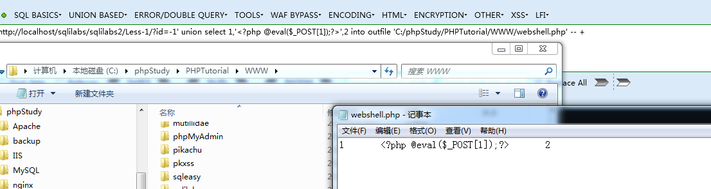

dumpfile

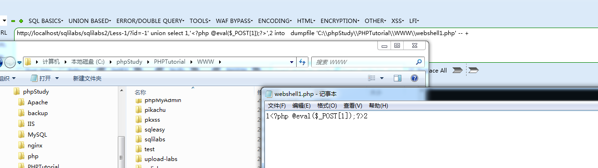

lines terminated by每行数据结尾字符 默认换行

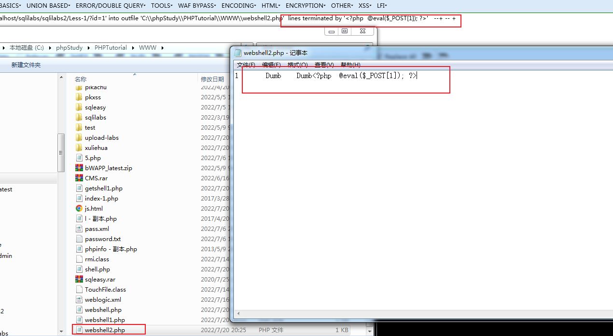

lines starting by 每行数据开始字符

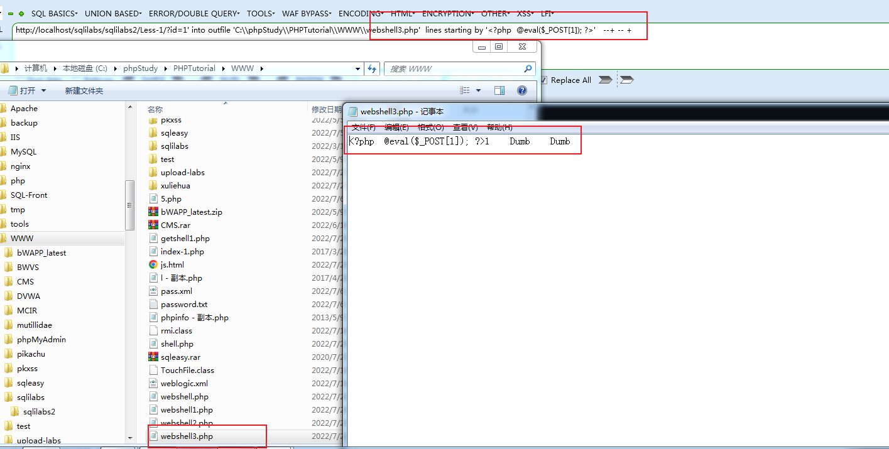

fields terminated by 字段分隔符 默认制表符

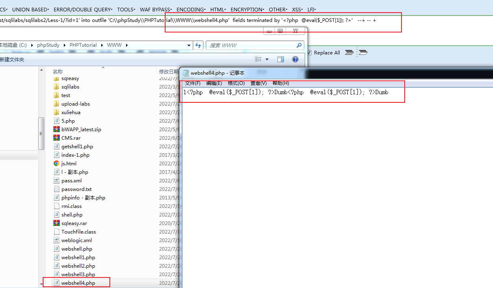

COLUMNS terminated by  字段之间的分隔符 默认制表符

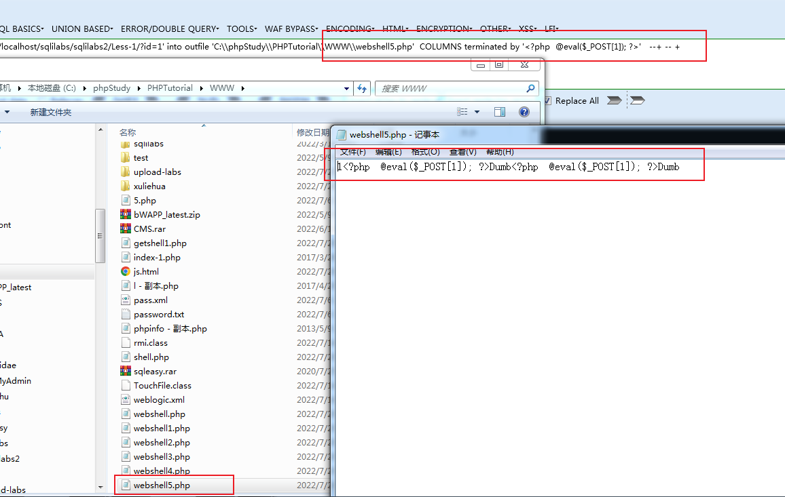

# 数据表

插入
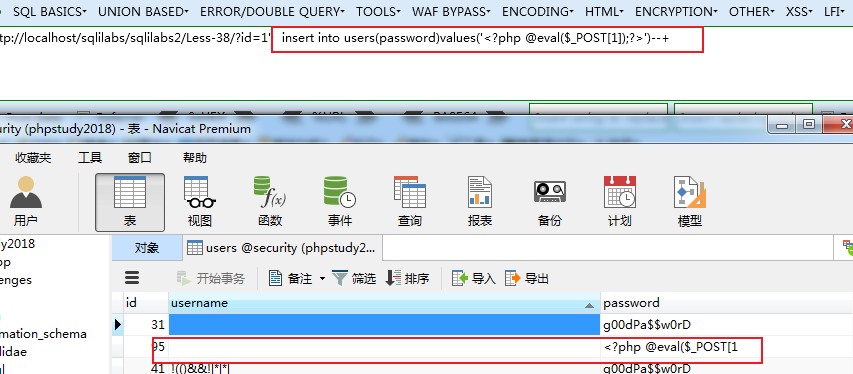

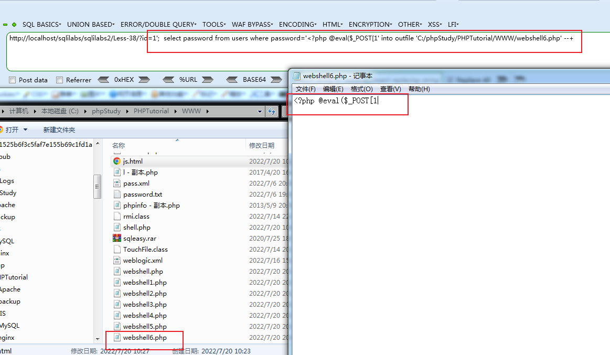

日志 全局配置

查看日志文件存放位置

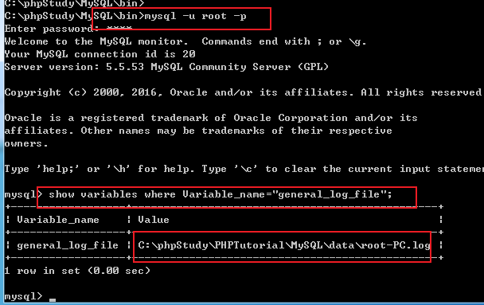

查看日志文件

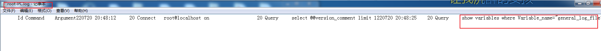

设置webshell为日志文件

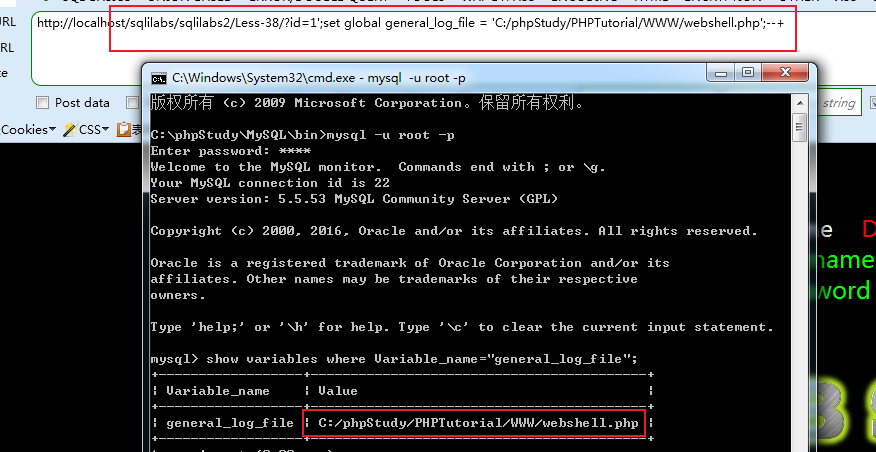

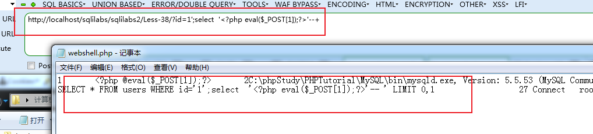

sqlmap getshell

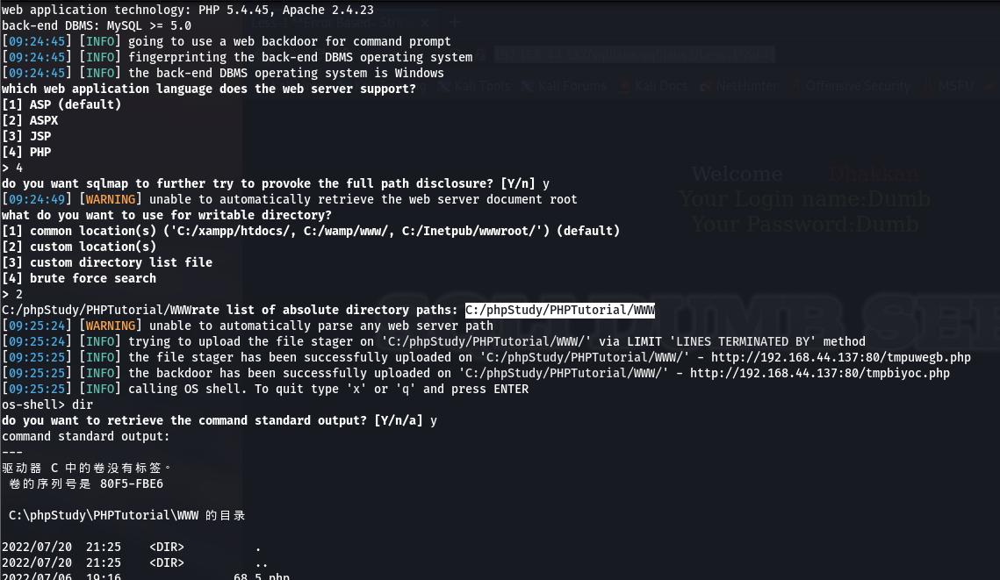