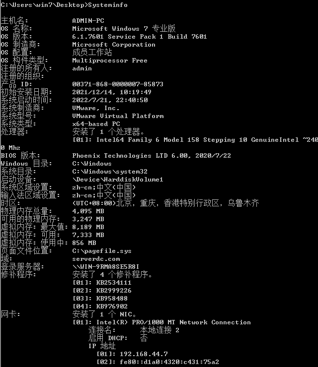

# 本机信息收集
## 查询网络配置：ipconfig /all

## 查询用户列表
net user 查看本机用户列表
net localgroup administrators 本机管理员（通常含有域用户）
query user || qwinsta 查看当前在线用户

## 查询进程列表
tasklist /v
wmic process list brief

WMIC在windows中比较重要，自带得命令行管理工具，批命令和脚本都可以执行
。还可以管理同域的远程计算机，不用安装，

## 查询操作系统及安装软件版本信息
1，获取操作系统和版本信息
Systeminfo | findstr /B/C:”OS 名称” /C:”OS 版本” 2，查看安装软件以及版本，路径等
Wmic product get name,version

Powershell “get-wmiobject –class win32_product|select-object –property
name,version”

## 查询端口列表
netstat –ano

netstat –ano | findstr “EXTABLISHED”

## 查询补丁列表
Systeminfo

Wmic qfe get description,installedOn

## 查询本机共享
Net share

Net share sharename 比如 ipc$ admin$

Wmic share get name,path,status

## 查询防火墙相关配置
1，关闭防火墙
A，windows server 2003系统及以前版本
Netsh firewall set opmode disable

B，windows server 2003 之后系统版本
Netsh advfirewall set allprofiles state off/on

2，查看防火墙配置
Netsh firewall show config

## 查询防火墙相关配置
3，修改防火墙配置
A，windows server 2003系统及以前版本,允许指定程序全部连接
Netsh firewall add allowedprogram c:\\nc.exe “allow nc” enable
B，windows server 2003 之后系统版本
允许指定程序连入/连出
netsh advfirewall firewall add rule name=“pass nc” dir=in/out action=allow
program=“C:\\nc.exe”
允许3389端口放行
netsh advfirewall firewall add rule name=“Remote Desktop” protocol=TCP
dir=in/out localport=3389 action=allow

## 查询并开启远程连接服务
查看远程连接端口号
Reg query “hkey\_local\_machine\\system\\currentcontrolset\\control\\terminal
server\\winstations\\RDP-Tcp” /v portnumber
查看3389是否开启
Netstat –ano | findstr “3389”
开启远程连接服务
Windows server 2008和windows server 2016开启3389的方法
1, wmic /namespace:\\root\\cimv2\\terminalservices path win32_terminalservicesetting where
(__CLASS != "") call setallowtsconnections 1
2, wmic /namespace:\\root\\cimv2\\terminalservices path win32_tsgeneralsetting where
(TerminalName ='RDP-Tcp') call setuserauthenticationrequired 1
3, reg add "HKLM\\SYSTEM\\CurrentControlSet\\Control\\Terminal Server" /v fSingleSessionPerUser /t
REG_DWORD /d 0 /f
以上前提条件是确保Windows Management Instrumentation（Winmgmt）服务已正常启动，权限需要