# 域内信息收集
## 判断是否 存在域
ipconfig /all
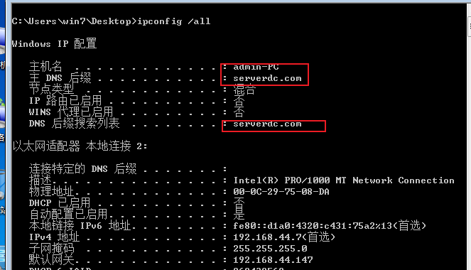
systeminfo
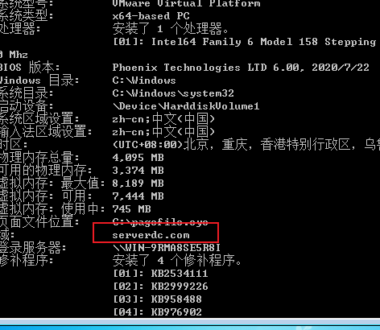
net config workstation
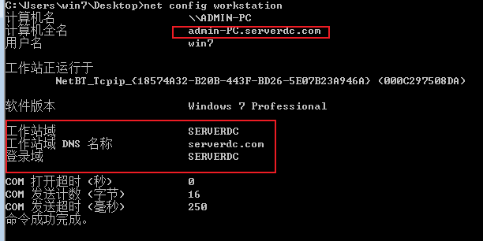
net time /domain
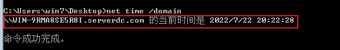
工具
nbtscan 利用netbios快速探测内网(网络邻居协议，优先)
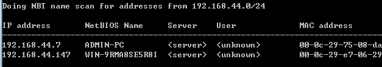
icmp 
for /L %I in (1,1,254) DO @ping –w 1 –n 1 192.168.3.%I | findstr
"TTL="
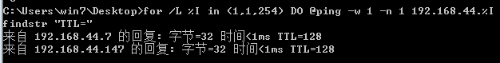
vbs脚本
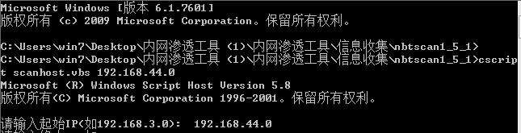
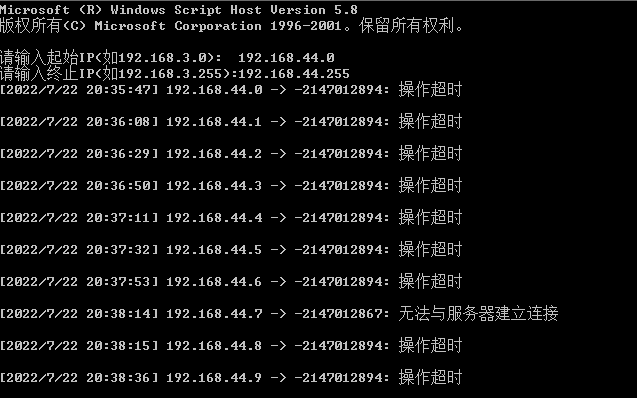
arp
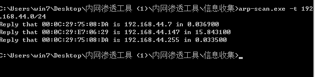

invoke-arpscan.ps1
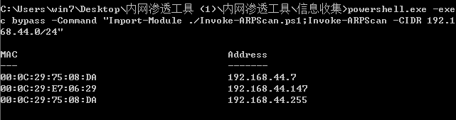
scanline
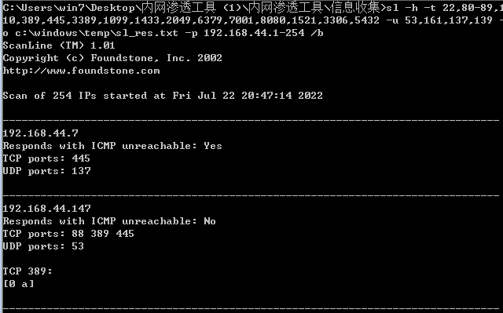
telnet
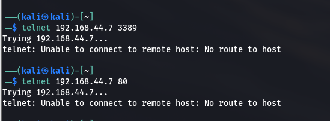
nmap 
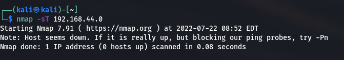
Metasploit

invoke-portscan.ps1

基础信息收集
netgroupNet group /domain 查看用户组列表
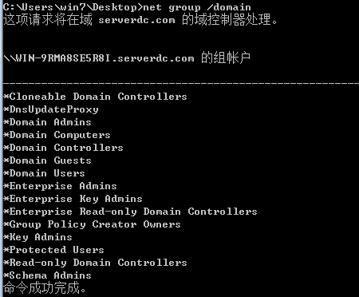
Net group “Domain Admins” /domain 查询域管理员列表
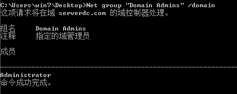
Net accounts /domain 查看域用户密码策略

Nltest /domain_trusts 查看域信任信息
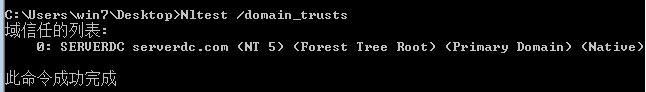
域控制器的查找
Nltest /DCLIST:XXX

Net time /domain
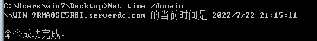
Net group “domain controllers” /domain
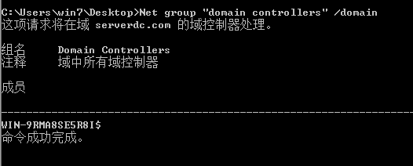
Netdom query pdc

域内用户和管理员的获取
Net user /domain 查看域用户列表
Wmic useraccount get /all
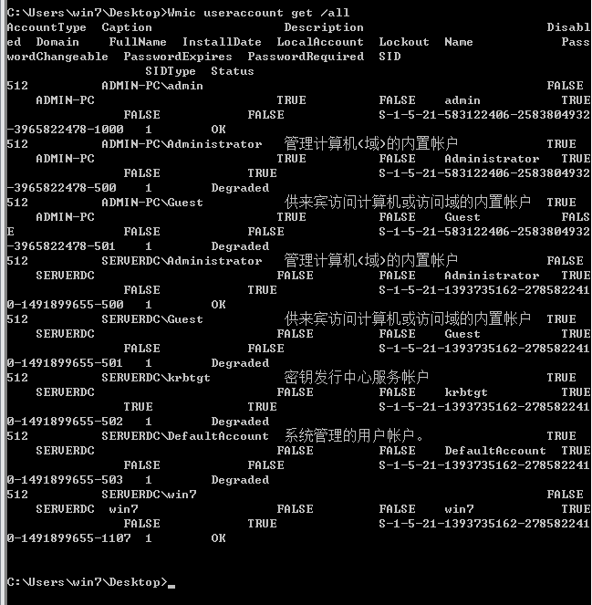
Dsquery user

Net localgroup administrators /domain
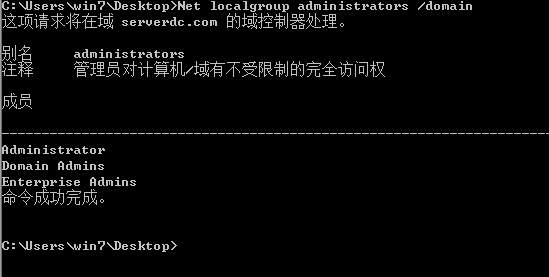
查询域管理员用户组
Net group “domain admins” /domain
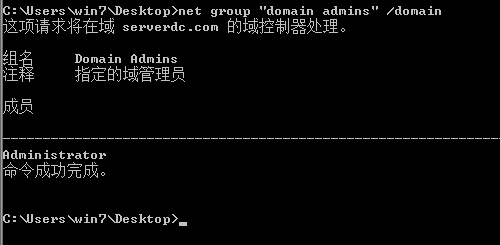
Net group “Enterprise Admins” /domain
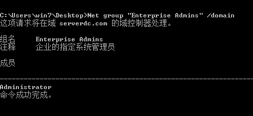

定位域管理员

1，定位域管理员工具
Psloggedon.exe 查看本地登录的用户和通过本地计算机或远程计算机资
源登录的用户
PVEFindADUser.exe 查找活动目录用户登录的位置、枚举域用户
Netsess.exe 查主机会话的工具
Nmap 的NSE脚本
Powerview 脚本-Invoke-UserHunter
Powershell.exe –exec bypass –Command “& {Import-Module C:\PowerView.ps1; 
Invoke-UserHunter}”

