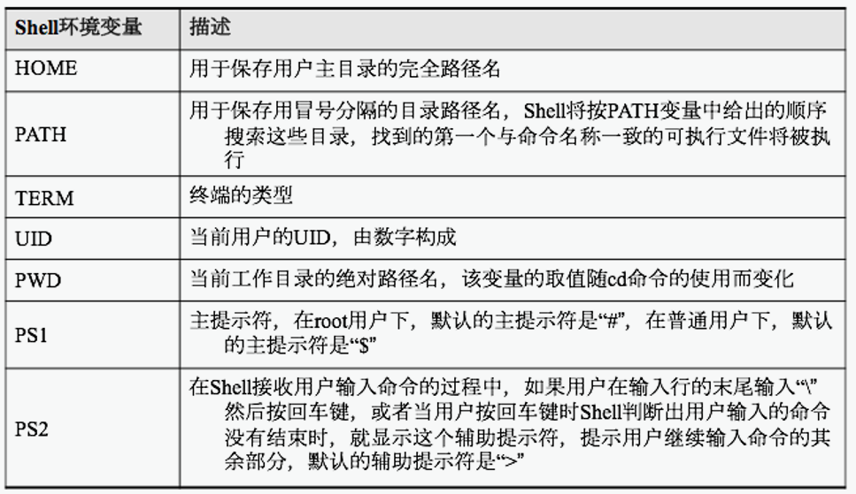
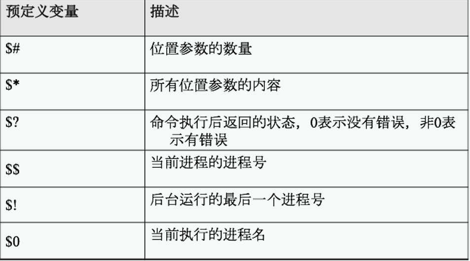
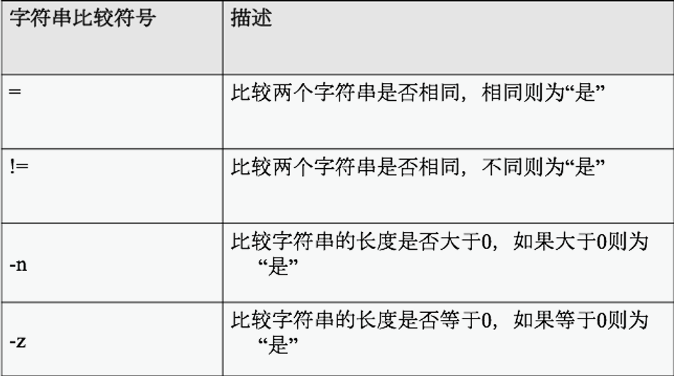
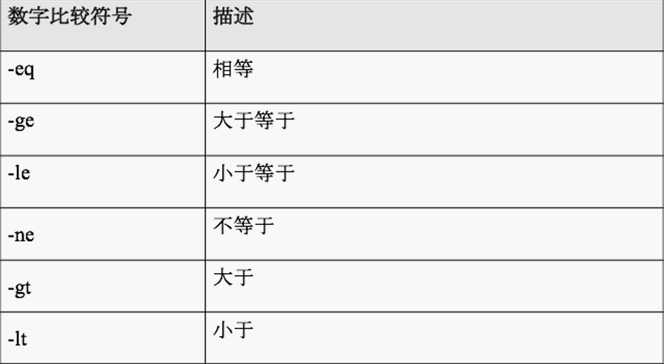
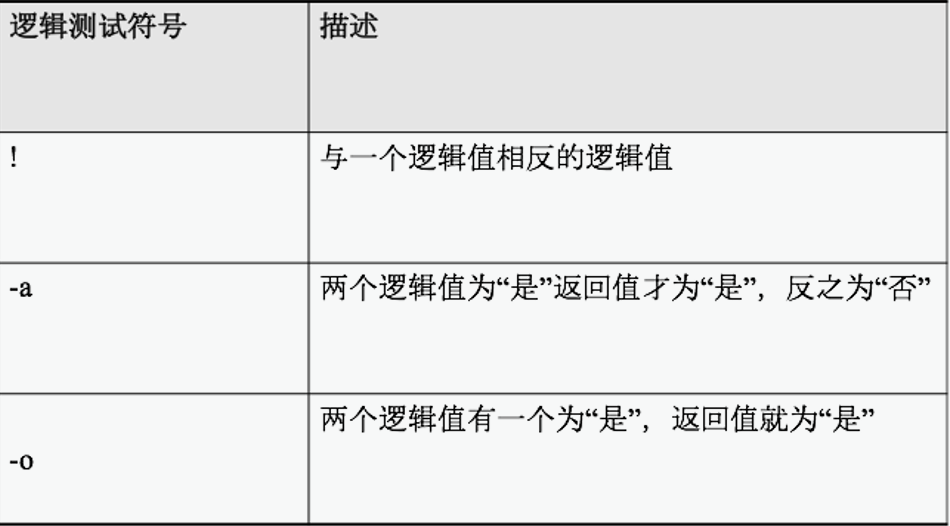
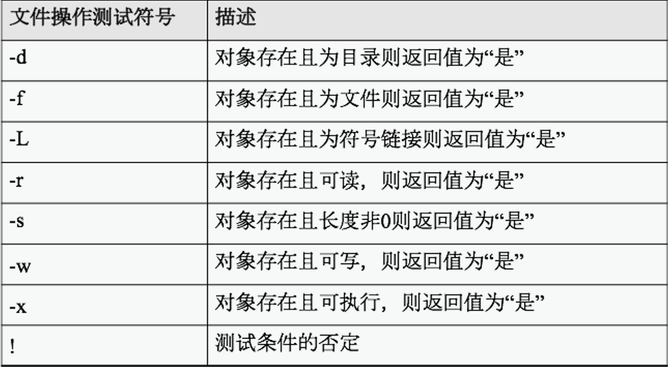

1.  创建文件 touch *.sh
    2．设置可执行权限 chmod u+x
    3．执行Shell程序
    4．使用bash命令执行程序 bash *.sh / ./*.sh

# 格式

```
#! /bin/bash；      #必须放在文件的第一行；
表明用来执行该文件的程序是/bin/bash；
chmod u+x [Shell 程序]      #修改程序文件的权限。
以#开头的语句知道这一行的结束表示注释；

单引号告诉shell忽略所有特殊字符
双引号忽略大多数，但不包括$、\、`

```

# 变量

## 常用环境变量



## 命名规则

readonly 只读 变量之前加
变量名=变量值；
在定义变量时，变量名前不应该加符号“$”； 在引用变量的内容时则应在变量名前加符号“$”；
在给变量赋值时，等号两边一定不能留空格，若变量中本身就包含了空格，则整个字符串都要用双引号括起来；
在编写Shell程序时，为了使变量名和命令名相区别，建议所有的变量名都用大写字母来表示。

## 位置参数

位置参数是一种在调用Shell程序的命令行中按照各自的位置决定的变量，是在程序名之后输入的参数。位置参数之间用空格分隔，Shell取第一个位置参数替换程序文件中的$1，第二个替换$2，依次类推。$0是一个特殊的变量，它的内容是当前这个Shell程序的文件名，所以$0不是一个位置参数，在显示当前所有的位置参数时是不包括$0的。

## 预定义变量

### 常用的预定义变量


预定义变量和环境变量相类似，也是在Shell一开始时就定义了的变量。所不同的是，用户只能根据Shell的定义来使用这些变量，所有预定义变量都是由符号“$”和另一个符号组成的。

# 变量表达式

test是Shell程序中的一个表达式，通过和Shell提供的if等条件语句相结合可以方便地测试字符串、文件状态和数字。其语法如下所示。

```
test [表达式]
```

表达式所代表的操作符有字符串操作符、数字操作符、逻辑操作符以及文件操作符。其中文件操作符是一种Shell特有的操作符，因为Shell里的变量都是字符串，为了达到对文件进行操作的目的，于是才提供了这样的一种操作符。

## 字符串比较


字符窜比较是用来测试字符串是否相同、长度是否为0、字符串是否为null。

## 数字比较


数字比较是用来测试数字的大小

## 逻辑测试


逻辑测试是用来测试文件是否存在。

## 文件操作测试


文件操作测试表达式通常是为了测试文件的文件操作逻辑。

# 条件结构

# if/else条件语句

|     |     |
| --- | --- |
| if-then-fi语句 | if-then-else-fi语句 |
| 语法格式：<br>if 命令行1<br>then<br>命令行2<br>fi | 语法格式：<br>if<br>命令行1<br>then<br>命令行2<br>else<br>命令行3<br>fi |

## Case条件语句

```
语法格式：
　　case string in
　　exp-1)
　　    若干个命令行1
　　；；
　　exp-2)
　　    若干个命令行2
　　；；
　　......
　　*)
　　    其它命令行
　　esac

```

# 循环结构

|     |     |     |
| --- | --- | --- |
| for循环语句 | while循环语句 | until循环语句 |
| 语法格式<br><br>　　for 变量名 　\[in数值列表\]<br><br>　　do<br><br>　　 若干个命令行<br><br>　　done | 语法格式：<br><br>　　while<br><br>　　 若干个命令行1<br><br>　　do<br><br>　　 若干个命令行2<br><br>　　done | 语句格式：<br><br>　　until<br><br>　　 若干个命令行1<br><br>　　do<br><br>　　 若干个命令行2<br><br>　　done |