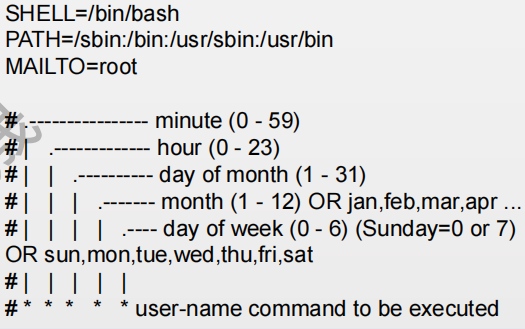

# 进程管理
ps -aux/l 查看进程占用CPU情况 / 用来观察自己的bash相关的进程
top是linux下常用的系统分析工具，能够实时的显示各个进程的资源占用情况
sar是系统维护的重要的使用工具，主要帮助我们掌握系统资源的使用情况，特别是内存和CPU的 使用情况
sar [options] n m 参数n代表时间秒钟，m代表次数几次；一共打印m次每次间隔n秒 • -r ：报告内存统计。 • -u ：报告CPU利用率
free指令会显示内存的使用情况，包括实体内存，虚拟的交换文件内存，共享内 存区段，以及系统核心使用的缓冲区等
## 作业控制
jobs:查看当前用户的作业 
• fg N:将后台进程号码为N作业切换到前台 
• bg N:将命令进程号码为N的命令进程放到后台执行 
• Ctrl+C:终止并退出前台命令的执行，回到SHELL 
• Ctrl+Z:进程前后台操作用到以下命令或按键 
• &：将一个作业放到后台，如ping www.baidu.com > tys & 以上效果同：先ping www.baidu.com，再ctrl+z,然后bg n
## 进度优先级
因为nice是一个从-20～19的值，nice默认等于0 （也即不起作用），进程的nice值为负数时，其优先级升高（也即代表优先级的 数值下降），而进程的nice值为正数时，则进程的优先级下降（也即优先级的数 值升高了）。
在Linux中，普通用户一般只能调高优先级数值，也即让自己的进 程“谦让”一点。 • 设定要启动的程序的优先级：
nice -n -增量 启动的命令及其选项和参数 • 调整进程的优先级：
renice -n 增量 进程PID号（增量可以为负数和正数）
• 实例： • vi test &； • nice --5 vi test；ctrl+z；此时可以看到nice值变化 • renice -n -10 pid
# 计划调度
## at命令 
添加： at 时间/ at 时间 -f 脚本文件 ctrl+d退出并执行 查询：atq 查看内容：at -c 删除：atrm
## cron介绍 

cron命令在系统启动时由一个shell脚本自动启动，进入后台； 
• cron启动后搜索/var/spool/cron目录，寻找以/etc/passwd文件中的用户名命名的 crontab文件，被找到的这种文件将载入内存；
• 如果没有crontab文件，就转入“休眠”状态，释放系统资源； 
• cron每分钟“醒”过来一次，查看当前是否有需要运行的命令；
• 如果发现某个用户设置了crontab文件，它将以该用户的身份去运行文件中指定的 命令。命令执行结束后，任何输出都将作为邮件发送给crontab的所有者，或者 /etc/crontab文件中MAILTO环境变量中指定的用户； 
• 按时定期执行 /etc/cron.houry， /etc/cron.daily， /etc/cron.weekly， /etc/cron.monthly

• 格式：cat /etc/crontab（每分钟 */1 * ＊＊＊）
• crontab [-u username]-e/r 编辑/删除用户 username的cron文件 
• crontab -l 查看用户的cron文件 • 前面五个*号代表五个数字，数字的取值范围和 含义如下：
• 分钟（0-59）；小时（0-23）；日期（1-31）； 月份（1-12）；星期（0-6）//0代表星期天 
• 除了数字还有几个个特殊的符号就是"*"、"/"和"-"、 ","，*代表所有的取值范围内的数字，"/"代表每的 意思,"*/5"表示每5个单位，"-"代表从某个数字到 某个数字,","分开几个离散的数字。

## cron注意事项

• 有时我们创建了一个crontab，但是这个任务却无法自动执行，而手动执行这个任务却没有问题， 这种情况一般是由于在crontab文件中没有配置环境变量引起的。
• 每条任务调度执行完毕，系统都会将任务输出信息通过电子邮件的形式发送给当前系统用户，这 样日积月累，日志信息会非常大，可能会影响系统的正常运行，因此，将每条任务进行重定向处 理非常重要。
• 0 */3 * * * /usr/local/apache2/apachectl restart >/dev/null 2>&1 
• “/dev/null 2>&1”表示先将标准输出重定向到/dev/null，然后将标准错误重定向到标准输出，由于标准输出已经重定向 到了/dev/null，因此标准错误也会重定向到/dev/null，这样日志输出问题就解决了。
• 系统级与用户级任务
• 系统级任务调度主要完成系统的一些维护操作，用户级任务调度主要完成用户自定义的一些任务，可以将用户级任 务调度放到系统级任务调度来完成（不建议这么做），但是反过来却不行，root用户的任务调度操作可以通过 “crontab –u root –e”来设置，也可以将调度任务直接写入/etc/crontab文件，需要注意的是，如果要定义一个定时重 启系统的任务，就必须将任务放到/etc/crontab文件，即使在root用户下创建一个定时重启系统的任务也是无效的。
• 新创建的cron job，不会马上执行，至少要过2分钟才执行。如果重启cron则马上执行。
# 报文捕获
## tcpdump介绍

• 用简单的话来定义tcpdump，就是：dump the traffic on a network，根据使用者 的定义对网络上的数据包进行截获的包分析工具
• tcpdump可以将网络中传送的数据包的“头”完全截获下来提供分析。它支持针 对网络层、协议、主机、网络或端口的过滤，并提供and、or、not等逻辑语句来 帮助你去掉无用的信息 
• tcpdump提供了源代码，公开了接口，因此具备很强的可扩展性，对于网络维护 和入侵者都是非常有用的工具
• tcpdump的输出格式为：系统时间 来源主机.端口 > 目标主机.端口 数据包参数

## tcpdump基础命令

• tcpdump -D 显示所有硬件设备
• tcpdump -i ens33 指定网卡监控其数据包
• tcpdump -w/-r 抓取数据包存取到文件/从文件读取数据包
• tcpdump -c/-C 指定抓取数据包个数/大小 
• tcpdump -t 不打印时间戳
• tcpdump -v/-vv 查看较详细的信息 安装tcpdump yum install tcpdump -y

## tcpdump关键字

• 第一种是关于类型的关键字，主要包括host，net，port 
• host 210.27.48.2，指明 210.27.48.2是一台主机 
• net 202.0.0.0 /24 指明 202.0.0.0 /24是一个网络地址 
• port 23 指明端口号是23 *如果没有指定类型，缺省的类型是host 
• 第二种是确定传输方向的关键字，主要包括src , dst ，这些关键字指明了传输的方向
• src 210.27.48.2 ,指明ip包中源地址是210.27.48.2 
•dst net 202.0.0.0 指明目的网络地址是202.0.0.0 *如果没有指明方向关键字，则缺省是src or dst关键字
• 第三种是协议的关键字，主要包括fddi,ip,arp,rarp,tcp,udp等类型 
• Fddi指明是在FDDI(分布式光纤数据接口网络)上的特定的网络协议，实际上它是"ether"的别名，fddi和 ether具有类似的源地址和目的地址，所以可以将fddi协议包当作ether的包进行处理和分析
• 其他的几个关键字就是指明了监听的包的协议内容 *如果没有指定任何协议，则tcpdump将会监听所有协议的信息包 
• 其它
• gateway,broadcast,less,greater等
• 逻辑运算：非（not/!）；与（and/&&）；或（or/||）

## tcpdump实例

• 抓取IP1与IP2或IP3之间的数据（防止shell对其中的括号进行错误解析，可以使 用“\”，也可以使用“ ’”） 
• tcpdump -i enss33 host IP1 and \( IP2 or IP 3 \) 
• tcpdump -i enss33 ‘host IP1 and ( IP2 or IP 3 )’ 
• 抓取IP1与除IP2之外的其它所有主机的数据 
• tcpdump -i enss33 host IP1 and ! IP2
• 抓取从IP1主机发送出去的目的端口为80的数据包
• tcpdump -i enss33 src host IP1 and dst port 80 
• 抓取除'echo request'或者'echo reply'类型以外ICMP的数据包 
• tcpdump 'icmp[icmptype] != icmp-echo and icmp[icmptype] != icmp-echoreply' 
• 打印TCP会话中的的开始和结束数据包, 并且数据包的源或目的不是本地网络上 的主机
• tcpdump ‘tcp[tcpflags] & (tcp-syn|tcp-fin) != 0 and not src or dst net localnet

## tcpdump习题
• 截获所有210.27.48.1的主机收到的和发出的所有的数据包
• 截获主机210.27.48.1和主机210.27.48.2或210.27.48.3的通信
• 获取主机210.27.48.1除了和主机210.27.48.2之外所有主机通信
• 获取主机210.27.48.1接收或发出的telnet包 
• 对本机的udp 123 端口进行监视(123为ntp的服务端口)
• 监视发送到TCP或UDP 80端口的数据包 
• tcpdump tcp -i eth1 -t -s 0 -c 100 and dst port ! 22 and src net 192.168.1.0/24 - w ./target.cap