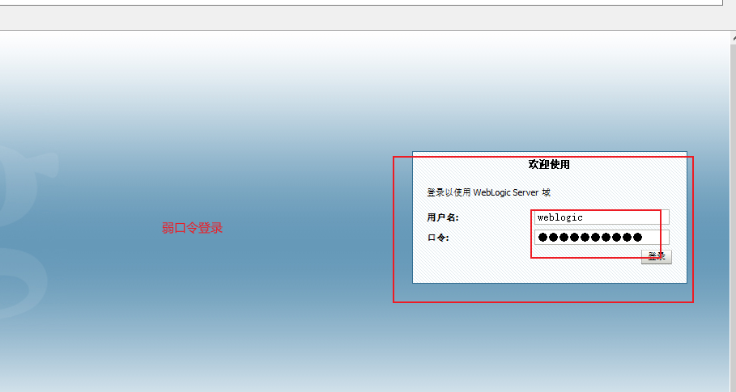

# 1.weblogic弱口令登录

# 2. 检查是否存在端口探测（ssrf）

# xml反序列化
## 反弹shell

# 写入webshell

jsp一句话木马 蚁剑直接连

# java反序列
## 开启rmi服务 使用payload攻击目标网站

## 生成payload 开启shell监听

# 未授权命令
## 搭建一个web网站 shell监听
## payload引用外部实体 弹shell
