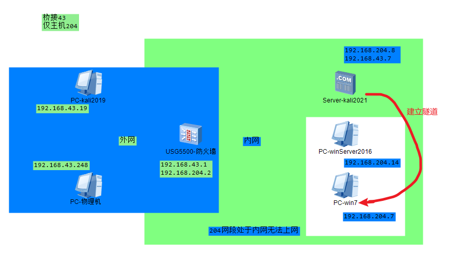
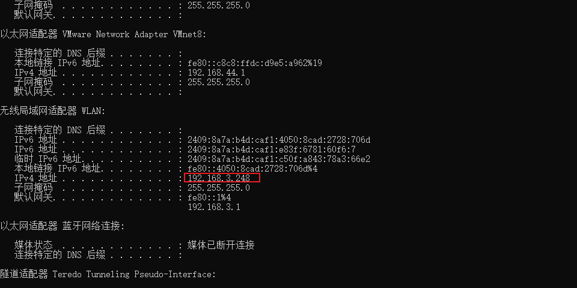

1\. 网络拓扑



2\. 通过物理机cmd 查看自己桥接网段



3\. 设置外网主机ip和防火墙桥接ip

```
iface eth0 inet static
address 192.168.3.x
netmask 255.255.255.0
gateway 192.168.3.x  # 防火墙ip
```

4\. 建立仅主机域控平台

略

5\. 设置内网kali2021 桥接和仅主机网卡设置ip 网关是防火墙

注意： 直接重启虚拟机即可 不用重启网卡 （没用）

6\. 建立隧道

7\. 检查连通性

2019-2021  2021-域内win7