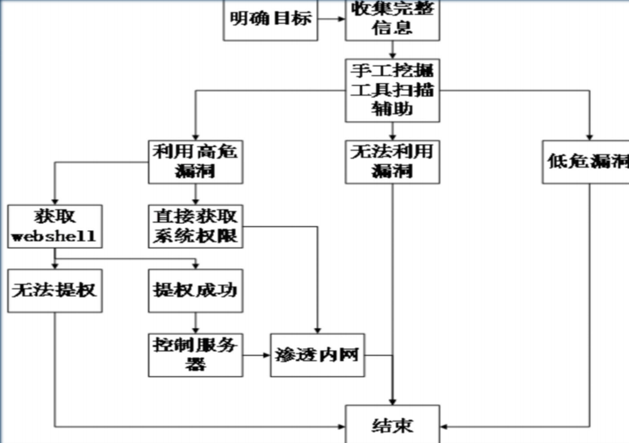

**渗透测试** 为了系统安全以攻击者的角度分析

**入侵** 以破坏为目的获取敏感数据

# 流程

## 1\. 明确目标

范围 ：ip 域名 内外网 测试账户
规则： 什么程度 时间 上传 提权
确定需求： web应用漏洞，业务逻辑漏洞 人员权限漏洞

## 3\. 信息收集

方式： 主动扫描 开放搜索（借助搜索引擎）
基础信息：IP 网段 域名 端口
应用信息：各端口应用
系统信息：操作系统版本
版本信息：所有探测的东西的版本
服务信息：中间件的各类信息，插件信息
人员信息：域名注册人员信息，web应用中发帖人的id 管理员信息
防护信息：是否能探测到防护设备

## 4\. 漏洞探测

系统漏洞：系统没打补丁
webSever 漏洞
web应用漏洞
其他端口服务漏洞
通信安全 ; 明文传输，token在cookie 中传输

## 5\. 漏洞验证

自动化验证：工具
手工验证：公开资源验证
实验验证：模拟环境
登录猜解：猜一下登录账号和密码
业务漏洞验证：如果发现业务漏洞及时验证

## 6\. 信息分析

精准打击：准备好exp
绕过防御机制：防火墙等设备
定制攻击路径：最佳工具路径，根据薄弱入口，高内网权限 最高权限
绕过检测机制：是否有检测机制，流量监控，杀毒软件，恶意代码检测（免杀）
攻击代码：经过验证得来的代码 不限xss，sql

## 7\. 获取所需

实施攻击：根据前几步实施攻击
获取内部信息：基础设施 网络连接 vpn 路由 拓扑
进一步渗透：内网入侵，敏感信息
持续存在（权限维持）：后门 rookit 增加管理账号
清理痕迹；清空相关日志，文件

## 8\. 信息整理

整理渗透工具：整理渗透过程中用到的代码，poc,exp...
整理收集信息：整理漏洞收集到的一切信息
整理漏洞信息：整理漏洞过程中遇到的各种漏洞，各种脆弱位置信息

## 9\. 形成报告

按需整理：按照范围，需求整理资料，形成报告
补充介绍：要对漏洞的成因，验证过程和带来的危害分析
修补建议：合理有效的解决方式
