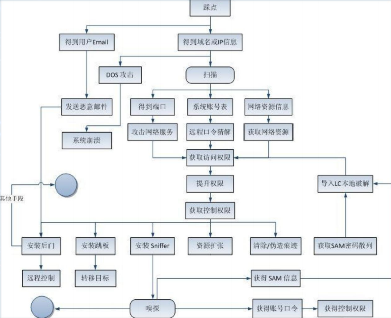
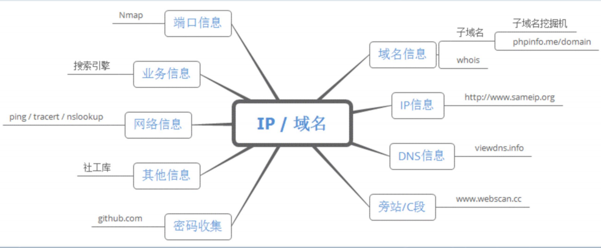

目的：了解架构 缩小攻击范围 描绘网路拓扑 建立脆弱点数据库

# 分类

主动信息收集 直接与目标主机建立交互 从而拿到目标信息 会有日志

被动信息收集：不与目标主机进行直接交互，通过搜索引擎或者社会工程等方式间接获取把目标主机信息

# hack模型

踩点->定位->入侵->后门->抹去痕迹

# 基本思路

# 域名
## whois 
查询域名相关信息
## 子域名 xxx.baidu.com 
爆破 子域名挖掘机 oneforall.py
##  备案号 
网站合法经营 icp.sojson.com

# 服务器方面
## dns 查询
## 端口服务
## 真实IP（CDN）

# 网站程序
## 网站架构
操作系统 数据库 web中间件 开发语言 框架
## 旁站c段 
同一台服务器其他域名 网站
## 目录扫描
dirdump
-i 目标 -iF 目标网址文件 -Icf 暴力破解文件
dirseacrh
-u 目标 -e 网站语言 -r 递归目录 -random-agents 随机ua
御剑目录扫描
## 源码泄露
谷歌搜索引擎+工具
## 脆弱系统
网络空间

## 密码收集 
github

## 指纹识别 
已知漏洞
bugScanner http://whatweb.bugscanner.com/look/

# 企业方面
天眼查 企业信用信息公示系统

# 端口扫描

判断存活（ping/tcp/udp）->端口扫描（tcp/udp）->服务识别（端口/banner/指纹）

|     |     |     |
| --- | --- | --- |
| 识别方式 | 准确率 | 效率  |
| 基于端口（默认服务） | 低   | 高   |
| 基于banner（欢迎界面） | 中   | 高   |
| 基于指纹（不同系统不同服务协议栈） | 高   | 低   |

# nmap

## tcp选项

-sT tcp
-sS tcp半开syn scan
-sA tcp ack
-sN tcp null 不设置标志位 标志头0 看rst
-sF tcp fin 只设置fin 看rst
-sM tcp maimon fin/ack 关闭回复rst包
-sI tcp idle 僵尸主机发送数据包与目标通信

## udp 选项

-sU udp扫描

## 目标选项

-p 快速
-F 扫描常用100个端口
-r 顺序小到大扫描端口

## 输出选项

-oN namp文件
-oX xml格式（可转化为html）
-oG 标准输出指定的gnmap文件
-oA 三种格式

## 其他选项

-sV 检查服务器版本信息
-O 操作系统信息
-Pn 跳过主机发现过程
-A 服务器版本 操作系统 脚本检测 路由探测
-sP 存活主机

## nmap六种状态

- open 开放
- closed 关闭
- filtered nmap不可访问 不知道端口开放情况
- Unfiltered nmap可以访问 不知道端口开放情况
- open|filtered 无法确定是open还是filtered 不回应扫描
- closed|filtered 无法区别closed还是filtered ip/id/idle 扫描中

## 可视化

zenmap

# masscan

速度快 4核电脑 双端口10g网卡->3min 整个互联网
异步 无状态 半连接 （nmap需要记录tcp/ip 状态 os只能连接1500左右）

## 基本使用

- 单端口(-p/--ports)
    -p443
- 多端口
    -p80,443
- 扫描一系列端口
    -p22-25
- 每秒数据包个数
    --rate 1000
- 排除目标
    \-\- excludefile exclude.txt
- 保存结果

> resulit.txt
> -oX xml
> -oG grepable
> -oJ json

## goby
端口扫描

