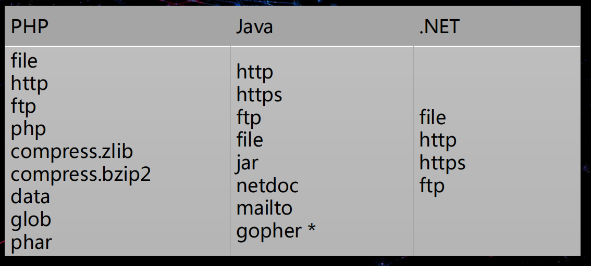

# XXE

外部实体注入漏洞

## 声明

&lt;?xml version="1.0" encoding="UTF-8"?&gt;

## 元素

自定义标签 基本与html标签差不多
&lt;har&gt;text&lt;/har&gt;
命名规范

- 区分大小写

```
例如 <P>和<p>是两个不同的标记。 
```

- 不能以数字开头。
- 不能包含空格。
- 名称中间不能包含冒号（:）。

## 属性。

（1）一个元素可以有多个属性，每个属性都有它自己的名称和取值， 例 如：&lt;mytag name=“value” …/&gt;
（2）属性值一定要用引号(单引号或双引号)引起来。
（3）属性名称的命名规范与元素的命名规范相同
（4）元素中的属性是不允许重复的
（5）在XML技术中，标签属性所代表的信息也可以被改成用子元素的形式来 描述

```
<?xml version="1.0" encoding="UTF-8"?> <!--XML 声明--> 
<girl height="168"> <!--自定的根元素girl;height属性需要加引导--> 
<age>35<age> 
<hair>长头发</hair> <!--自定义的4个子元素，即girl对象的属性--> 
<eye>大眼睛</eye> 
<face>可爱的脸庞</face> 
<summary>可爱美丽的女孩</summary> 
</girl> <!--根元素的闭合-->
```

## 预定义实体引用

如果连着使用键盘上的空格 只会显示一个空格

|     |     |     |
| --- | --- | --- |
| <   | <   | 小于号 |
| >   | >   | 大于号 |
| &   | &   | 和号  |
| '   | '   | 单引号 |
| "   | "   | 双引号 |

## 注释

和html一样

## CDATA

character data
&lt;!\[CDATA\[ <电子科技大学&gt;修行小和尚&lt;/电子科技大学&gt; \]\]>

&lt;电子科技大学&gt;修行小和尚&lt;/电子科技大学&gt;会被当做文本，不是标签

## DTD

文档类型定义

内部DTD声明 &lt;!DOCTYPE 根元素 \[元素声明\]&gt;

外部DTD声明 &lt;!DOCTYPE 根元素 SYSTEM "文件名"&gt;

```
<?xml version="1.0" encoding="UTF-8">
<!DOCTYPE root SYSTEM "root.dtd">
<root>
<a>aa</a>
<b>bb</b>
</root>
```

## 实体声明

### 内部实体声明

```
<!ENTITY entity-name "entity-value">

<?xml version="1.0" encoding="UTF-8"?> <!DOCTYPE note [ <!ENTITY hack "我是黑客"> ]><note>&hack; </note>
```

### 外部实体声明

```
<!ENTITY entity-name SYSTEM "URL/URL">

<?xml version="1.0" encoding="UTF-8"?>
<!DOCTYPE note [
<!ENTITY hack SYSTEM "file:///c:\windows-version.txt">
]>
<note>&hack;</note>
```

XML的外部实体“hack”被赋予的值为：c:\\windows-version.txt当解析xml文档时，hack会被替换为c:\\windows-version.txt的内容。

协议栈



### 实体又分为一般实体和参数实体:

一般实体

```
<!ENTITY 实体名 "实体内容">
```

参数实体

```
<!ENTITY % 实体名 "实体内容">
```

XXE漏洞攻击主要是利用了DTD引用外部实体导致的漏洞。

### 参数实体+外部实体

```
<? xml version="1.0" encoding="utf-8">
<!DOCTYPE hack [
<! ENTITY % name SYSTEM "file:///etc/passwd">
%name;
]
```

# PHP 
simplexml\_load\_string()函数**

解析xml

# 反序列化

__construct()：构造函数，当对象创建(new)时会自动调用。但在unserialize()时是不会自动调用 的。
__destruct()：析构函数，类似于C++。会在到某个对象的所有引用都被删除或者当对象被显式销 毁时执行，当对象被销毁时会自动调用。
__wakeup()：进行unserialize()时会检查是否存在 __wakeup()，如果存在，则会优先调用 __wakeup()方法,可以进行初始化对象。 
__toString()：用于处理一个类被当成字符串时应怎样回应，因此当一个对象被当作一个字符串时 就会调用。 
__sleep()：当一个对象被序列化的时候被调用,可以设定需要保存的成员属性。

重构logfile.php文件包含的对象 进行文件删除

正常的重构对象:O:7:"LogFile":1:{s:8:"filename";s:9:"error.log";}

假设现在有一个正常的首页index.php文件 通过非正常的重构对象: 进行文件删除 O:7:"LogFile":1:{s:8:"filename";s:9:"index.php";}
```
<?php 
		class chybeta { 
			public $test; 
			function __construct() {
				$this->test = new ph0en1x(); 
			}
			function __destruct() {
			$this->test->action(); 
			} 
		}
		class ph0en1x {
			function action() {
				echo "ph0en1x"; 
				} 
			}
		class ph0en2x {
			public $test2; function action() {
			eval($this->test2); 
			} 
		}
		$class = new chybeta(); 
		@unserialize($_GET['test']);
?>
传一个 ph0en2x