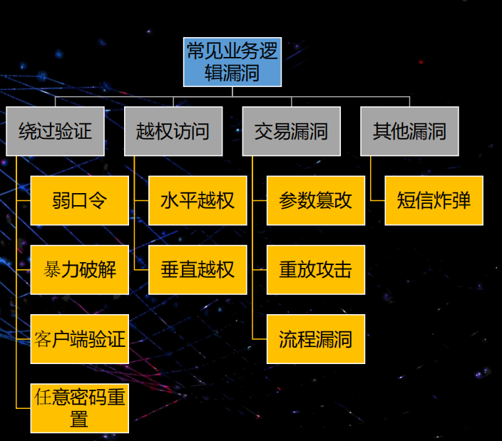
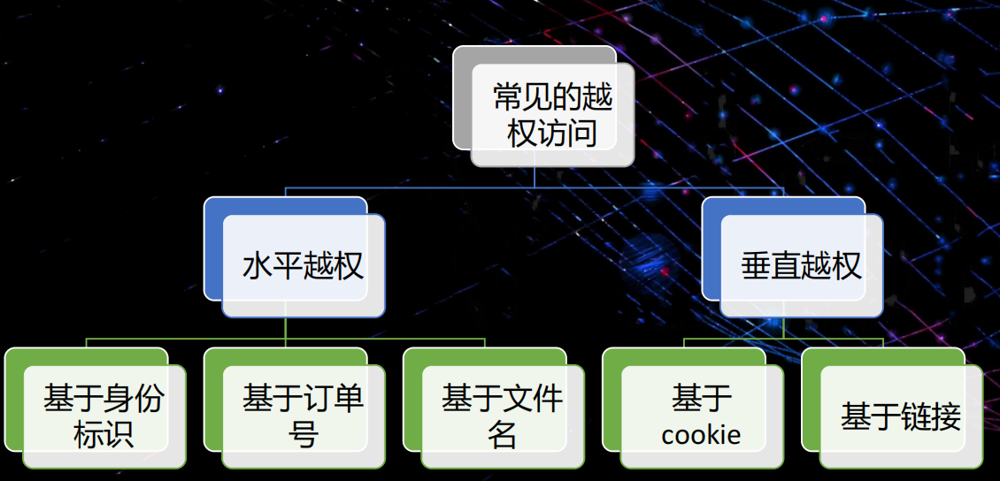
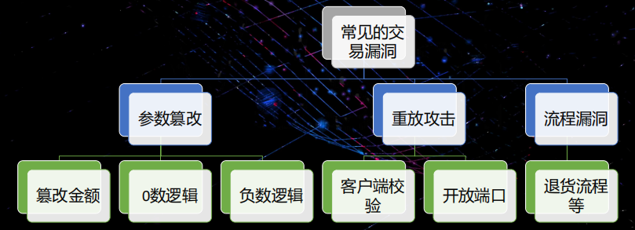
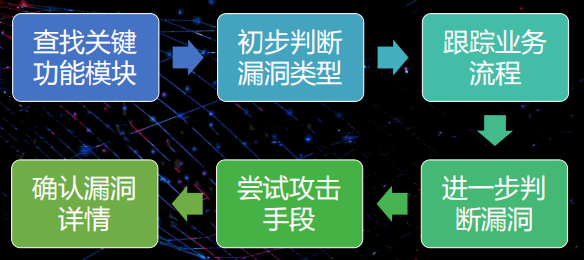
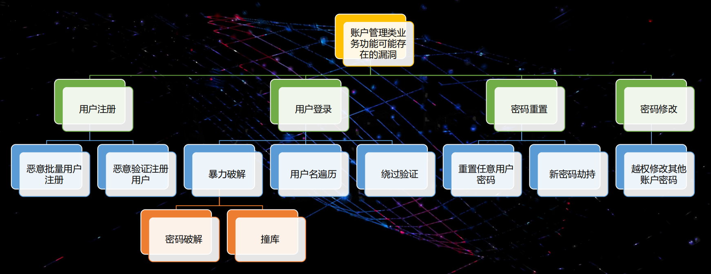
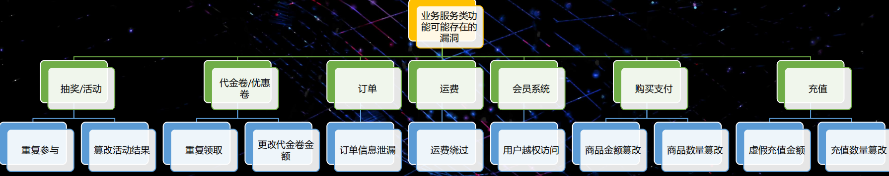
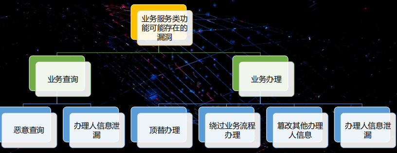

# 原理

## 绕过验证-弱口令
- 成因 
纯数字或者字母六位以下 或者是生日 键盘的按键顺序 默认口令
- 漏洞
登录 修改密码 重置密码
## 绕过验证-暴力破解
- 成因
没有验证码或者 不安全的无图片验证码 没有错误锁定机制 错误提示过于详细 如 用户名不存在
短信验证过短<6 短信验证码没有锁定机制
- 漏洞
BP+不过期的验证码
## 绕过验证-客户端验证
- 成因 
验证信息返回给客户端 或者客户需要验证信息进入下一步
- 漏洞
截取服务器返回给客户端的验证信息
## 绕过验证-任意密码重置
- 成因
重置问题太少/简单 链接可猜测 关键参数可以改 暴力破解 越权访问 客户端验证
- 漏洞
## 越权访问

### 越权访问-水平越权-身份标识
### 越权访问-水平越权-订单编号
### 越权访问-水平越权-文件名
### 越权访问-垂直越权-未授权访问
### 越权访问-垂直越权-基于cookie
## 交易漏洞

### 交易漏洞-篡改攻击-金额篡改
### 交易漏洞-参数篡改-0数逻辑
### 交易漏洞-参数篡改-负数逻辑
### 交易漏洞-交易漏洞-重放攻击
### 交易漏洞-流程漏洞
## 其他漏洞
### 短信验炸弹
# 挖掘思路

## 暴力破解漏洞
1. 登录模块没验证码
2. 错误的账号登录 抓包
3. 多次登录未见提示
4. BP暴力破解
5. 确认漏洞存在
## 绕过验证漏洞挖掘
1. 密码重置
2. 抓包校验过程 出现success 客户端存在验证
3. 抓包密码重置 跟踪重置某个未知密码
4. 关键步骤篡改目标账号密码
5. 使用修改后的密码登录账号
6. 确认漏洞存在
## 越权访问漏洞挖掘
1. 订单查询
2. 抓包 记录请求包
3. BP遍历单号 查看其他人的订单详情
4. 确认漏洞
## 交易篡改漏洞
1. 存在交易
2. 抓包 交易
3. 修改包 对价格进行篡改
4. 确认漏洞存在
# 功能和业务的漏洞
## 账户管理类

## 电子商务类

## 业务服务类

