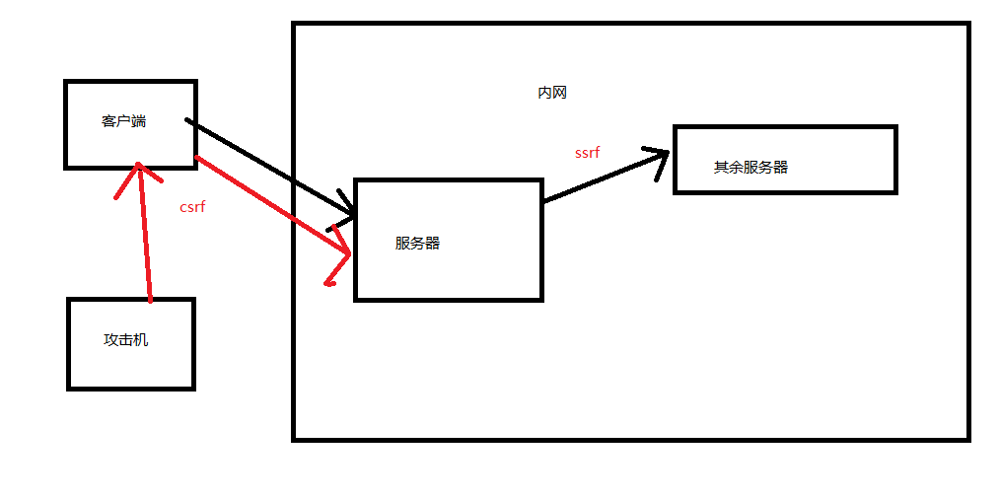

# CSRF
请求仿造
CSRF利用的前提条件
• 1.登录信任网站A,并在本地生成Cookie。
• 2.在不退出的情况下，访问危险网站B。
判断
1、对目标网站增删改的地方进行标记，并观察其逻辑，判断请求是否可以被伪造： ---比如修密码时，并不需要验证旧密码，导致请求容易被伪造； ---比如对于敏感信息的修改并没有使用安全的token验证，导致请求容易 被伪造；
2.确认凭证的有效期（这个问题会提高CSRF被利用的概率） ---虽然退出或者关闭了浏览器，但cookie仍然有效，或者session并没有及 时过期，导致CSRF攻击变的简单

# SSRF
读取服务器敏感文件

1、分享，通过URL地址分享网页内容，通过URL获取目标页标签等内容 
2、转码服务，适配手机屏幕大小，通过URL地址进行图片转码 
3、图片加载与下载，通过URL加载网络图片（头像上传、等）
4、图片、文章收藏，通过URL获取目标的title等信息 
5、其他加载URL的功能
## 绕过
IP地址转换成十进制: 127.0.0.1=2130706433

url地址格式改写: 增加干扰(@前面的是 账号密码)
http://aa@192.168.3.6
http://www.baidu.com@192.168.3.6 
http://192.168.3.6 
都是访问同一个地址

url地址格式改写: 
增加干扰 xip.io是如何工作的？ xip.io 是在公共Internet上运行自定义DNS服务 器。当您的计算机查找xip.io域时，xip.io DNS服 务器从域中提取IP地址，然后将其发送回响应。 前面随便加,最后面必须是.xip.io 
127.0.0.1.xip.io 
www.127.0.0.1.xip.io
haha.127.0.0.1.xip.io 
haha.xixi.127.0.0.1.xip.io 都会访问同一个地址: 127.0.0.1

## 防御
1. 统一错误信息
2. 限制端口
3. 内网黑名单
4. 禁用不需要的协议