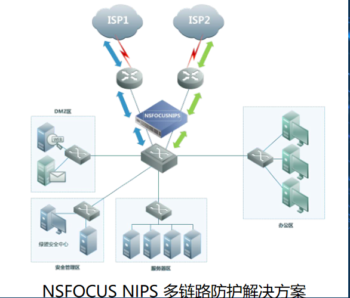

# 安全事件发生的时间
预防：在安全事件发生前，发现信息系统本身存在的安全隐患，修复、避免等方式对安全隐患进行加固，防止被利用。
防护：在安全事件发生前时，实时发现非法者的攻击行为，并及时阻断，保证信息系统的安全。
补偿：在安全事件发生后，追查非法者的攻击方式、ip等入侵证据，便于信息系统的加固和追责。
# 安全功能
合规及安全管理类

用于安全检查、发现网络设备、主机、服务器中存在的漏洞或不合规的配置

攻防类

用于保护系统中的网络设备、主机、服务器、应用等稳定运行，阻止黑客的攻击行为

安全审计类

对网络异常行为的管理和监测，如网络连接和访问的合法性进行控制、监测网络攻击事件等，便于追责。

# 等级保护

信息安全等级保护是对信息和信息载体按照重要性等级分级别进行保护的一种工作，在中国、美国等很多国家都存在的一种信息安全领域的工作。在中国，信息安全等级保护广义上为涉及到该工作的标准、产品、系统、信息等均依据等级保护思想的安全工作；狭义上一般指信息系统安全等级保护。

网络安全  系统安全 应用安全 数据安全
 # 扫描器
 ## 1. 厂商设备
 绿盟远程安全评估系统 天融信漏洞扫描 启明星辰天镜系统 nessus 
 ## 2. 扫描工具
 awvs
 nmap
 burpsuit
 appscanner
 # 安全基线
 最低的安全标准
是否被攻击的参照（当收到攻击时，依据安全基线来排查自身被攻击的场所）

# 常见的产品

## 绿盟安全配置核查系统
（NSFOCUS Benchmark Verification System
 简称：NSFOCUS BVS）

完善的安全配置知识库，涵盖操作系统、网络设备、数据库、中间件、虚拟化平台等近50类设备及系统的安全配置加固建议，可以全面的指导IT信息系统的安全配置及加固工作。

## 天融信基线管理系统TopTBM

集中部署

## 神州泰岳Ultra-BMS 安全基线管理系统
Ultra-BMS用于协助企业建立构建核心重要IT资源的安全配置基线，以及实现企业IT资产资源的“安全基线快照”，建立和动态监控管理，同时并基于强大自动化工具属性，也是提供企业入网安全辅导、入网安全验收、日常安全巡检管理等的重要场景，实现动态监控管理及综合安全管控能力重要自动化工具。Ultra-BMS 是帮助企业开展综合安全合规管理的利器。

# 典型应用——绿盟

小规模网络下单独部署漏洞扫描产品，完成全部网络的安全检查，是传统使用方法。
NSFOCUS BVS 可以部署应用在小规模网络安全运维环境中，另外，针对需要携带设备到现场的监督检查使用要求，提供了便携式工业硬件的 BVS NX3-P 型号。使用NSFOCUS BVS，通过简单部署即可完成业务系统安全配置检查工作

## 单机部署

# 防火墙
防火墙（Firewall），也称防护墙，是由Check Point创立者Gil Shwed于1993年发明并引入国际互联网（US5606668（A）1993-12-15）。它是一种位于内部网络与外部网络之间的网络安全系统。一项信息安全的防护系统，依照特定的规则，允许或是限制传输的数据通过。

# 常见的产品
厂商设备

安恒明御下一代防火墙
思科下一代防火墙Firepower 4100 系列
华为下一代防火墙USG6600系列
深信服下一代防火墙

典型应用

# IDS、IPS

是一部能够监视网络或网络设备的网络资料传输行为的计算机网络安全设备，能够即时的中断、调整或隔离一些不正常或是具有伤害性的网络行为。
IDS：入侵检测系统
IPS：入侵防御系统

假设防火墙是一幢大楼的门锁或者门口的保安

那么IDS就是这幢大楼里的监视系统。一旦小偷爬窗进入大楼，或内部人员有越界行为，只有实时监视系统才能发现情况并发出警告

IPS ：一部能够监视网络或网络设备的网络资料传输行为的计算机网络安全设备，能够即时的中断、调整或隔离一些不正常或是具有伤害性的网络资料传输行为。

# 常见的产品
厂商设备

绿盟入侵防护系统（NIPS）
天融信入侵防御系统TopIDP
启明星辰天清
迪普入侵防护系统
网神入侵防护系统

# 典型应用
目前，很多企业为了保证网络带宽资源的充足和网络冗余，网络出口采用多链路连接方式，连接到两个或更多 ISP 服务商。
针对这种连接方式，绿盟科技入侵防护系统提供多链路防护的解决方案，在网络出口处部署一台绿盟网络入侵防护系统，采用多路 NIPS（N 系列）的部署方式

大型企业的网络规模很大，结构相对复杂，不仅有总部，还有各地的分支机构，既要保护网络边界的安全，同时又要保护企业内网的安全。

# WEB应用防火墙
WEB应用防火墙（WAF）

Web应用防护系统（也称：网站应用级入侵防御系统。英文：Web Application Firewall，简称： WAF）。利用国际上公认的一种说法：Web应用防火墙是通过执行一系列针对HTTP/HTTPS的安全策略来专门为Web应用提供保护的一款产品

# 常见的产品——软/云WAF

# 常见的产品——硬件WAF
厂商设备

绿盟科技web应用防火墙（WAF）
天融信WEB防火墙(TOP-WAF)
安恒明御web应用防火墙
迪普web应用防火墙
网神web用防火墙

# 典型应用
下图所示明御Web应用防火墙部署于网上银行核心交易系统中，有效的防止敏感信息泄露、防止各种应用攻击，并实现金融行业相关法规的合规性要求。明御Web应用防火墙具备良好的应用层解析功能，有很好的识别HTTPS环境下真实访问者信息，从而实现基于真实访问者的安全审计、安全防御措施，提升网上银行的安全防护能力。

# 典型应用——天融信
在线串接模式下 TopWAF 产品以全透明的方式接入网络，通常 TopWAF 产品部署在防火墙之后，Web 服务器区域之前，保护在线运行的 Web 服务器。在线串接时 TopWAF 产品以软硬件的高可靠设计，来避免对网络产生的影响。

# 防篡改
防止WEB应用被篡改的设备。
通常这个功能会集成在其他的安全产品当中。

# 常见的产品

厂商设备

明御®安恒网站卫士网页防篡改
天融信网页防篡改系统

天融信网页防篡改系统是天融信公司专门针对网站篡改攻击精心研发的一款防护产品，系统主要功能是通过文件底层驱动技术对Web站点目录提供全方位的保护，防止黑客、病毒等对目录中的网页、电子文档、图片、数据库等任何类型的文件进行非法篡改和破坏。防篡改系统保护网站安全运行，维护政府和企业形象，保障互联网业务的正常运营，彻底解决了网站被非法修改的问题，是高效、安全、易用的新一代的网页防篡改系统。

# 典型应用——安恒

把网页防篡改系统的监控端、发布端和管理控制端软件仅部署在一台Web服务器上。Web服务器既接收网页发布，也对外提供Web服务。

需要两台服务器。即把网页防篡改系统的监控端软件安装在一台Web服务器上，发布端和管理控制端软件安装在另一台服务器上，用来发布、更新站点文件的内容。
# 典型应用——天融信

对一个标准站点部署网页防篡改时，Web服务器和内容管理系统都沿用原来的机器，而需要在其间增加一台备份服务器。网页防篡改的自动同步机制完全与内容管理系统无关，适合与所有的内容管理系统协同工作，而内容管理系统本身无须做任何变动。
# 抗拒绝服务系统

分布式拒绝服务攻击(DDoS:Distributed Denial of Service)指借助于客户/服务器技术，将多个计算机联合起来作为攻击平台，对一个或多个目标发动DDoS攻击，从而成倍地提高拒绝服务攻击的威力。
# 常见的设备

厂商设备
绿盟抗拒绝服务系统
中新金盾抗拒绝服务系统

# 典型应用

针对 IDC、ICP 或运营商关键业务系统，绿盟抗拒绝服务系统提供了基于流量牵引技术的旁路部署方式。通常，流量监测设备 NTA 部署在网络任意位置，ADS 设备“旁路”部署在网络入口。
# 上网行为管理
上网行为管理是指帮助互联网用户控制和管理对互联网的使用，包括对网页访问过滤、网络应用控制、带宽流量管理、信息收发审计、用户行为分析。

# 常见的设备
厂商设备

深信服上网行为管理AC
360网康上网行为管理 ICG

# 典型应用——360

企业网
1、在数据中心部署上网行为管理，对进入数据中心的流量进行行为和内容审计，防止泄密事件发生。
2、开启应用控制和网页过滤策略，限制访问和使用工作无关的网络应用。
3、开启防共享接入功能，研发区网络全面禁止共享接入。
4、基于网站、应用、用户、时间等多维度统计报表，让管理者对网络使用情况一目了然。

校园网
1、通过论坛发帖审计功能，完整记录发帖信息，方便学校管理员及时定位发帖人和发帖时间。
2、与原有计费系统实现联动，实现IP、主机名等信息与学号相对应，为后续行为管控和日志查询提供便利。
3、通过流量管理策略控制或阻断P2P等流量，保障其他应用的网络带宽。
4、通过三权分立功能，使日志查询、策略建立、策略审核权限分开，不同管理员通过U-Key方式登录设备，查询各自权限下的数据。
5、开启防共享接入功能，对账号可接入的终端数量进行限制，防止私接行为。
# VPN
虚拟专用网络的功能是：在公用网络上建立专用网络，进行加密通讯。在企业网络中有广泛应用。VPN网关通过对数据包的加密和数据包目标地址的转换实现远程访问。VPN有多种分类方式，主要是按协议进行分类。VPN可通过服务器、硬件、软件等多种方式实现。
# 常见的产品

厂商设备
深信服SSL VPN
山石网科VPN

中国人民大学构建SSL VPN远程访问系统
1.打破时间和空间的限制，提高资源的利用率
2.能对用户进行身份验证，提供安全接入手段
3.合理的流量管理机制，提高用户使用满意度
4.免客户端登录，实现便捷接入

# 数据库审计
数据库审计（简称DBAudit）能够实时记录网络上的数据库活动，对数据库操作进行细粒度审计的合规性管理，对数据库遭受到的风险行为进行告警，对攻击行为进行阻断。它通过对用户访问数据库行为的记录、分析和汇报，用来帮助用户事后生成合规报告、事故追根溯源，同时加强内外部数据库网络行为记录，提高数据资产安全。
# 常见的产品
厂商设备

深信服数据库安全审计系统DAS
天融信数据库审计TopAudit-DB
安恒明御®数据库审计与风险控制系统

# 典型应用

DBAuditor采用旁路模式部署，需要在交换机或网络设备上镜像被审计数据库的进出流量

# 典型应用——天融信

单机部署是最常见的部署方式，将审计系统接到交换机的镜像口后，对审计系统进行诸如 IP 和镜像口的基础配置后，即可使用审计系统了。

# 典型应用——天融信

多点部署中，其中有一台作为管理中心，其他设备作为代理点，管理中心本身也是一个代理点。管理中心负责策略的下发，数据查询等。用户可根据自身情况，决定代理点是将审计事件发送给管理中心还是存储在代理点本地，无论事件是存储在管理中心还是代理点，管理员都可以通过管理中心的 WEB 界面，查询各个代理点的审计事件和统计分析结果等。

# 堡垒机

堡垒机，即在一个特定的网络环境下，为了保障网络和数据不受来自外部和内部用户的入侵和破坏，而运用各种技术手段实时收集和监控网络环境中每一个组成部分的系统状态、安全事件、网络活动，以便集中报警、记录、分析、处理的一种技术手段。总的来说就是一个IT运维系统.
# 常见的产品
厂商设备

绿盟科技堡垒机（SAS-H）
天融信堡垒主机（TA-SAG）
启明星辰天玥（堡垒机）
江南科友HAC堡垒机
齐治堡垒机
帕拉迪堡垒机

# 典型应用——启明星辰

天玥运维安全网关旁路方式部署于网络中，无需对网络结构进行任何调整。运维人员直接访问天玥运维安全网关的对应端口，建立安全加密的数据通道，然后发起到服务器对应服务的访问，无需直接访问服务器，从而进一步加强内部服务器的安全性。支持HA双机热备部署，以避免单点故障隐患，最大程度满足运维的可靠性和连续性。

# 网闸
网闸是使用带有多种控制功能的固态开关读写介质，连接两个独立主机系统的信息安全设备。由于两个独立的主机系统通过网闸进行隔离，使系统间不存在通信的物理连接、逻辑连接及信息传输协议，不存在依据协议进行的信息交换，而只有以数据文件形式进行的无协议摆渡。因此，网闸从逻辑上隔离、阻断了对内网具有潜在攻击可能的一切网络连接，使外部攻击者无法直接入侵、攻击或破坏内网，保障了内部主机的安全。安全网闸一般只支持静态web页、邮件文件等静态数据的交换
# 态势感知
安全感知平台定位为客户的安全大脑，是一个检测、预警、响应处置的大数据安全分析平台。其以全流量分析为核心，结合威胁情报、行为分析建模、UEBA、失陷主机检测、图关联分析、机器学习、大数据关联分析、可视化等技术，对全网流量实现全网业务可视化、威胁可视化、攻击与可疑流量可视化等，帮助客户在高级威胁入侵之后，损失发生之前及时发现威胁。

 

