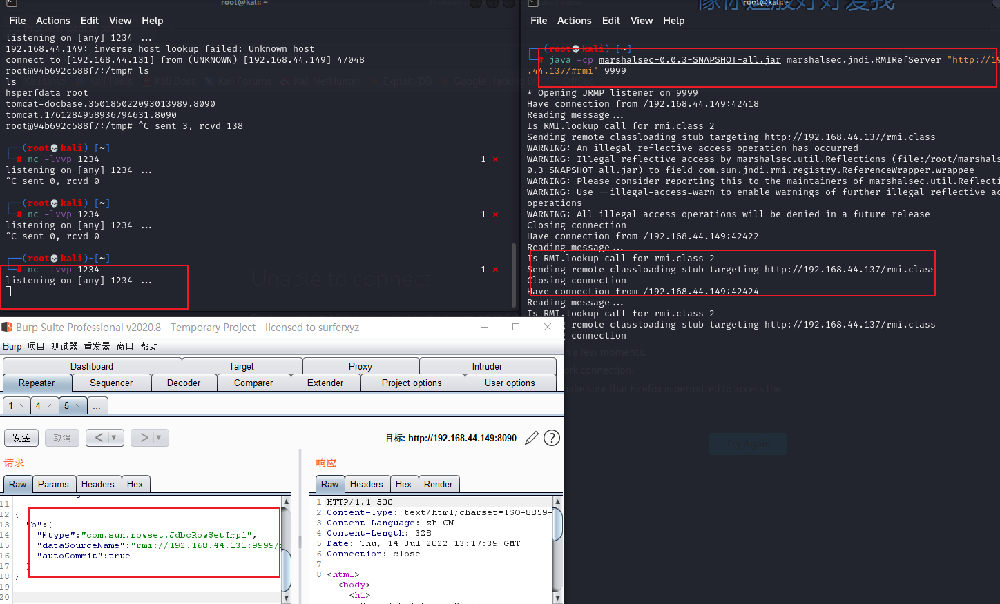

AutoType @type记录了该原始类 json数据反序列化后会生成一个名为fruit的对象，他是以apple类反序列化过来的对象 JSON.parse方法，并且调用了parse()方法继续进行JSON格式的匹配
会通过scanSymbol方法获取到双引号之间的字符串也就是@type，之后会获取@type字段的值，并且尝试获取这个类的Class，经过一系列的判断后，调用了deserializer.deserialize方法来对该class类进行反序列化。
parseField方法，进入该方法后，就会调用setValue(object, value)方法，在这里，会执行构造的恶意代码，最后造成代码执行。

