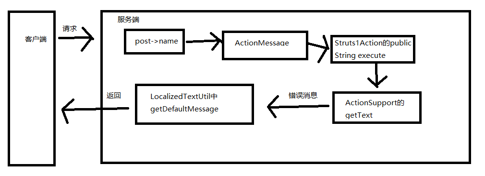
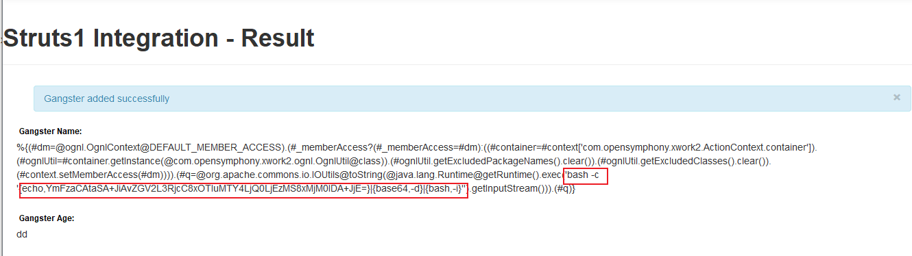
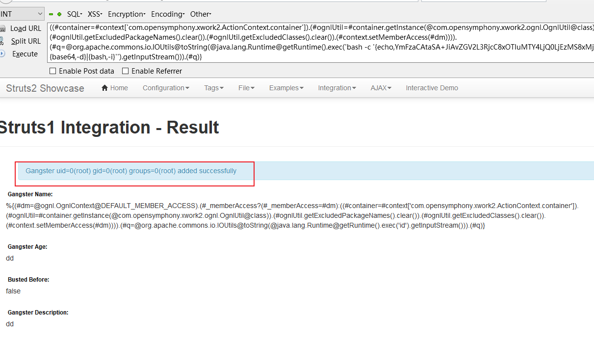

Struts2.3.x中showcase.war中存在一个名为“SaveGangsterAction.java”类，
1. 这个类实现了Struts2中的Struts1.x-core.jar插件中的Action直接将HTTP POST中的name参数值作为key传给ActionMessage类，其中ActionMessage中的key就可以被控制。
2. 接下来会调用org.apache.struts2.s1.Struts1Action的public String execute() throws Exception，调用com.opensymphony.xwork2.ActionSupport的getText(String aTextName)的方法来获取对象的错误消息。
2. 再调用com.opensymphony.xwork2.util.LocalizedTextUtil中以下方法private static GetDefaultMessageReturnArg getDefaultMessage(String key, Locale locale, ValueStack valueStack, Object[] args, String defaultMessage)方法来调用ognl获取对应的错误消息。

