# VPN概述

传统的VPN组网主要采用专线VPN和基于客户端设备的加密VPN两种方式。专线VPN是指用户租用数字数据网（DDN）电路、ATM永久性虚电路（PVC）、帧中继（FR）PVC等组建一个二层的VPN网络，骨干网络由电信运营商进行维护，客户负责管理自身的站点和路由。基于客户端设备的加密VPN则将VPN的功能全部由客户端设备来实现，VPN各成员之间通过非信任的公网实现互联。第一种方式的成本比较高，扩展性也不好；第二种方式对用户端设备及人员的要求较高。

## VPN 分类
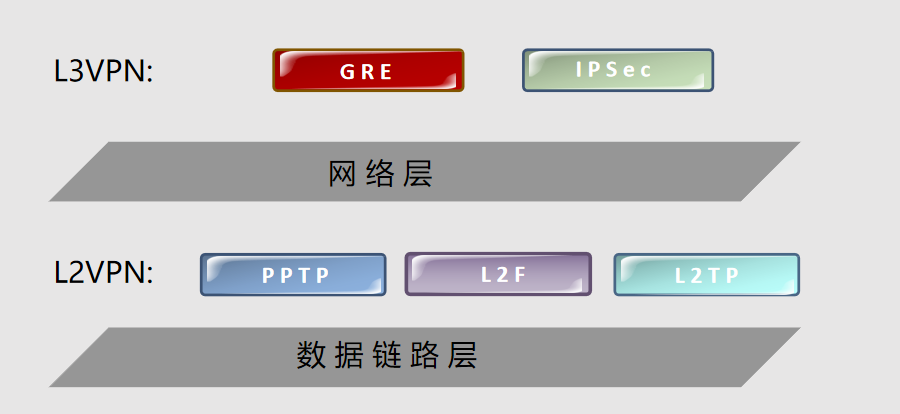
```
L3VPN
三层VPN主要是指VPN技术工作在协议栈的网络层。以IPSec VPN技术为例，IPSec报头与IP报头工作在同一层次，封装报文时或者是以IPinIP的方式进行封装，或者是IPSec报头与IP报头同时对数据载荷进行封装。
除IPSec VPN技术外，主要的三层VPN技术还有GRE VPN。GRE VPN产生的时间比较早，实现的机制也比较简单。GRE VPN可以实现任意一种网络协议在另一种网络协议上的封装。与IPSec相比，安全性没有得到保证，只能提供有限的简单的安全机制。
L2VPN
与三层VPN类似，二层VPN则是指VPN技术工作在协议栈的数据链路层，即数据链路层。二层VPN主要包括的协议有点到点隧道协议（PPTP, Point-to-Point Tunneling Protocol）、二层转发协议（L2F, Layer 2 Forwarding）以及二层隧道协议（L2TP, Layer 2 Tunneling Protocol）。
```
# IPsec VPN基础介绍

## IPSec VPN  
IPSec是IETF定义的一个协议组。通信双方在IP层通过加密、完整性校验、数据源认证等方式，保证了IP数据报文在网络上传输的机密性、完整性和防重放。

机密性（Confidentiality）指对数据进行加密保护，用密文的形式传送数

完整性（Data integrity）指对接收的数据进行认证，以判定报文是否被篡

防重放（Anti-replay）指防止恶意用户通过重复发送捕获到的数据包所进行的攻击，即接收方会拒绝旧的或重复的数据包
## VPN常见技术


**隧道技术**
隧道技术是VPN技术中最关键的技术。隧道技术是指在隧道的两端通过封装以及解封装技术在公网上建立一条数据通道，使用这条通道对数据报文进行传输。隧道是由隧道协议形成的，分为第二、三层隧道协议。二层隧道协议，使用二层网络协议进行传输，它主要应用于构建远程访问虚拟专网，第二层隧道协议主要有L2F、PPTP、L2TP等。L2TP协议是目前IETF的标准，由IETF融合PPTP与L2F而形成；三层隧道协议，用于传输三层网络协议，它主要应用于构建企业内部虚拟专网和扩展的企业内部虚拟专网，主要的第三层隧道协议有VTP、IPSec等。IPSec（IP Security）由多个协议组成，并通过这个协议集来提供安全协议选择、安全算法，确定服务所使用密钥等服务，从而在IP层提供安全保障。
**数据认证技术和身份认证技术**
数据认证技术主要保证数据在网络传输过程中不被非法篡改。数据认证技术主要采用哈希算法，由于哈希算法的不可逆特性以及理论上的结果唯一性，因此在摘要相同的情况下可以保证数据没被篡改过。
身份认证技术主要保证接入VPN的操作人员的合法性以及有效性，主要采用“用户名密码”方式进行认证，对安全性较高的还可以使用USB KEY等认证方式。
**加解密技术**
加解密技术是数据通信中一项较成熟的技术，VPN技术可以借助加解密技术保证数据在网络中传输时不被非法获取。即当数据被封装入隧道后立即进行加密，只有当数据到达隧道对端后，才能由隧道对端对数据进行解密。
**密钥管理技术**
密钥管理技术在VPN中的主要任务是在不安全的公用数据网上安全地传递密钥而不被窃取。最典型的应用就是IKE技术，IKE技术主要被IPSec VPN所借用，具体原理将在随后章节进行介绍。

## 数据加密  
加密算法：对称式加密和非对称式加密
对称式加密：加密和解密是同一个密钥
非对称式加密：加密和解密通常使用两个密钥

### 数据加密 -对称式加密
对称式加密过程
1.发送方将原始数据和加密密钥一起经过加密算法后变成密文发送出去
2.接收方收到后，用密钥和相同算法的逆算法对密文进行解密
特点
算法公开、计算量小、加密速度快、加密效率高
安全性得不到保障
在分布式网络上密钥管理困难
缺少签名功能
加密算法
DES、3DES、AES

### 数据加密 -非对称式加密
非对称式加密过程
1.A和B都产生一对用于加密和解密的公钥和私钥
2.A把A的公钥告诉B，B把B的公钥告诉A
3.A给B发送消息时，用B的公钥加密
4.B收到消息后，用自己的密钥解密
特点
算法强度复杂，密钥分发简单，安全性更高
加密解密速度慢于对称式加密
加密算法
RSA 、Elgamal、背包算法、Rabin、D-H、ECC (椭圆曲线加密算法)
目前的主流方式
数据用对称式加密，密钥用对方的公钥加密，源认证的问题
### 数据完整性
数据完整性的保证：哈希算法
哈希算法
MD5、SHA
不可逆和雪崩效应
哈希过程
比较哈希值，保证数据完整性
### 数字证书
数字证书：
提供了一种在Internet上验证通信实体身份的方式
由权威机构——CA机构，又称为证书授权（Certificate Authority）中心发行
**过程**

1.对数据哈希，得到一个哈希值
2.用私钥对哈希值加密，得到数字签名
3.把数据、数据签名、数字证书对称式加密，得到密文
4.把对称式的密钥用B的公钥加密，得到数字信封
5.把密文放信封里发送给B

1.B用自己的私钥解开数字信封
2.用对称密钥解密，得到数据、数字签名、数字证书
3.数字证书里有A的公钥和A的名称，保证源认证
4.用A的公钥对数字签名解密，得到哈希值
5.收到的数据进行哈希，和得到的哈希值进行比较

# IPsec VPN原理
## 架构
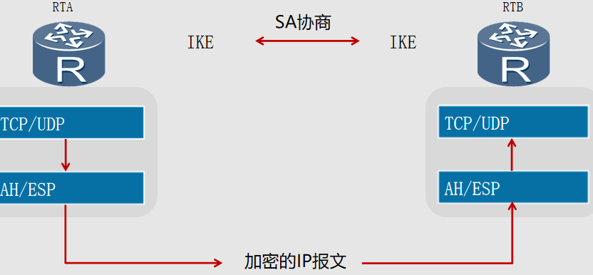
IPSec不是一个单独的协议，它通过AH和ESP这两个安全协议来实现IP数据报文的安全传送。
IKE协议提供密钥协商，建立和维护安全联盟SA等服务。
## 安全联盟SA
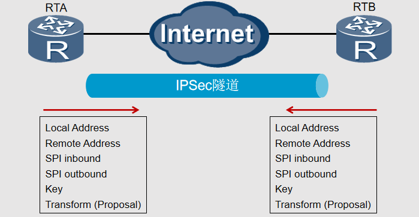
安全联盟定义了IPSec对等体间将使用的数据封装模式、认证和加密算法、密钥等参数。
安全联盟是单向的，两个对等体之间的双向通信，至少需要两个SA。
## 密钥保护
密钥生存周期
密钥生命周期设置决定何时把旧密钥替换成新密钥。密钥生命周期决定了在一定的时间段内，新旧密钥交替的周期。例如，在某业务通信中需要1000秒，而我们设定密钥生命周期为100秒，那么整个数据报文传输期间将会产生10个密钥。由于在此业务通信周期内使用了10个密钥，即使攻击者破解了某个密钥对数据报文进行解密处理，也无法实现对所有数据报文的解密。
完美向前保密（PFS）
完美向前保密，即每一密钥均是“独一无二”的，这样一个密钥被破解，并不影响其他密钥的安全性，因为这些密钥间没有派生关系。所以若有攻击者破解了一个密钥后，只能访问受这个密钥保护的所有数据报文，而受其它密钥保护的数据报文还是无法破解。 PFS是由DH算法保障的。此特性是通过在IKE阶段2的协商中增加密钥交换来实现的。
Diffie-Hellman (DH) 组
DH算法是一种公共密钥算法。通信双方在不传送密钥的情况下通过交换一些数据，计算出共享的密钥。加密的前提是交换加密数据的双方必须要有共享的密钥。IKE的精髓在于它永远不在不安全的网络上直接传送密钥，而是通过一系列数据的交换，最终计算出双方共享的密钥。即使第三方（如黑客）截获了双方用于计算密钥的所有交换数据，也不足以计算出真正的密钥。IKE共定义了5个DH组，组1定义的密钥长度为768位；组2长度为1024位。密钥长度越长，所生成的密钥安全度也就越高，越难被破译。DH组的选择很重要，因为DH组只在第一阶段的SA协商中确定，第二阶段的协商不再重新选择DH组，两个阶段使用的是同一个DH组，因此该DH组的选择将影响所有“会话密钥”的生成。在协商过程中，对等的实体间应选择同一个DH组，即密钥长度应该相等。若DH组不匹配，将视为协商失败。 
## IKE--互联网密钥交换协议
IKE的3个任务：
对建立IPSec的双方进行认证
通过密钥交换，产生用于加密和HMAC的随机密钥
协商协议参数：加密协议，散列函数，封装协议，封装模式，密钥有效期
IKE协商方式：
手工方式(manual)方式
IKE 自动协商(isakmp)方式
## IKE的2个阶段
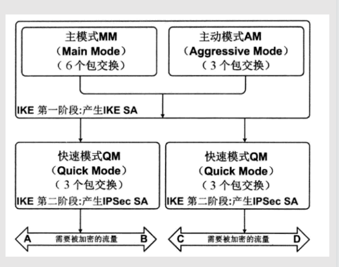
第一阶段的主要目的
对建立IPSec的双方进行认证，确保只有合法的对等体才能建立IPSec VPN协商的结果就是IKE SA

第二阶段的主要目的
根据需要加密实际流量，协商保护流量的策略
# IPsec 协议封装模式
## AH协议
AH是一种基于IP的传输层协议，协议号为51。其工作原理是在每一个数据包的标准IP报头后面添加一个AH报文头。AH对数据包和认证密钥进行Hash计算，接收方收到带有计算结果的数据包后，执行同样的Hash计算并与原计算结果比较，传输过程中对数据的任何更改将使计算结果无效，这样就提供了数据来源认证和数据完整性校验。SPI:IPSec安全参数索引，用于唯一标识IPSec安全联盟
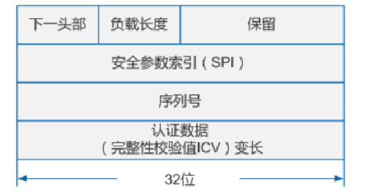
```
下一头部:8比特
标识AH报文头后面的负载类型。传输模式下，是被保护的上层协议（TCP或UDP）或ESP协议的编号；隧道模式下，是IP协议或ESP协议的编号。
说明：当AH与ESP协议同时使用时，AH报文头的下一头部为ESP报文头。
负载长度:8比特
表示以32比特为单位的AH报文头长度减2，缺省为4。
SPI:32比特
IPSec安全参数索引，用于唯一标识IPSec安全联盟。
序列号
32比特
是一个从1开始的单项递增的计数器，唯一地标识每一个数据包，用于防止重放攻击。
认证数据
一个变长字段，长度为32比特的整数倍，通常为96比特。
该字段包含数据完整性校验值 ICV（Integrity Check Value），用于接收方进行完整性校验。可选择的认证算法有MD5、SHA1、SHA2、SM3。
```
## ESP协议
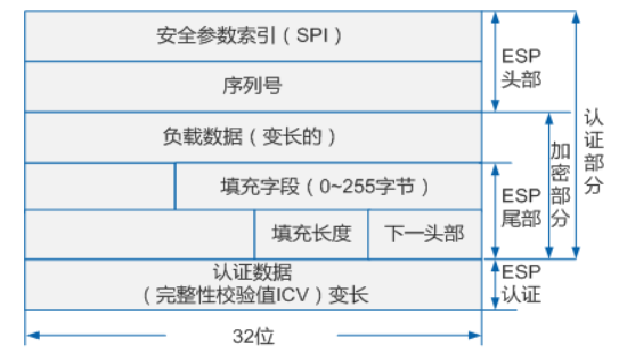
ESP是一种基于IP的传输层协议，协议号为50。其工作原理是在每一个数据包的标准IP报头后面添加一个ESP报文头，并在数据包后面追加一个ESP尾（ESP Tail和ESP Auth data）。与AH不同的是，ESP将数据中的有效载荷进行加密后再封装到数据包中，以保证数据的机密性，但ESP没有对IP头的内容进行保护。
## AH协议和ESP协议比较
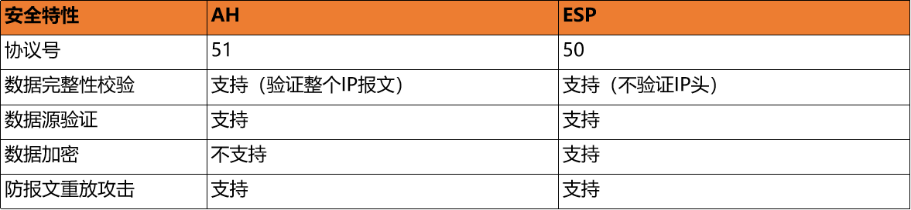
## IPSec传输模式
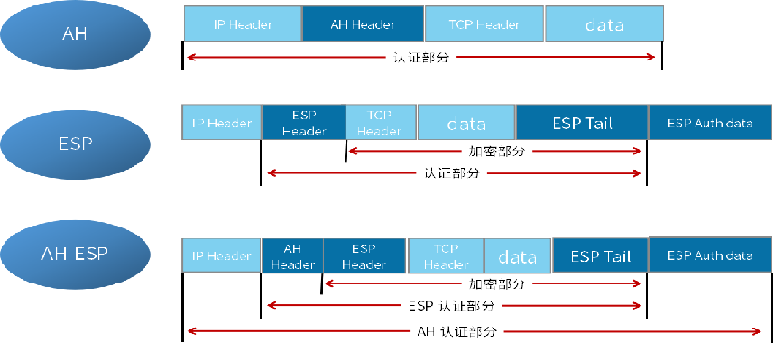
在传输模式下， AH或ESP报头位于IP报头和传输层报头之间，AH或ESP主要对上层协议数据提供保护。
传输模式中的AH：在IP头部之后插入AH头，对整个IP数据包进行完整性校验。
传输模式中的ESP：在IP头部之后插入ESP头，在数据字段后插入尾部以及认证字段。对高层数据和ESP尾部进行加密，对IP数据包中的ESP报文头，高层数据和ESP尾部进行完整性校验。
传输模式中的AH+ESP：在IP头部之后插入AH和ESP头，在数据字段后插入尾部以及认证字段。
## IPSec隧道模式
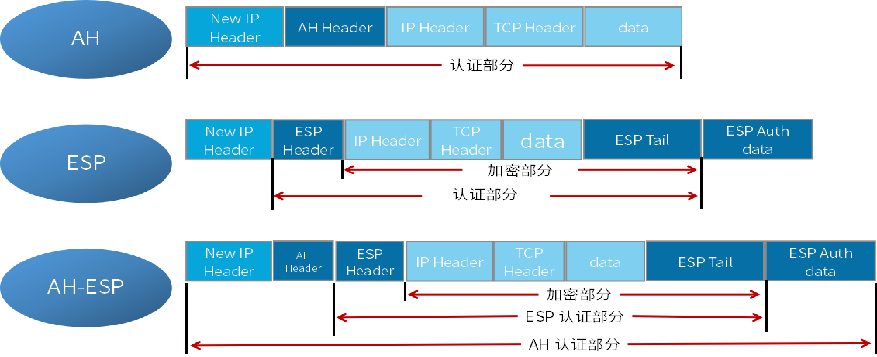
隧道模式中，AH或ESP头封装在原始IP报文头之前，并另外生成一个新的IP头封装到AH或ESP之前。隧道模式可以完全地对原始IP数据报进行认证和加密，并可以使用IPSec对等体的IP地址来隐藏客户机的IP地址。
隧道模式中的AH：对整个原始IP报文提供完整性检查和认证，认证功能优于ESP。
隧道模式中的ESP：对整个原始IP报文和ESP尾部进行加密，对ESP报文头、原始IP报文和ESP尾部进行完整性校验。
隧道模式中的AH+ESP：对整个原始IP报文和ESP尾部进行加密，AH、ESP分别会对不同部分进行完整性校验。

# Ipsec VPN配置案例
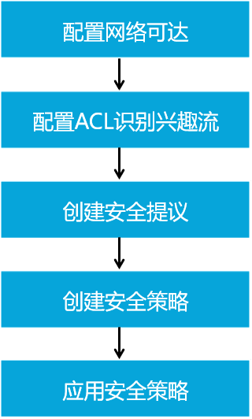
```
配置IPSec VPN的步骤如下：
首先需要检查报文发送方和接收方之间的网络层可达性，确保双方只有建立IPSec VPN隧道才能进行IPSec通信。
第二步是定义数据流。因为部分流量无需满足完整性和机密性要求，所以需要对流量进行过滤，选择出需要进行IPSec处理的兴趣流。可以通过配置ACL来定义和区分不同的数据流。
第三步是配置IPSec安全提议。IPSec提议定义了保护数据流所用的安全协议、认证算法、加密算法和封装模式。安全协议包括AH和ESP，两者可以单独使用或一起使用。AH支持MD5和SHA-1认证算法；ESP支持两种认证算法（MD5和SHA-1）和三种加密算法（DES、3DES和AES）。为了能够正常传输数据流，安全隧道两端的对等体必须使用相同的安全协议、认证算法、加密算法和封装模式。如果要在两个安全网关之间建立IPSec隧道，建议将IPSec封装模式设置为隧道模式，以便隐藏通信使用的实际源IP地址和目的IP地址。
第四步是配置IPSec安全策略。IPSec策略中会应用IPSec提议中定义的安全协议、认证算法、加密算法和封装模式。每一个IPSec安全策略都使用唯一的名称和序号来标识。IPSec策略可分成两类：手工建立SA的策略和IKE协商建立SA的策略。
第五步是在一个接口上应用IPSec安全策略。
```

## 配置采用IKE协商方式建立IPSec隧道
配置接口的IP地址和到对端的静态路由，保证两端路由可达。
配置ACL，以定义需要IPSec保护的数据流。
配置IPSec安全提议，定义IPSec的保护方法。
配置IKE对等体，定义对等体间IKE协商时的属性。
配置安全策略，并引用ACL、IPSec安全提议和IKE对等体，确定对何种数据流采取何种保护方法。
在接口上应用安全策略组，使接口具有IPSec的保护功能。
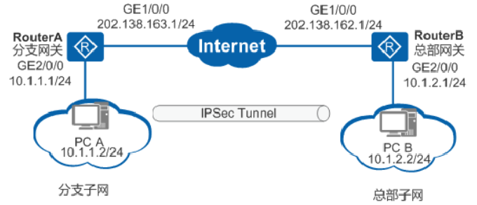
## 配置IKE对等体
```
配置默认ipsec sa：[RouterA]ipsec proposal tys1
配置IKE安全提议
[RouterA] ike proposal 5
[RouterA-ike-proposal-5] encryption-algorithm aes-128
[RouterA-ike-proposal-5] authentication-algorithm sha2-256
[RouterA-ike-proposal-5] dh group14
[RouterA-ike-proposal-5] quit
配置IKE对等体，并根据默认配置，配置预共享密钥和对端ID
[RouterA] ike peer spub v1
[RouterA-ike-peer-spub] ike-proposal 5
[RouterA-ike-peer-spub] pre-shared-key cipher huawei@123
[RouterA-ike-peer-spub] remote-address 202.138.162.1
[RouterA-ike-peer-spub] quit
```
## 配置IKE动态协商方式安全策略。
```
配置IPsec安全策略组
[RouterA] ipsec policy map11 10 isakmp
[RouterA-ipsec-policy-isakmp-map1-10] ike-peer spub
[RouterA-ipsec-policy-isakmp-map1-10] proposal tys1
[RouterA-ipsec-policy-isakmp-map1-10] security acl 3101
[RouterA-ipsec-policy-isakmp-map1-10] quit

接口上引用安全策略组
[RouterA] interface gigabitethernet 1/0/0
[RouterA-GigabitEthernet1/0/0] ipsec policy map11
[RouterA-GigabitEthernet1/0/0] quit
display ike sa命令用来查看由IKE协商建立的安全联盟信息。
display ike statistics用来查看IKE运行统计信息。

```
## GRE over IPSec原理
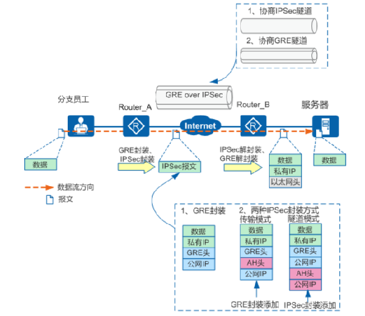
GRE over IPSec可利用GRE和IPSec的优势，通过GRE将组播、广播和非IP报文封装成普通的IP报文，通过IPSec为封装后的IP报文提供安全地通信，进而可以提供在总部和分支之间安全地传送广播、组播的业务，例如视频会议或动态路由协议消息等。
## 配置GRE over IPSec
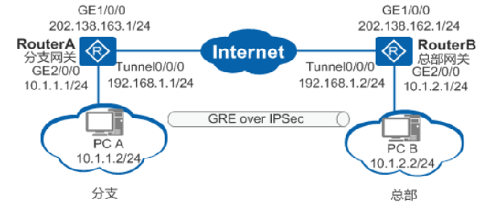
配置物理接口的IP地址和到对端的静态路由，保证两端路由可达。
配置GRE Tunnel接口。
配置IPSec安全提议，定义IPSec的保护方法。
配置IKE对等体，定义对等体间IKE协商时的属性。
配置安全框架，并引用安全提议和IKE对等体。
在Tunnel接口上应用安全框架，使接口具有IPSec的保护功能。
配置Tunnel接口的转发路由，将需要IPSec保护的数据流引到Tunnel接口。
## 配置IP地址和到对端的静态路由，保证两端路由可达
```
<Huawei> system-view
[Huawei] sysname RouterA
[RouterA] interface gigabitethernet 1/0/0 
[RouterA-GigabitEthernet1/0/0] ip address 202.138.163.1 255.255.255.0
[RouterA-GigabitEthernet1/0/0] quit
[RouterA] interface gigabitethernet 2/0/0
[RouterA-GigabitEthernet2/0/0] ip address 10.1.1.1 255.255.255.0
[RouterA-GigabitEthernet2/0/0] quit
[RouterA] ip route-static 202.138.162.0 255.255.255.0 202.138.163.2
```
## 配置GRE Tunnel接口
```
[RouterA] interface tunnel 0/0/0
[RouterA-Tunnel0/0/0] ip address 192.168.1.1 255.255.255.0
[RouterA-Tunnel0/0/0] tunnel-protocol gre
[RouterA-Tunnel0/0/0] source 202.138.163.1  （两端取反）
[RouterA-Tunnel0/0/0] destination 202.138.162.1 （两端取反）
[RouterA-Tunnel0/0/0] quit
```
## 创建IPSec安全提议

```
[RouterA] ipsec proposal tran1
[RouterA-ipsec-proposal-tran1] esp authentication-algorithm sha2-256
[RouterA-ipsec-proposal-tran1] esp encryption-algorithm aes-128
配置IKE安全提议
[RouterA] ike proposal 5
[RouterA-ike-proposal-5] authentication-algorithm sha2-256
[RouterA-ike-proposal-5] encryption-algorithm aes-128
[RouterA-ike-proposal-5] dh group14
配置IKE对等体
[RouterA] ike peer spub
[RouterA-ike-peer-spub] ike-proposal 5
[RouterA-ike-peer-spub] pre-shared-key cipher Huawei@1234
[RouterA-ike-peer-spub] quit

```
## 创建IPsec安全框架
```
[RouterA] ipsec profile profile1
[RouterA-ipsec-profile-profile1] proposal tran1
[RouterA-ipsec-profile-profile1] ike-peer spub
[RouterA-ipsec-profile-profile1] quit

隧道口调用Ipsec安全框架
[RouterA] interface tunnel 0/0/0
[RouterA-Tunnel0/0/0] ipsec profile profile1
[RouterA-Tunnel0/0/0] quit 

```
## 配置Tunnel接口的转发路由

```
配置Tunnel接口的转发路由，将需要IPSec保护的数据流引到Tunnel接口
[RouterA] ip route-static 10.1.2.0 255.255.255.0 tunnel 0/0/0 

```


**配GRE的应用场景有哪些?**
GRE可以解决异种网络的传输问题；GRE隧道扩展了受跳数限制的路由协议的工作范围，支持企业灵活设计网络拓扑；GRE可以与IPSec结合来实现加密传输组播数据。
display interface tunnel命令显示的信息中会包含Internet Address和Tunnel source，
**这两者的区别是什么?**
Internet Address代表建立GRE隧道所用的虚拟隧道地址，Tunnel source表示隧道的起点，是设备的出接口物理地址。


