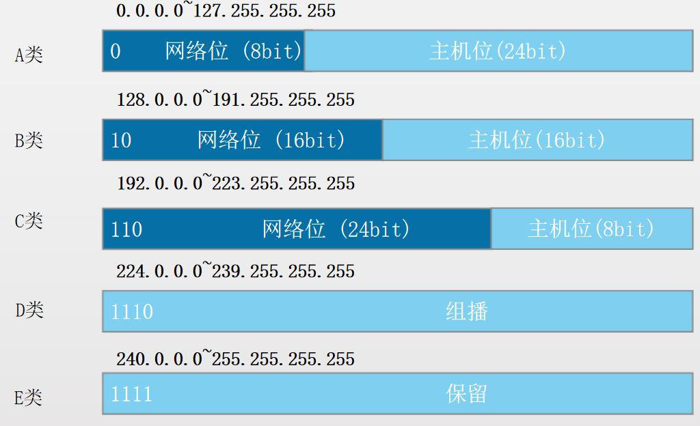

分割方式 32位点分十进制

|     |     |
| --- | --- |
| 网络位 | 主机位 |
| 192.168.1 | .1  |
| 11000000.10101000.00000001 | .00000001 |

子网掩码

|     |     |
| --- | --- |
| 255.255.255 | .0  |
| 1111111.1111111.1111111 | .00000000 |

网络地址

|     |     |
| --- | --- |
| 192.168.1 | .0  |
| 11000000.10101000.00000001 | .00000000 |

广播地址

|     |     |
| --- | --- |
| 192.168.1 | .255 |
| 11000000.10101000.00000001 | .11111111 |

IP地址数量 2^n-2  n 主机位数

IP地址范围：网络地址+1，广播地址-1

分类

IP地址类型

- 公有ip地址
    
- 私有ip地址范围
    

10.0.0.0~10.255.255.255

172.16.0.0~172.31.255.255

192.168.0.0~192.168.255.255

- 特殊地址

127.0.0.0~127.255.2·55.255 本地测试使用

0.0.0.0

255.255.255.255

子网划分

可变长子网掩码

192.168.44.0               0 000000 子网一

192.168.44.128           1 000000 子网二

计算

1.你所选择的子网掩码将会产生多少个子网?

2的x次方（x：子网位数）

2.每个子网能有多少主机?

2的y次方-2（y：主机位数）

3.有效子网（块大小）?

块大小=2的y次方（y：主机位数）

(结果叫做block size 或base number)

4.每个子网的广播地址是?

主机位全为1。（广播地址=下个子网号-1）

5.每个子网的有效主机分别是?

忽略子网内全为0和全为1的地址，剩下的就是有效主机地址。

子网划分策略‘

平均（等分） 分蛋糕 越大越优先