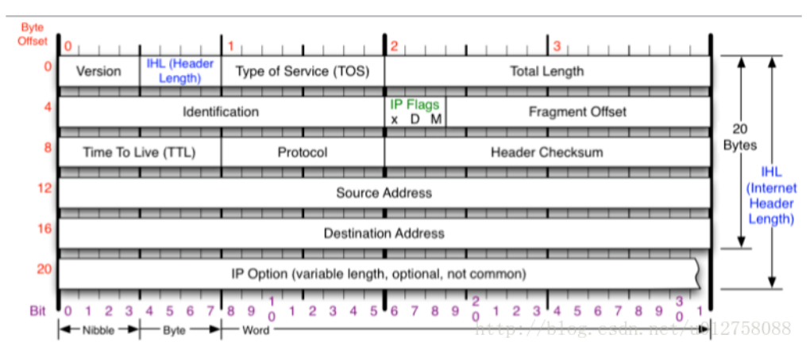

# 网络通信模型

OSI TCP/IP IPX/SPX SNA

|     |     |     |     |     |
| --- | --- | --- | --- | --- |
| 局域网 |     | 广域网 |     |     |
| 802.2 | 以太网 | 帧中继 | PPP | HDLC |

# OSI七层模型

|     |     |     |     |     |
| --- | --- | --- | --- | --- |
| 层数  | 作用  | 封装与解封装 | 数据单元 |     |
| 应用层 | 提供网络服务 | Hello | APDU |     |
| 表示层 | 数据格式化，加密，解密 | Hello | PPDU |     |
| 会话层 | 建立，维护，管理会话连接 | Hello | SPDU |     |
| 传输层 | 建立，维护，管理端到端的连接 | TCP/UDP报头+ | segment(段) |     |
| 网络层 | IP寻址和路由选择 | IP报头+ | Packet（包） |     |
| 数据链路层 | 控制网络层和物理层之间的通信 | mac层++FCS | Frame(帧) |     |
| 物理层 | 比特流传输 | 010101 | Bit(比特） |     |

# 单播组播广播

mac帧

|     |     |     |
| --- | --- | --- |
| 7bit | 0/1 | 其他  |

0 单播 1组播

|     |     |     |     |     |     |
| --- | --- | --- | --- | --- | --- |
| FF  | FF  | FF  | FF  | FF  | FF  |

全为1 即FF 广播

# 常见网络设备

CSMA/CD 载波监听多路访问技术

**先听后发，边发边听，冲突停发，随机延迟后再发。**

|     |     |     |     |
| --- | --- | --- | --- |
|     | 集线器 | 交换机 | 路由器 |
| 工作层次 | 物理层 | 数据链路层 | 网络层 |
| 宽带影响 | 共享  | 独享  | 共享  |
| 转发依据 | mac地址 | mac地址 | IP地址 |
| 数据传输形式 | 电信号 | 帧/包 | 包   |
| 传输模式 | 半双工 | 半双工/全双工 | 全双工 |
| 功能  | 信号放大和传输作用 | 连接局域网中的终端 | 连接不同的网络 |
| 传输方式 | 单播/多播/广播 | 先广播 再单播/多播 | 先广播 再单播/多播 |
| 冲突域 | 一个冲突域 | 分割  | 分割  |
| 广播域 | 一个广播域 | 一个广播域 | 分割  |

# 以太网帧格式

数据链路层

Ethernet Ⅱ帧格式

|     |     |     |     |     |     |
| --- | --- | --- | --- | --- | --- |
| 7byte | 6byte | 6byte | 2type | 46-1500type | 4byte |
| 前导字符 | 目标mac | 源mac | 以太网类型（type） | 数据/载荷（data） | 校验位（FCS） |

802.3帧格式

|     |     |     |     |     |     |     |     |
| --- | --- | --- | --- | --- | --- | --- | --- |
| 7byte | 6byte | 6byte | 2type |     |     | 46-1500type | 4byte |
| 前导字符 | 目标 mac | 源mac | 长度（Length） | DSAP(目的服务访问点) | SSAP(源服务访问点) | 数据/载荷(data) | 校验位（FCS） |

物理层

mac 地址

24bit OUI厂商代号 +24bit 厂商自定义

# 报文

数据链路层

网络层

# OSI优缺点

1.  促进标准化工作；
    
    各层间结构上相互独立，把网络操作分成低复杂性单元；
    
    灵活性好，某一层变化不会影响到其他层；
    
    各层间通过一个“接口”实现上下层通信；
    
    易于实现和维护；
    
    便于学习；
    
2.  许多功能在多个层次重复，有冗余感（如流控，差错控制等）
    各层功能分配不均匀（链路、网络层任务重，会话层任务轻）
    功能和服务定义复杂，很难产品化（实际应用中几乎没有完全按OSI七层模型设计的产品）