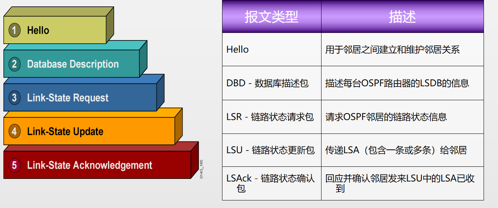
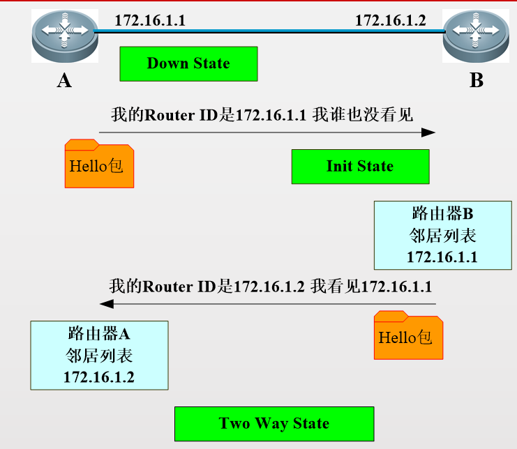
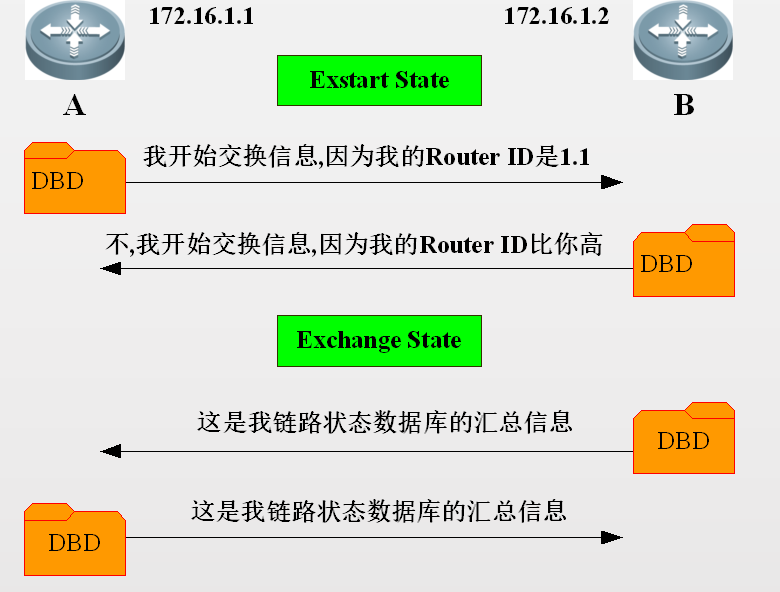
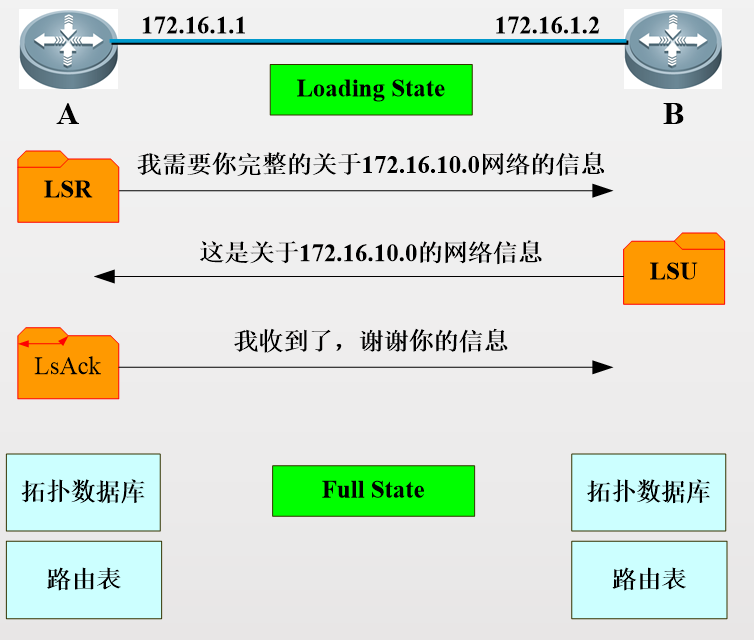

# 概述

- OSPF，Open Shortest Path First 开放式最短路径优先
- OSPF是由IETF开发的一种链路状态路由协议
- 管理距离：10
- 采用SPF算法（Dijkstra算法）计算到达目的地的最短路径
- 链路（link） → 路由器接口
- 状态（state） → 描述接口及其与邻居路由器间的关系

# 工作原理

## 链路状态路由协议

1.  声明路由器标识
2.  创建邻居表
3.  学习链路关系 建立链路关系表

## RouterID

Router ID（RID）
是在OSPF区域内唯一标识一台路由器的IP地址
Router ID选取规则：
1、用命令手动指定的RouterID，最优先
2、活动的物理接口最大的IP地址为RouterID

## OSPF 三张表

邻居表
列出本地路由器全部已经建立邻接关系的邻居路由器信息；
链路状态数据库（LSDB）列出网络中其他路由器的信息，由此显示了全网的网络拓扑；
路由表
列出通过SPF算法计算出的到达每个相连网络的最佳路径；

## OSPF 最短路径树生成

# OSPF 建立邻接关系过程

## OSPF报文

hello

OSPF的邻接关系的建立和维持是依赖于hello包的

Hello包的发送周期与OSPF类型有关

管理Hello包交换的规则是Hello协议

Hello用来确定DR、BDR路由器的选择

工作过程

邻居发现

路由通告

# OSPF区域划分

# OSPF配置