# 应用层

协议栈

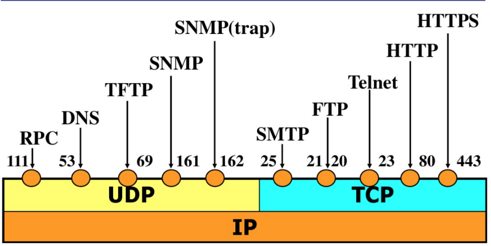

# 传输层

TCP

提供面向连接的、可靠的、有序的、流量控制的传输服务

UDP

提供无连接、不可靠的、无序的、无流量控制的传输服务

通过端口号区分上层应用

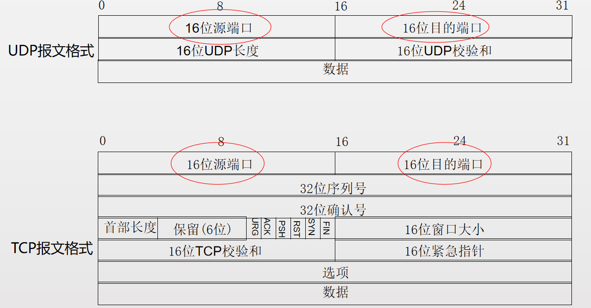

三次握手四次挥手

Flag字段(8位)

ACK

确认号标志，置1表示确认号有效，表示收到对端的特定数据

RST

复位标志，置1表示拒绝错误和非法的数据包，复位错误的连接

Reset the connection 重置连接

用于复位因某种原因导致的错误连接，也用来拒绝非法数据和请求。如果接收到RST位时候，通常发生了某些错误

Rst可能被接收方或者中间设备置位

RST置位的原因

服务器端口没有打开（listen）

服务器响应太慢，用户终止连接

网络攻击

其他

SYN

同步序号标志，置1表示同步序号，用来建立连接

FIN

结束标志，置1表示连接将被断开，用于拆除连接

Option字段

MSS 最大段大小，通过置位，协商能承载的TCP数据的大小

Maximum Segment Size 最大段的大小

只在建立连接时置位，用于协商双方能接收的段 （segment）的大小（TCP的数据部分）

MSS=MTU-TCP头部-IP头部，可以根据需要人为调整

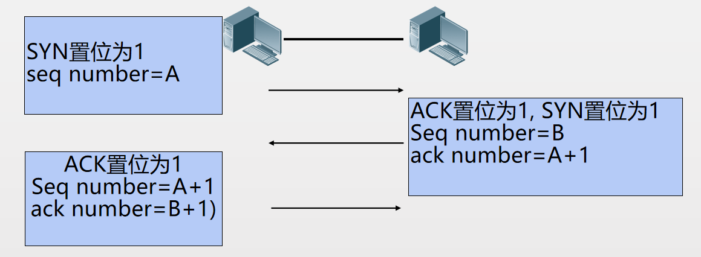

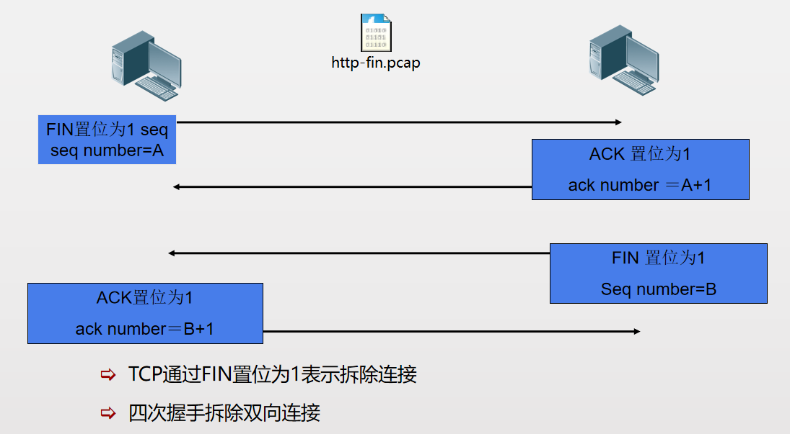

TCP 重传机制

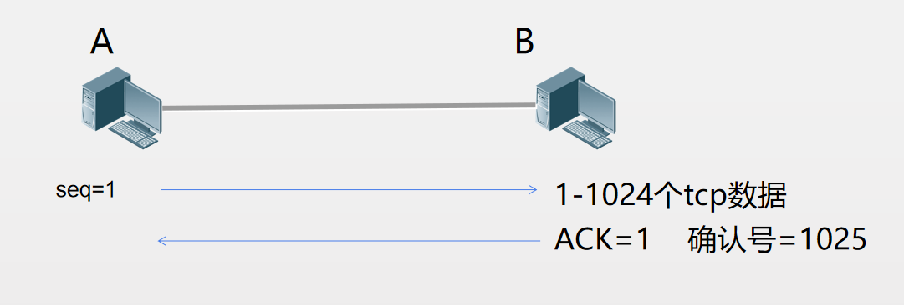

# 网络层

提供主机到主机的传输服务

通过IP地址标识主机

IP

提供主机到主机的传输服务

ICMP

辅助IP工作，提供出错和控制信息

ARP

提供IP和MAC地址之间的映射

IPV4 报文

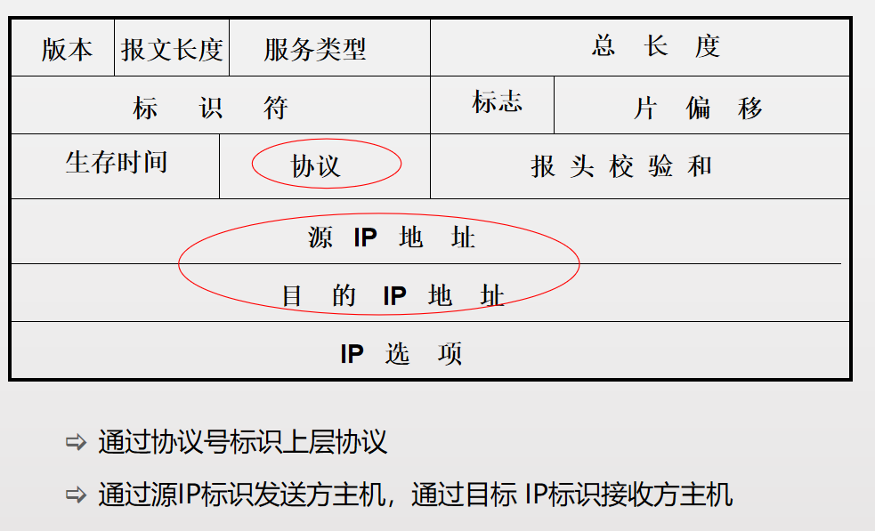

ARP协议

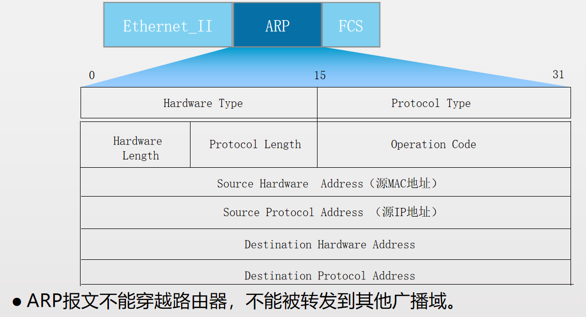

工作过程

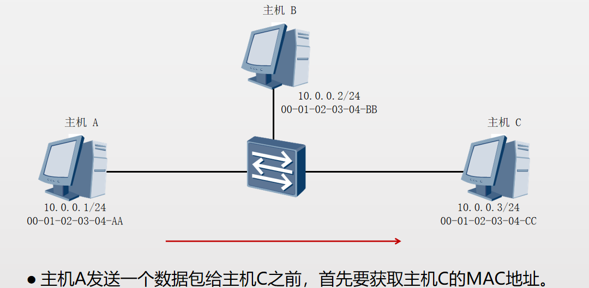

ARP缓存

ARP缓存用来存放IP地址和MAC地址的关联信息。在发送数据前，设备会先查找ARP缓存表。

如果缓存表中不存在相应信息，则通过发送ARP Request报文来获得它。学习到的IP地址和MAC地址的映射关系会被放入ARP缓存表中存放一段时间。

在有效期内，设备可以直接从这个表中查找目的MAC地址来进行数据封装，而无需进行ARP查询。过了这段有效期，ARP表项会被自动删除。

如果目标设备位于其他网络，则源设备会在ARP缓存表中查找网关的MAC地址，然后将数据发送给网关，网关再把数据转发给目的设备。

ARP请求

arp request 网关广播 获取mac  检查是否匹配 缓存

ARP响应

收到广播包 如果与自身相匹配 返回响应包 arp reply 单播

ARP代理

目标主机和源主机处于不同网络内 路由器会将自己与目标处于同一网段的端口的mac地址来回应

免费ARP

当主机IP改变时 发送arp广播包 查看网络中是否有ip冲突

# ICMP

ICMP用来传递差错、控制、查询等信息

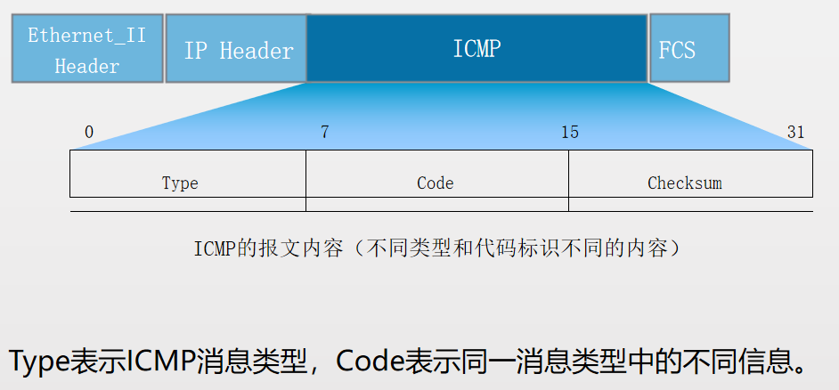

ICMP消息类型和编码类型

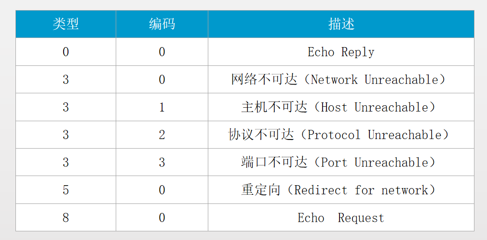

应用

**ping**

Ping常用的配置参数说明如下：

1\. -a source-ip-address指定发送ICMP ECHO-REQUEST报文的源IP地址。如果不指定源IP地址，将采用出接口的IP地址作为ICMP ECHO-REQUEST报文发送的源地址。

2\. -c count指定发送ICMP ECHO-REQUEST报文次数。缺省情况下发送5个ICMP ECHO-REQUEST报文。

3\. -h ttl-value指定TTL的值。缺省值是255。

4\. -t timeout指定发送完ICMP ECHO-REQUEST后，等待ICMP ECHO-REPLY的超时时间。

**tracert**

Tracert常用的配置参数说明如下：

-a source-ip-address指定tracert报文的源地址。

-f first-ttl指定初始TTL。缺省值是1。

-m max-ttl指定最大TTL。缺省值是30。

-name使能显示每一跳的主机名。

-p port指定目的主机的UDP端口号。

# 数据链路层

在相邻节点间提供数据传输服务

局域网

IEEE802.2 定义LLC子层

IEEE802.3 以太网标准 II

广域网

HDLC

PPP

Frame Relay

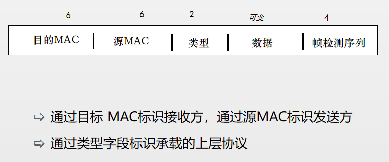

# 物理层

为数据传输提供物理通道

物理层介质

双绞线、同轴电缆、光纤、无线等

局域网

10Base-T、100Base-TX/FX。。。

广域网

RS-232、V.24、V.35