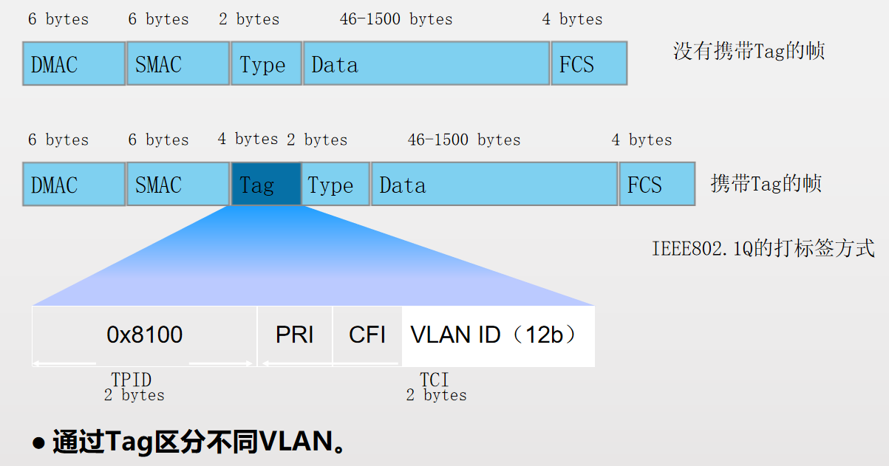
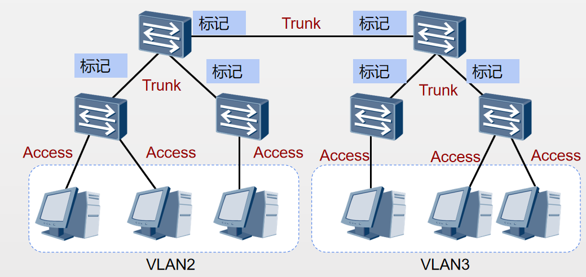
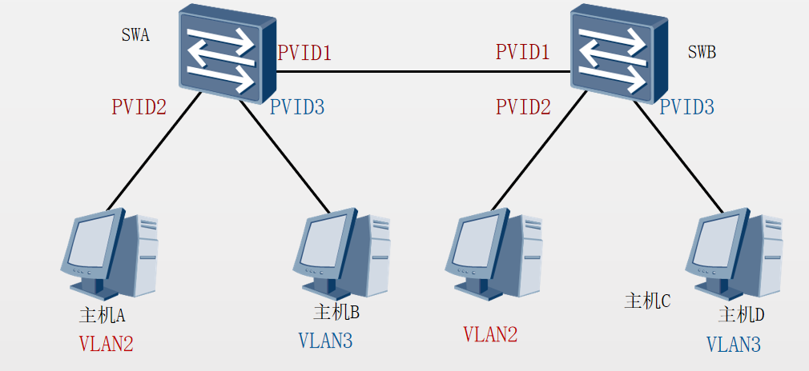
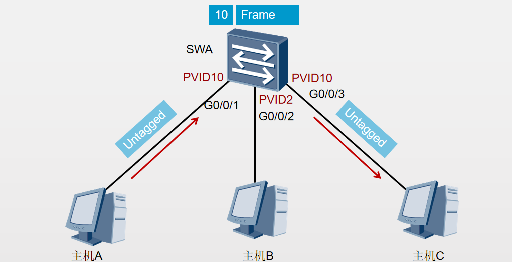
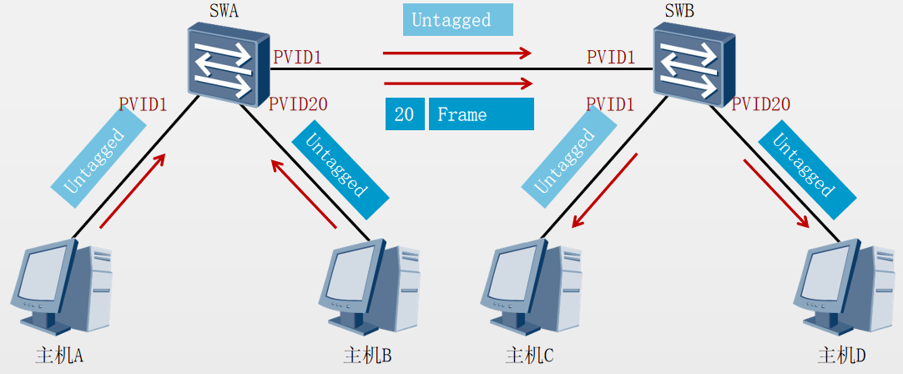
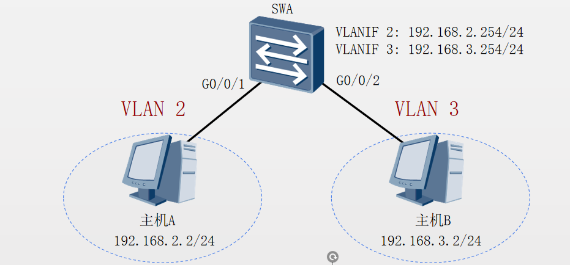

# vlan的基本原理

VLAN（Virtual Local Area Network）即虚拟局域网，是将一个物理的局域网在逻辑上划分成多个广播域的技术。通过在交换机上配置VLAN，可以实现在同一个VLAN内的用户可以进行二层互访，而不同VLAN间的用户被二层隔离。这样既能够隔离广播域，又能够提升网络的安全性。

**VLAN能够隔离广播域。（这是不同vlan不能通信的根本原因）**

vlan划分方法

|     |     |     |
| --- | --- | --- |
|     | vlan5 | vlan10 |
| 基于端口 | G0/0/1, G0/0/7 | G0/0/2 G0/0/9 |
| 基于mac地址 | 00-01-02-03-04-AA<br>00-01-02-03-04-CC | 00-01-02-03-04-BB<br>00-01-02-03-04-DD |
| 基于IP子网划分 | 10.0.1.* | 10.0.2.* |
| 基于协议划分 | IP  | IPX |
| 基于策略 | 10.0.1.* + G0/0/1+ 00-01-02-03-04-AA | 10.0.2.* + G0/0/2 + 00-01-02-03-04-BB |

基于端口的VLAN划分方法在实际中最为常见

vlan互通原理

通过vlan 标志识别vlan



链路类型



用户主机和交换机之间的链路为接入链路（Access）

交换机与交换机之间的链路为干道链路（Trunk）

PVID（缺省VLAN）



PVID表示端口在缺省情况下所属的VLAN。

缺省情况下，华为交换机每个端口的PVID都是1。

当端口收到Untagged数据帧时，交换机将给它加上该缺省VLAN的VLAN Tag。

端口类型-Access



Access端口在收到数据后会添加VLAN Tag，VLAN ID和端口的PVID相同。

Access端口在转发数据前会移除VLAN Tag。

端口类型-Trunk



当Trunk端口收到帧时，如果该帧不包含Tag，将添加上端口的PVID；如果该帧包含Tag，则不改变。

当Trunk端口发送帧时，该帧的VLAN ID在Trunk的允许发送列表中：若与端口的PVID相同时，则剥离Tag发送；若与端口的PVID不同时，则直接发送。

VLAN配置
```
[SWA]vlan 10  声明一个
[SWA-vlan10]quit
[SWA]vlan batch 2 to 3 批量 声明
Info: This operation may take a few seconds. Please wait for a moment...done. 

```
配置验证
```

[SWA]display vlan
The total number of vlans is : 4
------------------------------------------------------------
U:Up; D:Down; TG:Tagged; UT:Untagged; MP:Vlan-mapping; ST:Vlan-stacking; #: ProtocolTransparent-vlan; *:Management-vlan;
--------------------------------------------------------------
VID  Type    Ports                                                          
--------------------------------------------------------------
1    common  UT:GE0/0/1(U) ……
2    common  
3    common 
```

Access端口配置
```
[SWA]interface GigabitEthernet 0/0/5
[SWA-GigabitEthernet0/0/5]port link-type access
[SWA-GigabitEthernet0/0/5]interface GigabitEthernet 0/0/7
[SWA-GigabitEthernet0/0/7]port link-type access
```
添加端口到VLAN
```
[SWA]vlan 2
[SWA-vlan2]port GigabitEthernet 0/0/7
[SWA-vlan2]quit
[SWA]interface GigabitEthernet0/0/5 
[SWA-GigabitEthernet0/0/5]port default vlan 3
```
配置验证
```
[SWA]display vlan
The total number of vlans is : 4
------------------------------------------------------------
U:Up; D:Down; TG:Tagged; UT:Untagged; MP:Vlan-mapping; ST:Vlan-stacking; #: ProtocolTransparent-vlan; *:Management-vlan;
--------------------------------------------------------------
VID  Type    Ports                                                          
--------------------------------------------------------------
1    common  UT:GE0/0/1(U) ……
2    common  UT:GE0/0/7(U)                                                      
  common  UT:GE0/0/5(U)
```


# 交换机链路类型

# 交换机通vlan通信

# 交换机跨vlan通信
配置三层交换

```
[SWA]vlan batch 2 3
[SWA-GigabitEthernet0/0/1]port link-type access
[SWA-GigabitEthernet0/0/1]port default vlan 2 
[SWA-GigabitEthernet0/0/2]port link-type access
[SWA-GigabitEthernet0/0/2]port default vlan 3
[SWA]interface vlanif 2
[SWA-Vlanif2]ip address 192.168.2.254 24 
[SWA-Vlanif2]quit
[SWA]interface vlanif 3 
[SWA-Vlanif3]ip address 192.168.3.254 24 
[SWA-Vlanif3]quit

```
配置验证
```
Host A>ping 192.168.3.2

Ping 192.168.3.2: 32 data bytes, Press Ctrl_C to break
From 192.168.3.2: bytes=32 seq=1 ttl=127 time=15 ms
From 192.168.3.2: bytes=32 seq=2 ttl=127 time=15 ms
From 192.168.3.2: bytes=32 seq=3 ttl=127 time=32 ms
From 192.168.3.2: bytes=32 seq=4 ttl=127 time=16 ms
From 192.168.3.2: bytes=32 seq=5 ttl=127 time=31 ms

--- 192.168.3.2 ping statistics ---
  5 packet(s) transmitted
  5 packet(s) received
  0.00% packet loss
  round-trip min/avg/max = 15/21/32 ms

```
