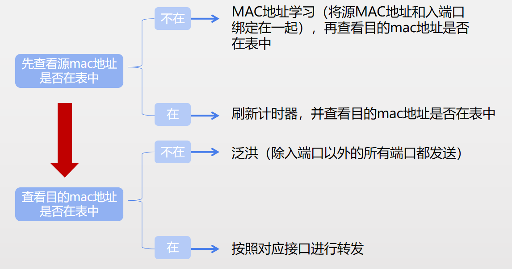
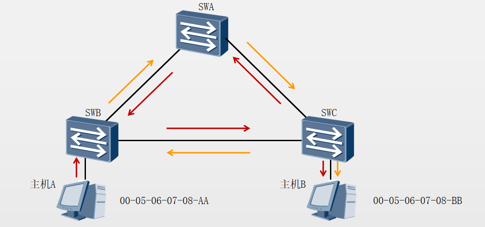
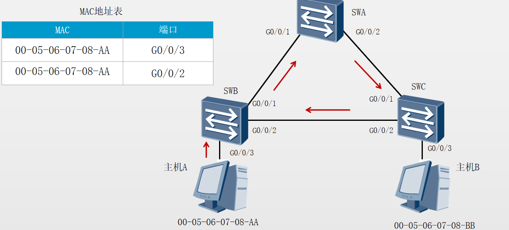
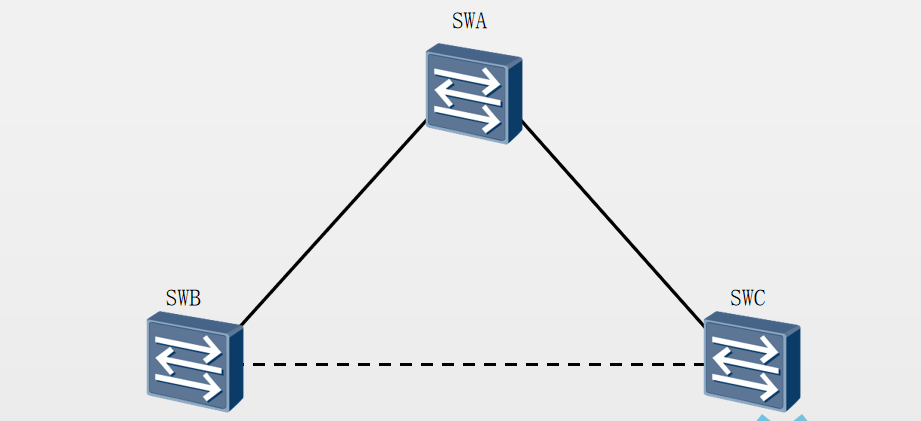
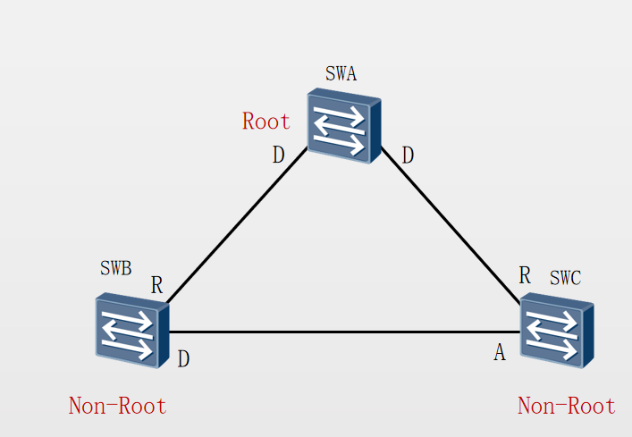

# 基本特性
通过vlan的划分，可以分割广播域 
初始状态下，交换机MAC地址表为空。
## 学习mac
交换机将收到的数据帧的源MAC地址和对应接口记录到MAC地址表中。
数据帧的目的MAC地址不在MAC表中，或者目的MAC地址为广播地址时，交换机会泛洪该帧
交换机根据MAC地址表将目标主机的回复信息单播转发给源主机
## 转发原理

环路会引起广播风暴。
网络中的主机会收到重复数据帧。

环路会引起MAC地址表震荡。

STP通过阻塞端口来消除环路，并能够实现链路备份的目的。

STP操作

选举一个根桥。（根交换机）
每个非根交换机选举一个根端口。（距离根交换机最近的接口）
每个网段选举一个指定端口。（不能重复）
阻塞非根、非指定端口。

# 冲突域
# 广播域
# 生成树