# 动态路由协议分类
距离向量(Distance Vector)：RIP  IGRP  EIGRP
链路状态(Link State)：OSPF、IS-IS

距离
路由器每经过特定时间周期向邻居发送自己的路由表。距离——有多远		矢量——从哪个方向
特性
采用周期性的完全更新(发送整个路由表)和触发更新结合的路由更新方式
采用广播的方式进行路由更新（RIPv2采用的是组播）
DV的路由协议有RIPv1，RIPv2，EIGRP
EIGRP和BGP属于高级的DV协议，他们学习路径的方式更多的趋近于DV，但是他们具备很多LS的特征（比如触发更新，组播更新等）
链路
从对等路由器处获取信息，建立一张完整的网络图——链路状态数据库
再根据链路状态数据库，用SPF（最短路径树）算法计算出一个以自己为根的树型结构，再生成路由表。

# 动态路由协议RIP
RIP是路由信息协议（Routing Information Protocol）的简称，它是一种基于距离矢量（Distance-Vector）算法的协议，使用跳数作为度量来衡量到达目的网络的距离。RIP主要应用于规模较小的网络中。
RIP协议通过端口520进行工作，工作在应用层，有V1/V2两种版本
**工作原理**
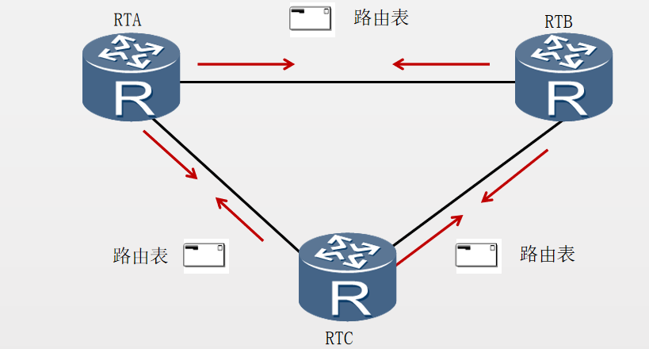

路由器运行RIP后，会首先发送路由更新请求（request），收到请求的路由器会发送自己的RIP路由进行响应（response）。
网络稳定后，路由器会周期性（30秒）发送路由更新信息。
**路由表建立**
路由器学习到直连网段
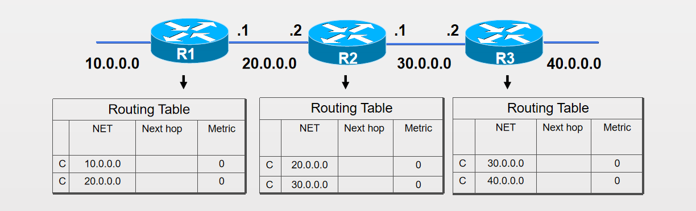
当路由器的更新周期30s到了时候，会向邻居发送路由表
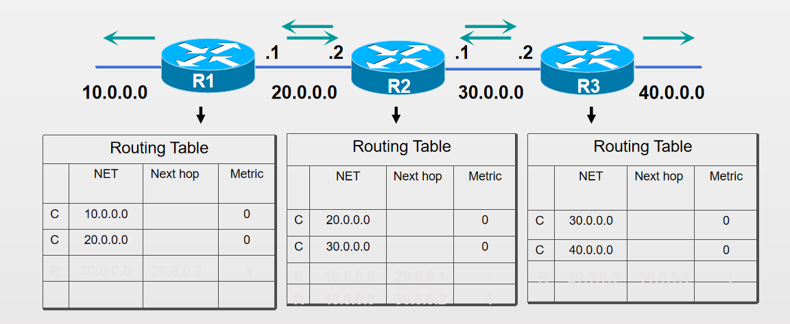
再过30s，路由器的第二个更新周期到了，再次发送路由表
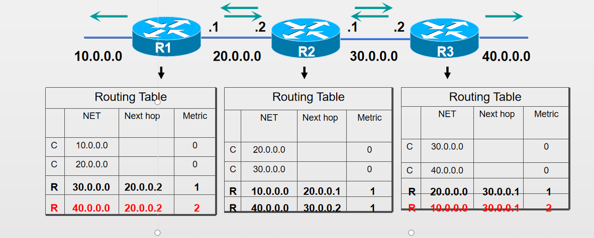

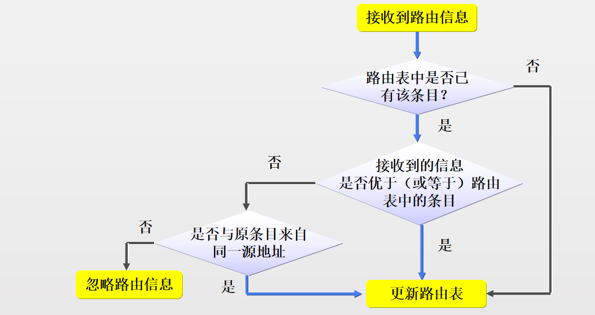

RIP-度量
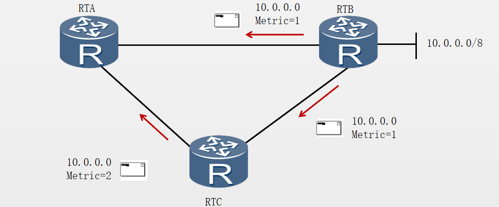
RIP使用跳数作为度量值来衡量到达目的网络的距离。
缺省情况下，直连网络的路由跳数为0。当路由器发送路由更新时，会把度量值加1。RIP规定超过15跳为网络不可达。
RIP的度量值（Metric）
RIP以跳数作为唯一的度量值
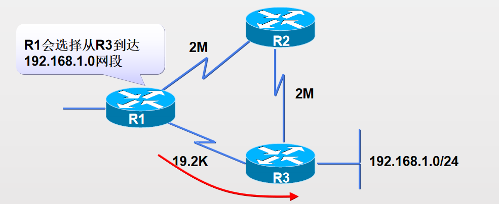
RIPv1报文格式
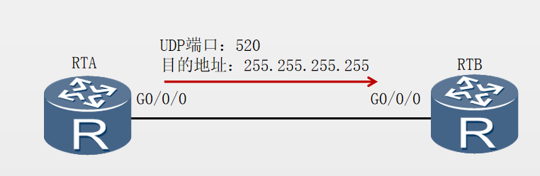
RIPv2报文格式
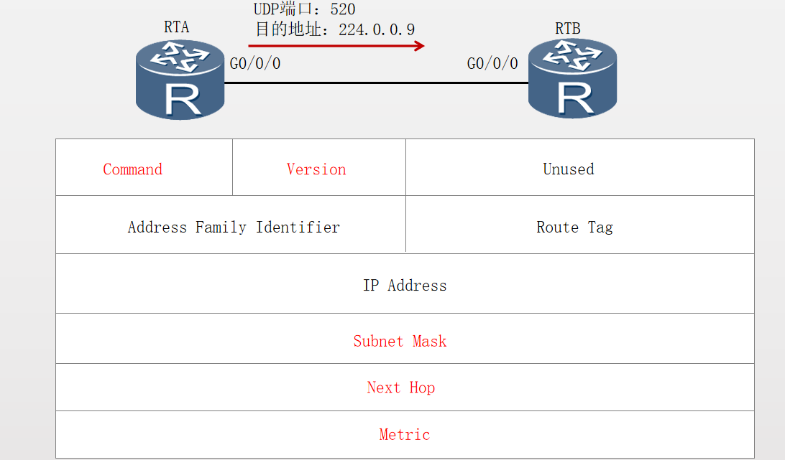
RIPv1 vs RIPv2
RIPv1是有类别路由协议，不支持VLSM和CIDR。
以广播的形式发送报文。
不支持认证。

  RIPv2为无类别路由协议，支持VLSM和CIDR。
 支持以广播或者组播（224.0.0.9）方式发送报文。
 支持明文认证和 MD5 密文认证。
 特点
 配置简单
易于维护
适合小型网络


# RIP协议环路问题
1、最大跳数：不能超过16跳
2、水平分割
3、触发更新
4、毒性逆转、路由中毒

水平分割是一个规则，用来防止路由链路环路的产生
规则：从一个接口上学习到的路由信息，不再从这个接口发送出去
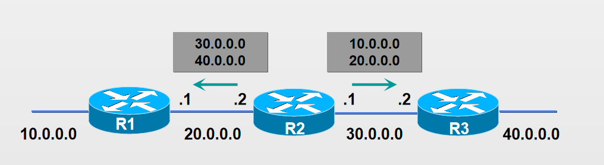
触发更新
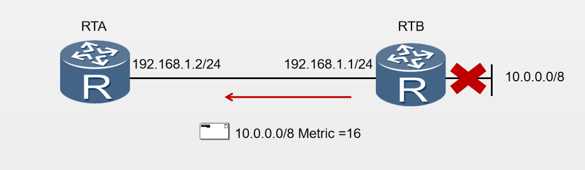
触发更新是指当路由信息发生变化时，立即向邻居设备发送触发更新报文。

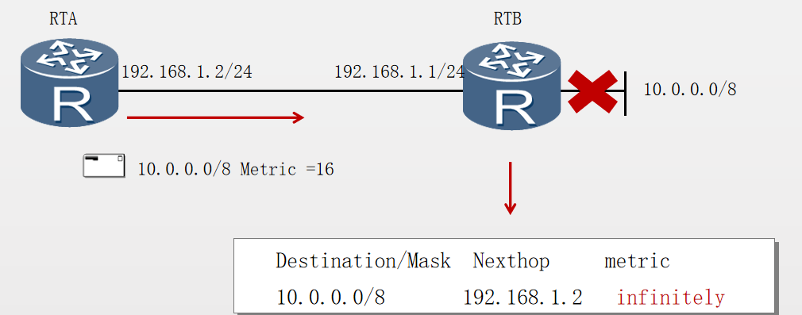
路由中毒是指路由器从将某个消失的路由条目跳数标记为无限大。

# RIP协议基本配置

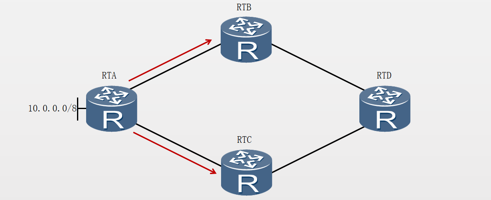
RIP基本配置
```
[RTA]rip
[RTA-rip-1]version 2 
[RTA-rip-1]network 10.0.0.0
[RTC]interface GigabitEthernet 0/0/0 
[RTC-GigabitEthernet0/0/0]rip metricin 2   收到时在原有的基础上加2
[RTA]interface GigabitEthernet 0/0/0 
[RTA-GigabitEthernet0/0/0]rip metricout 2  发送出去时从默认+1变成+2
[RTC]interface GigabitEthernet 0/0/0 
[RTC-GigabitEthernet0/0/0]rip split-horizon  水平分割（默认启用）
[RTC-GigabitEthernet0/0/0]rip poison-reverse 毒性逆转
两个特性都是针对接口配置，同时配置后，只有rip poison-reverse会生效
```
配置验证
```
[RTC] display rip 1 interface GigabitEthernet0/0/0 verbose 
 GigabitEthernet0/0/0(192.168.1.2)
  State           : UP          MTU    : 500
  Metricin        : 2       
  Metricout       : 1       
  Input           : Enabled     Output : Enabled     
  Protocol        : RIPv2 Multicast
  Send version    : RIPv2 Multicast Packets 
  Receive version : RIPv2 Multicast and Broadcast Packets
  Poison-reverse                : Enabled 
  Split-Horizon                 : Enabled
  Authentication type           : None 
  Replay Protection             : Disabled 

```
虽然两者都显示“Enabled”，但只有“Poison-reverse”生效。
**RIP配置-Output**
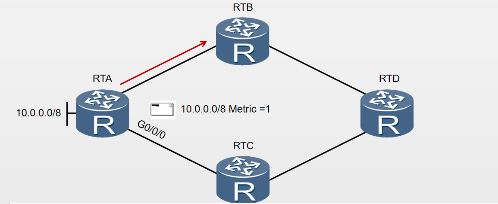


[20220707.md](../../_resources/20220707.md)


```
[RTA]interface GigabitEthernet 0/0/0
[RTA-GigabitEthernet0/0/0]undo rip output
RIP配置-Input

[RTD]interface GigabitEthernet 0/0/1
[RTD-GigabitEthernet0/0/1]undo rip input
抑制接口
[RTD]rip
[RTD-rip-1]silent-interface GigabitEthernet 0/0/1
配置G0/0/1接口为抑制状态，只接收RIP 报文，更新自己的路由表，但不发送RIP报文
此命令的优先级大于rip input和rip output。
配置验证
[RTD] display rip
Public VPN-instance    
    RIP process : 1
       RIP version   : 2
       Preference    : 100
       Checkzero     : Enabled
       Default-cost  : 0
       Summary       : Enabled
       Host-route    : Enabled
       Maximum number of balanced paths : 8
       Update time   : 30 sec              Age time : 180 sec 
       Garbage-collect time : 120 sec 
       Graceful restart  : Disabled
       BFD               : Disabled
       Silent-interfaces : GigabitEthernet0/0/1

```

RIPv2-认证
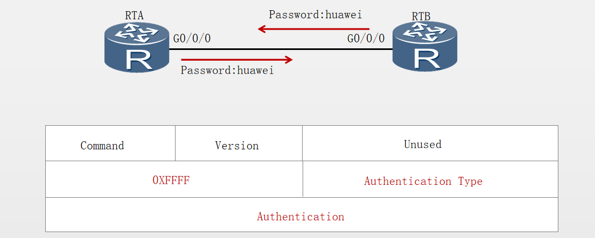
```
RIPv2支持对协议报文进行认证，认证方式有明文认证和MD5认证两种。
[Huawei-GigabitEthernet0/0/0]rip authentication-mode simple cipher huawei   明文
[Huawei-GigabitEthernet0/0/0]rip authentication-mode md5 usual huawei   MD5
```
RIP-汇总
```
默认开启路由汇聚即自动汇总
smmary always 开启自动汇总
主类汇总
什么时候会出现自动汇总的情况？
关闭汇总
[Huawei-rip-1]undo summary
发送具体明细条目
手动汇总
rip summary address x.x.x.x
[AR3]int g0/0/1
[AR3-GigabitEthernet0/0/1]rip summary-address 192.168.0.0 255.255.252.0

```
