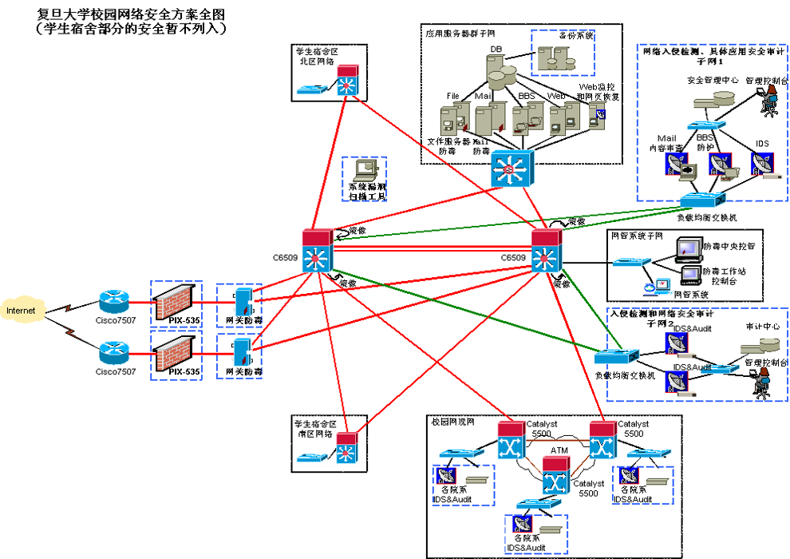

# 企业网络安全介绍


案例


# 端口安全

## MAC地址泛洪


攻击者C一直更改发送出去数据帧的源MAC地址，交换机会将新的MAC地址和接口添加到CAM表中，最终交换机的CAM表容量达到上限，即使有条目老化之后新的数据又会快速填充MAC地址表，最终导致原本能正常通信的主机之间数据被泛洪。

## MAC地址欺骗


攻击者C发送数据帧时更改源Mac B，交换机收到此数据帧后会将Mac B与Port 3绑定，导致主机A再向主机B发送数据时，交换机会将此数据从Port 3发送出去

## 概述

端口安全（Port Security）通过将接口学习到的动态MAC地址转换为安全MAC地址（包括安全动态MAC、安全静态MAC和Sticky MAC），阻止非法用户通过本接口和交换机通信，从而增强设备的安全性。

## 类型

|     |     |     |
| --- | --- | --- |
| 类型  | 定义  | 特点  |
| 安全动态MAC地址 | 使能端口安全而未使能Sticky MAC功能时转换的MAC地址。 | 设备重启后表项会丢失，需要重新学习。<br>缺省情况下不会被老化，只有在配置安全MAC的老化时间后才可以被老化。 |
| 安全静态MAC地址 | 使能端口安全时手工配置的静态MAC地址 | 不会被老化，手动保存配置后重启设备不会丢失。 |
| Sticky MAC地址 | 使能端口安全后又同时使能Sticky MAC功能后转换得到的MAC地址 | 不会被老化，手动保存配置后重启设备不会丢失。 |

```
接口使能端口安全功能时，接口上之前学习到的动态MAC地址表项将被删除，之后学习到的MAC地址将变为安全动态MAC地址。 
接口使能Sticky MAC功能时，接口上的安全动态MAC地址表项将转化为Sticky MAC地址，之后学习到的MAC地址也变为Sticky MAC地址。 
接口去使能端口安全功能时，接口上的安全动态MAC地址将被删除，重新学习动态MAC地址。 
接口去使能Sticky MAC功能时，接口上的Sticky MAC地址会转换为安全动态MAC地址。
```

## 端口安全限制动作

超过安全MAC地址限制数后的动作

|     |     |
| --- | --- |
| 动作  | 实现说明 |
| restrict | 丢弃源MAC地址不存在的报文并上报告警。推荐使用restrict动作。 |
| protect | 只丢弃源MAC地址不存在的报文，不上报告警。 |
| shutdown | 接口状态被置为error-down，并上报告警。默认情况下，接口关闭后不会自动恢复，只能由网络管理人员在接口视图下使用restart命令重启接口进行恢复。 |

接口上安全MAC地址数达到限制后，如果收到源MAC地址不存在的报文，端口安全则认为有非法用户攻击，就会根据配置的动作对接口做保护处理。缺省情况下，保护动作是restrict。

```
[Huawei]error-down auto-recovery cause mac-address-flapping  interval interval-value
命令使能接口状态自动恢复为Up的功能，并设置接口自动恢复为Up的延时时间，使被关闭的接口经过延时时间后能够自动恢复。
```

## 端口安全配置实现

## 端口安全配置验证
在SWB上使用命令查看绑定的MAC地址表：
```
<SWB>display mac-address sticky 
MAC address table of slot 0:
-------------------------------------------------------------------------------MAC Address      VLAN/       PEVLAN CEVLAN Port            Type      LSP/LSR-ID    VSI/SI                                                 MAC-Tunnel  
-------------------------------------------------------------------------------5489-988a-13ee  10          -      -      GE0/0/2                      sticky    -           
5489-983f-24e5  10          -      -      GE0/0/1                      sticky    -           

```
在SWC上使用命令查看动态学习到的MAC地址表
```
<SWC>display mac-address security 
MAC address table of slot 0:
-------------------------------------------------------------------------------MAC Address     VLAN/       PEVLAN CEVLAN Port            Type      LSP/LSR-ID  VSI/SI                                              MAC-Tunnel  
-------------------------------------------------------------------------------5489-9876-42c4 20          -      -      GE0/0/1                      security  -           
5489-9897-4520 20          -      -      GE0/0/2                      security  -           

```
## 端口安全配置案例
如图所示，用户PC1、PC2、PC3通过接入设备连接公司网络。为了提高用户接入的安全性，将接入设备Switch的接口使能端口安全功能，并且设置接口学习MAC地址数的上限为接入用户数，这样其他外来人员使用自己带来的PC无法访问公司的网络。
配置GE0/0/1接口的端口安全功能。
# 使能接口Sticky MAC功能，同时配置MAC地址限制数。
接口GE0/0/2和GE0/0/3的配置与接口GE0/0/1相同，不再赘述。
[Switch] interface gigabitethernet 0/0/1 
[Switch-GigabitEthernet0/0/1] port-security enable 
[Switch-GigabitEthernet0/0/1] port-security mac-address sticky 
[Switch-GigabitEthernet0/0/1] port-security max-mac-num 1


# 欺骗类安全问题

```
DHCP采用了Client/Server模型；DHCP Client需要从DHCP Server那里获得各种网络配置参数，这个过程是通过DHCP Client与DHCP Server之间交互各种DHCP消息来实现的。DHCP消息是封装在UDP报文中的，DHCP Server使用端口号67来接收DHCP消息，DHCP Client使用端口号68来接收DHCP消息。本课程中，我们主要关心DHCP Client是如何获得自己的IP地址的。
如图所展示的是DHCP Client通过DHCP来申请获取自己的IP地址的基本过程，这一过程包含了四个阶段：
发现阶段：
发现阶段也就是PC上的DHCP Client寻找DHCP Server的阶段。PC上的DHCP Client开始运行后，会以广播的方式发送一个DHCP Discover消息。
需要说明的是，图中所示的二层广播域中除了路由器R上运行了DHCP Server外，可能还有其它设备也运行了DHCP Server。如果是这样，那么所有这些DHCP Server都会接收到PC发送的DHCP Discover消息，也都会对所收到的DHCP Discover消息做出回应。
提供阶段
提供阶段也就是DHCP Server向DHCP Client提供IP地址的阶段，每一个接收到DHCP Discover消息的DHCP Server（包括路由器R上运行的DHCP Server）都会从自己维护的地址池中选择一个合适的IP地址，并通过DHCP Offer消息将这个IP地址发送给DHCP Client。DHCP Server是以单播的方式来发送DHCP Offer消息的。	
请求阶段
在请求阶段中，PC上的DHCP Client会在若干个收到的Offer（即若干个收到的DHCP Offer消息）中根据某种原则来确定出自己将要接受哪一个Offer。通常情况下，DHCP Client会接受它所收到的第一个Offer（即最先收到的那个DHCP Offer消息）。图中，假设PC最先收到的DHCP Offer消息是来自路由器R。于是，PC上的DHCP Client会以广播方式发送一个DHCP Request消息，其意图就是向路由器R上的DHCP Server提出请求，希望获取到该DHCP Server发送给自己的DHCP Offer消息中所提供的那个IP地址。注意，这个DHCP Request消息中携带有R上的DHCP Server的标识（称为Server Identifier），表示PC上的DHCP Client只愿意接受R上的DHCP Server所给出的Offer。
显然，该二层广播域中所有的DHCP Server都会接收到PC上的DHCP Client发送的DHCP Request消息。R上的DHCP Server收到并分析了该DHCP Request消息后，会明白PC已经愿意接受自己的Offer了。其他的DHCP Server收到并分析了该DHCP Request消息后，会明白PC拒绝了自己的Offer。于是，这些DHCP Server就会收回自己当初给予PC的Offer。也就是说，当初准备提供给PC使用的IP地址现在可以用来分配给别的设备使用了。
确认阶段
在确认阶段，R上的DHCP Server会向PC上的DHCP Client发送一个DHCP Ack消息。注意，由于种种原因，R上的DHCP Server也可能会向PC上的DHCP Client发送一个DHCP Nak消息。如果PC接收到了DHCP Nak消息，就说明这次获取IP地址的尝试失败了。在这种情况下，PC只能重新回到发现阶段来开始新一轮的IP地址申请过程。
```
## DHCP 威胁
DHCP在设计上未充分考虑到安全因素，从而留下了许多安全漏洞，使得DHCP很容易受到攻击。实际网络中，针对DHCP的攻击行为主要有以下三种：
## DHCP饿死攻击
攻击原理：攻击者持续大量地向DHCP Server申请IP地址，直到耗尽DHCP Server地址池中的IP地址，导致DHCP Server不能给正常的用户进行分配。
漏洞分析：DHCP Server向申请者分配IP地址时，无法区分正常的申请者与恶意的申请者。

解决方法
为了抑制大量DHCP用户恶意申请IP地址，在使能设备的DHCP Snooping功能后，可配置设备或接口允许接入的最大DHCP用户数，当接入的用户数达到该值时，则不再允许任何用户通过此设备或接口成功申请到IP地址。
而对通过改变DHCP Request报文中的CHADDR字段方式的攻击，可使能设备检测DHCP Request报文帧头MAC与DHCP数据区中CHADDR字段是否一致功能，此后设备将检查上送的DHCP Request报文中的帧头MAC地址是否与CHADDR值相等，相等则转发，否则丢弃。
## 仿冒DHCP Server攻击
攻击原理：攻击者仿冒DHCP Server，向客户端分配错误的IP地址及提供错误的网关地址等参数，导致客户端无法正常访问网络。
漏洞分析：DHCP客户端接收到来自DHCP Server的DHCP消息后，无法区分这些DHCP消息是来自仿冒的DHCP Server，还是来自合法的DHCP Server。

解决方法
为了防止DHCP Server仿冒者攻击，可配置设备接口的“信任（Trusted）/非信任（Untrusted）”工作模式。
将与合法DHCP服务器直接或间接连接的接口设置为信任接口，其他接口设置为非信任接口。此后，从“非信任（Untrusted）”接口上收到的DHCP回应报文将被直接丢弃，这样可以有效防止DHCP Server仿冒者的攻击。如图3所示。

## DHCP中间人攻击
攻击原理：攻击者利用ARP机制，让PC-A学习到IP-S与MAC-B的映射关系，又让Server学习到IP-A与MAC-B的映射关系。如此一来，PC-A与Server之间交互的IP报文都会经过攻击者中转。
漏洞分析：从本质上讲，中间人攻击是一种Spoofing IP/MAC攻击，中间人利用了虚假的IP地址与MAC地址之间的映射关系来同时欺骗DHCP的客户端和服务器

## IP欺骗
伪造IP地址
非法行为追踪困难
IP地址冲突等造成管理困难


# 防护机制 dhcp Snooping
## DHCP Snooping简介
定义：
    DHCP Snooping是DHCP（Dynamic Host Configuration Protocol）的一种安全特性，用于保证DHCP客户端从合法的DHCP服务器获取IP地址，并记录DHCP客户端IP地址与MAC地址等参数的对应关系，防止网络上针对DHCP攻击。
受益：
    设备具有防御网络上DHCP攻击的能力，增强了设备的可靠性，保障通信网络的正常运行。
为用户提供更安全的网络环境，更稳定的网络服务。
## DHCP Snooping防饿死攻击
为了防止某些端口的DHCP用户恶意申请IP地址，可配置接口允许学习的DHCP Snooping绑定表项的最大个数，当用户数达到该值时，则任何用户将无法通过此接口成功申请到IP地址。
为了防止攻击者不断改变DHCP Request报文中的CHADDR字段进行攻击，可使能检测DHCP Request报文帧头MAC地址与DHCP数据区中CHADDR字段是否相同的功能，相同则转发报文，否则丢弃。

```
若在网络中存在DHCP用户恶意申请IP地址，将会导致IP地址池中的IP地址快速耗尽以致DHCP Server无法为其他合法用户分配IP地址。另一方面，DHCP Server通常仅根据CHADDR（client hardware address）字段来确认客户端的MAC地址。如果攻击者通过不断改变DHCP Request报文中的CHADDR字段向DHCP Server申请IP地址，将会导致DHCP Server上的地址池被耗尽，从而无法为其他正常用户提供IP地址。
为了防止某些端口的DHCP用户恶意申请IP地址，可配置接口允许学习的DHCP Snooping绑定表项的最大个数，当用户数达到该值时，则任何用户将无法通过此接口成功申请到IP地址。为了防止攻击者不断改变DHCP Request报文中的CHADDR字段进行攻击，可使能检测DHCP Request报文帧头MAC地址与DHCP数据区中CHADDR字段是否相同的功能，相同则转发报文，否则丢弃。
执行命令system-view，进入系统视图。
配置接口允许学习的DHCP Snooping绑定表项的最大个数，可在VLAN视图或接口视图下配置。
执行命令vlan vlan-id，进入VLAN视图；或执行命令interface interface-type interface-number，进入接口视图。
执行命令dhcp snooping max-user-number max-number，配置接口允许学习的DHCP Snooping绑定表项的最大个数。
若在VLAN视图下执行该命令，则VLAN内所有的接口接入的用户最大数为该命令所配置的值。
缺省情况下，在规格范围内，设备允许学习的DHCP Snooping绑定表项的最大个数没有限制。
使能对报文的CHADDR字段进行检查功能，可在VLAN视图或接口视图下进行配置。
执行命令vlan vlan-id，进入VLAN视图；或执行命令interface interface-type interface-number，进入接口视图。
执行命令dhcp snooping check mac-address enable，使能检测DHCP Request报文帧头MAC与DHCP数据区中CHADDR字段是否一致功能。
缺省情况下，未使能检测DHCP Request报文帧头MAC与DHCP数据区中CHADDR字段是否一致功能。
在VLAN视图下执行此命令，则对设备所有接口接收到的属于该VLAN的DHCP报文命令功能生效；在接口下执行该命令，则仅对该接口接收到的所有DHCP报文命令功能生效。
执行命令quit，返回到系统视图。
（可选）配置DHCP Snooping丢弃报文数量的告警阈值，可在系统视图或接口视图下执行。
系统视图下：
执行命令dhcp snooping alarm threshold threshold，配置全局DHCP Snooping丢弃报文数量的告警阈值。
在系统视图下执行该命令，则设备所有的接口该命令功能生效。
缺省情况下，全局DHCP Snooping丢弃报文数量的告警阈值为100packets。
接口视图下：
执行命令interface interface-type interface-number，进入接口视图。
执行命令dhcp snooping alarm mac-address threshold threshold，配置帧头MAC地址与DHCP数据区中CHADDR字段不匹配而被丢弃的DHCP报文的告警阈值。
缺省情况下，全局DHCP Snooping丢弃报文数量的告警阈值为100packets，接口下DHCP Snooping丢弃报文数量的告警阈值为在系统视图下使用命令dhcp snooping alarm threshold配置的值。

注：：若在系统视图、接口视图下同时进行了配置，则接口下DHCP Snooping丢弃报文数量的告警阈值以两者最小值为准。
```
## DHCP Snooping防仿冒服务器攻击
DHCP Snooping将交换机上的端口分为两种类型，即信任端口（Trusted端口）和非信任端口（Untrusted端口）。默认交换机接口为Untrust接口
交换机从Trusted端口接收到DHCP响应报文（例如DHCP Offer报文、DHCP Ack报文等等）后，会转发这些报文。
交换机从Untrusted端口接收到报文（例如DHCP Offer报文、DHCP Ack报文等等）后，会丢弃这些报文。

```
DHCP Snooping将交换机上的端口分为两种类型，即信任端口（Trusted端口）和非信任端口（Untrusted端口）；与合法的DHCP Server相连接的端口应配置为Trusted端口，其他端口应配置为Untrusted端口。
交换机从Trusted端口接收到DHCP响应报文（例如DHCP Offer报文、DHCP Ack报文等等）后，会转发这些报文，从而保证合法的DHCP Server可以正常地分配IP地址及提供其他网络参数；交换机从Untrusted端口接收到报文（例如DHCP Offer报文、DHCP Ack报文等等）后，会丢弃这些报文，从而阻止仿冒的DHCP Server分配IP地址及提供其他网络参数。
关键配置命令：交换机DHCP响应的端口默认是Untrusted端口。如果需要将交换机的某个端口配置为Trusted端口，可以在该端口视图下使用命令dhcp snooping trusted。如果需要将某个Trusted端口恢复为Untrusted端口，可以在该端口视图下使用命令undo dhcp snooping trusted。
```
## DHCP Snooping防中间人攻击
通过配置动态ARP检测，让设备将ARP报文对应的源IP、源MAC、接口、VLAN信息和绑定表中的信息进行检查对比。

## DAI简介
中间人攻击（Man-in-the-middle attack）是指攻击者与通讯的两端分别创建独立的联系，并交换其所收到的数据，使通讯的两端认为与对方直接对话，但事实上整个会话都被攻击者完全控制。在中间人攻击中，攻击者可以拦截通讯双方的通话并插入新的内容。

```攻击的一个场景。攻击者主动向UserA发送伪造UserB的ARP报文，导致UserA的ARP表中记录了错误的UserB地址映射关系，攻击者可以轻易获取到UserA原本要发往UserB的数据；同样，攻击者也可以轻易获取到UserB原本要发往UserA的数据。这样，UserA与UserB间的信息安全无法得到保障。
```

为了防御中间人攻击，可以在Router上部署动态ARP检测DAI（Dynamic ARP Inspection）功能。
动态ARP检测DAI是利用绑定表来防御中间人攻击的。
当设备收到ARP报文时，将此ARP报文对应的源IP、源MAC、VLAN以及接口信息和绑定表的信息进行比较，如果信息匹配，说明发送该ARP报文的用户是合法用户，允许此用户的ARP报文通过，否则就认为是攻击，丢弃该ARP报文。
动态ARP检测功能仅适用于DHCP Snooping场景。设备使能DHCP Snooping功能后，当DHCP用户上线时，设备会自动生成DHCP Snooping绑定表。
注：对于静态配置IP地址的用户，设备不会生成DHCP Snooping绑定表，所以需要手动添加静态绑定表。
## DHCP Snooping与DAI技术联动
首先开启DHCP Snooping功能
之后在接口下配置DAI功能
arp anti-attack check user-bind enable

```
执行命令system-view，进入系统视图。
执行命令interface interface-type interface-number，进入接口视图；或者执行命令vlan vlan-id，进入VLAN视图。
执行命令arp anti-attack check user-bind enable，使能动态ARP检测功能（即对ARP报文进行绑定表匹配检查功能）。
缺省情况下，未使能动态ARP检测功能。
（可选）接口视图下执行命令arp anti-attack check user-bind check-item { ip-address | mac-address | vlan }*，或者VLAN视图下执行命令arp anti-attack check user-bind check-item { ip-address | mac-address | interface }*，配置对ARP报文进行绑定表匹配检查的检查项。
缺省情况下，对ARP报文的IP地址、MAC地址、VLAN和接口信息都进行检查。
如果希望仅匹配绑定表某一项或某两项内容的特殊ARP报文也能够通过，则可以配置对ARP报文进行绑定表匹配检查时只检查某一项或某两项内容。
 说明：指定ARP报文绑定表匹配检查项对配置了静态绑定表的用户不起作用，即设备仍然按照静态绑定表的内容对ARP报文进行绑定表匹配检查。
（可选）接口视图下执行命令arp anti-attack check user-bind alarm enable，使能动态ARP检测丢弃报文告警功能。
缺省情况下，未使能动态ARP检测丢弃报文告警功能。
 注意：由于动态ARP检测丢弃报文告警功能针对的是接口下DAI功能丢弃的ARP报文数告警统计，因此建议不要同时在VLAN视图下配置命令arp anti-attack check user-bind enable以及在加入该VLAN的接口视图下配置命令arp anti-attack check user-bind alarm enable，避免VLAN下的DAI功能可能造成实际丢包数目和接口DAI告警统计值之间的偏差。
由于设备缺省的发送ARP告警的时间间隔为0（即不发送ARP告警信息），因此使能动态ARP检测丢弃报文告警功能后，必须使用命令arp anti-attack log-trap-timer time调大设备发送告警的时间间隔，设备才会发送ARP告警。
（可选）接口视图下执行命令arp anti-attack check user-bind alarm threshold threshold，配置动态ARP检测丢弃报文告警阈值。
缺省情况下，动态ARP检测丢弃报文告警阈值为系统视图下arp anti-attack check user-bind alarm threshold threshold命令配置的值。如果系统视图下没有配置该值，则接口下缺省的告警阈值为100。
```
## IPSG简介

定义
IP源防攻击IPSG（IP Source Guard）是一种基于二层接口的源IP地址过滤技术，它能够防止恶意主机伪造合法主机的IP地址来仿冒合法主机，还能确保非授权主机不能通过自己指定IP地址的方式来访问网络或攻击网络。
目的
随着网络规模越来越大，通过伪造源IP地址实施的网络攻击（简称IP地址欺骗攻击）也逐渐增多。一些攻击者通过伪造合法用户的IP地址获取网络访问权限，非法访问网络，甚至造成合法用户无法访问网络，或者信息泄露。IPSG针对IP地址欺骗攻击提供了一种防御机制，可以有效阻止此类网络攻击行为。
一个典型的利用IPSG防攻击的示例如图1所示，非法主机伪造合法主机的IP地址获取上网权限。此时，通过在设备的接入用户侧的接口或VLAN上部署IPSG功能，设备可以对进入接口的IP报文进行检查，丢弃非法主机的报文，从而阻止此类攻击。


IP源防攻击IPSG（IP Source Guard）是一种基于二层接口的源IP地址过滤技术，它能够防止恶意主机伪造合法主机的IP地址来仿冒合法主机，还能确保非授权主机不能通过自己指定IP地址的方式来访问网络或攻击网络。

IPSG利用绑定表（源IP地址、源MAC地址、所属VLAN、入接口的绑定关系）去匹配检查二层接口上收到的IP报文，只有匹配绑定表的报文才允许通过，其他报文将被丢弃。

注：IPSG只匹配检查IP报文，对于ARP、PPPoE等非IP报文不做匹配检查


绑定表如下所示，包括静态和动态两种。
绑定表生成后，主机发送的报文，只有匹配绑定表才会允许通过，不匹配绑定表的报文都将被丢弃。缺省情况下，如果在没有绑定表的情况下使能了IPSG，设备将拒绝除DHCP请求报文外的所有IP报文。


## DHCP Snooping与IPSG技术联动
首先开启DHCP Snooping功能
之后在接口下配置IPSG功能
ip source check user-bind enable
```
创建静态绑定表项静态绑定表项包括IPv4和IPv6两种绑定表项，请根据网络环境选择配置。
执行命令system-view，进入系统视图。
执行命令user-bind static { { ip-address | ipv6-address } { start-ip [ to end-ip ] } &<1-10> | mac-address mac-address } * [ interface interface-type interface-number ] [ vlan vlan-id [ ce-vlan ce-vlan-id ] ]，配置静态用户绑定表项。
缺省情况下，不存在静态绑定表。
 说明：IPSG按照静态绑定表项进行完全匹配，即静态绑定表项包含几项就检查几项。请确保所创建的绑定表是正确且完整的，主机发送的报文只有匹配绑定表才会允许通过，不匹配绑定表的报文都将被丢弃。
设备支持将多个IP地址（段）做批量绑定，例如多个IP批量绑定到同一个接口或同一个MAC。如果这些IP地址不是连续的，可以重复输入1～10个start-ip地址。例如执行命令user-bind static ip-address 192.168.1.2 192.168.1.5 192.168.1.12 interface ethernet 2/0/0，将多个IP地址绑定到同一个接口。
如果这些IP地址是连续的，可以重复输入1～10个start-ip to end-ip的地址段。需要注意的是，采用关键字to输入的区间不能有交叉。例如执行命令user-bind static ip-address 172.16.1.1 to 172.16.1.4 mac-address 0001-0001-0001，将多个IP地址绑定到同一个MAC地址。
AR120–S&AR150-S&AR160-S&AR200-S&AR1200–S系列产品不支持ipv6-address和ce-vlan关键字。
如果绑定表创建错误或者已绑定主机的网络权限变更，需要删除某些静态表项，请执行命令undo user-bind static [ interface interface-type interface-number | { ip-address | ipv6-address } { start-ip [ to end-ip ] } &<1-10> | mac-address mac-address | vlan vlan-id[ ce-vlan ce-vlan-id ] ] *。


创建动态绑定表项动态绑定表项包括IPv4和IPv6两种绑定表项，请根据网络环境选择配置。
通过DHCP方式获取IP地址的IPv4或者IPv6主机，可以配置DHCP Snooping生成DHCP Snooping动态绑定表项
执行命令system-view，进入系统视图。
执行命令dhcp enable，使能DHCP功能。缺省情况下，未使能DHCP功能。
执行命令dhcp snooping enable，全局使能DHCP Snooping功能。缺省情况下，全局未使能DHCP Snooping功能。
进入VLAN或者接口视图。
执行命令vlan vlan-id，进入VLAN视图。
执行命令interface interface-type interface-number，进入接口视图。
执行命令dhcp snooping enable，使能VLAN或者接口的DHCP Snooping功能。缺省情况下，VLAN和接口下未使能DHCP Snooping功能。
配置信任接口，以下任务二选一。
在VLAN视图下执行命令dhcp snooping trusted interface interface-type interface-number，配置加入该VLAN的接口为信任状态。
在接口视图下执行命令dhcp snooping trusted，配置该接口为信任状态。
缺省情况下，使能DHCP Snooping功能后，接口为非信任状态。
 说明：一般将与服务器直接或间接相连的接口配置为信任接口。在使能DHCP Snooping功能并配置信任接口之后，用户侧接口根据DHCP ACK报文自动生成动态绑定表。
AR150-S&AR160-S&AR200-S&AR1200-S系列产品不支持配置信任接口。为使设备能够获取到用户的绑定表项，在接口或VLAN下使能DHCP Snooping功能之前，需确保已在该接口或VLAN对应的VLANIF口上使能了DHCP Relay或DHCP Server功能。
有关DHCP Snooping的详细配置，请参见《Huawei AR100-S&AR110-S&AR120-S&AR150-S&AR160-S&AR200-S&AR1200-S&AR2200-S&AR3200-S系列企业路由器 配置指南-安全配置》中的“DHCP Snooping配置”。
使能IPSG功能
绑定表创建后，IPSG并未生效，只有在指定接口（接入用户侧的接口）或在指定VLAN上使能IPSG后才生效。基于接口使能IPSG：该接口接收的所有的报文均进行IPSG检查。如果用户只希望在某些不信任的接口上进行IPSG检查，而信任其他接口，可以选择此方式。并且，当接口属于多个VLAN时，基于接口使能IPSG更方便，无需在每个VLAN上使能。
基于VLAN使能IPSG：属于该VLAN的所有接口接收的报文均进行IPSG检查。如果用户只希望在某些不信任VLAN上进行IPSG检查，而信任其他VLAN，可以选择此方式。并且，当多个接口属于相同的VLAN时，基于VLAN使能IPSG更方便，无需在每个接口上使能。
 说明：接口上使能仅对该接口生效，其它接口不会执行IPSG检查。
VLAN上使能仅对该VLAN生效，其它VLAN不会执行IPSG检查。
进入接口或VLAN视图。
执行命令interface interface-type interface-number，进入接口视图。
执行命令vlan vlan-id，进入VLAN视图。
执行命令ip source check user-bind enable，使能接口或者VLAN的IP报文检查功能。缺省情况下，接口和VLAN上未使能IP报文检查功能。
```
# 其他安全攻击
## DOS攻击
DoS是Denial of Service的简称，即拒绝服务。指故意的攻击网络协议实现的缺陷或直接通过野蛮手段残忍地耗尽被攻击对象的资源，目的是让目标计算机或网络无法提供正常的服务或资源访问，使目标系统服务系统停止响应甚至崩溃。服务资源包括网络带宽，文件系统空间容量，开放的进程或者允许的连接。
## DDOS攻击
分布式拒绝服务攻击(英文意思是Distributed Denial of Service，简称DDoS)是指处于不同位置的多个攻击者同时向一个或数个目标发动攻击，或者一个攻击者控制了位于不同位置的多台机器并利用这些机器对受害者同时实施攻击。由于攻击的发出点是分布在不同地方的，这类攻击称为分布式拒绝服务攻击，其中的攻击者可以有多个。
## CC攻击
CC(ChallengeCollapsar，挑战黑洞)攻击是DDoS攻击的一种类型，使用代理服务器向受害服务器发送大量貌似合法的请求。CC根据其工具命名，攻击者使用代理机制，利用众多广泛可用的免费代理服务器发动DDoS攻击。
CC主要是用来攻击页面的，每个人都有这样的体验：当一个网页访问的人数特别多的时候，打开网页就慢了，CC就是模拟多个用户（多少线程就是多少用户）不停地进行访问那些需要大量数据操作（就是需要大量CPU时间）的页面，造成服务器资源的浪费，CPU长时间处于100%，永远都有处理不完的连接直至就网络拥塞，正常的访问被中止。


