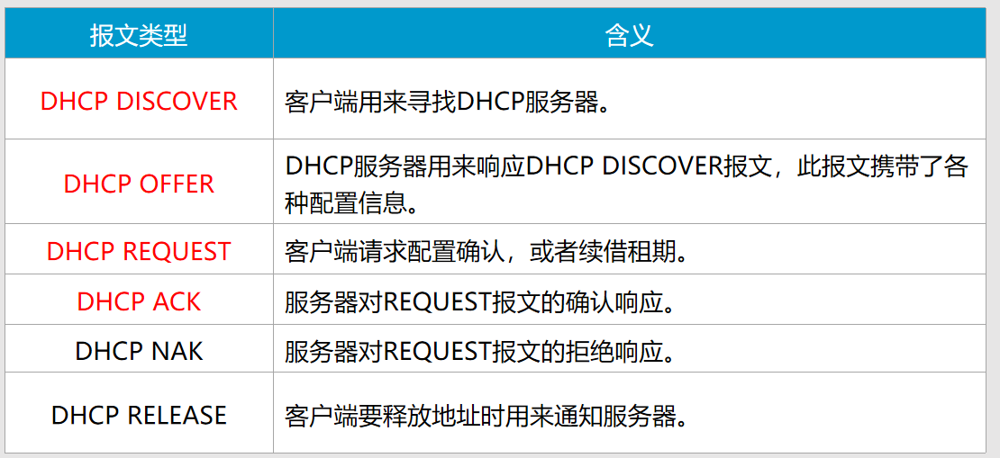
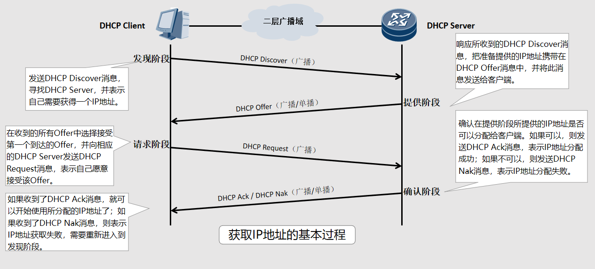
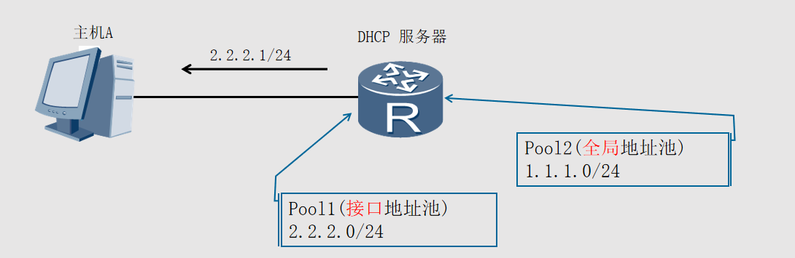
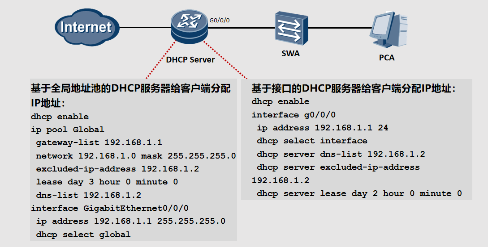
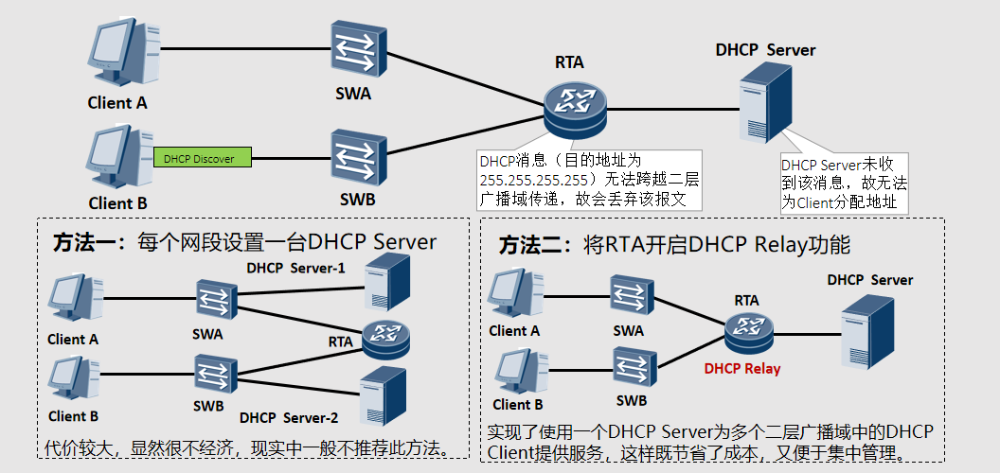
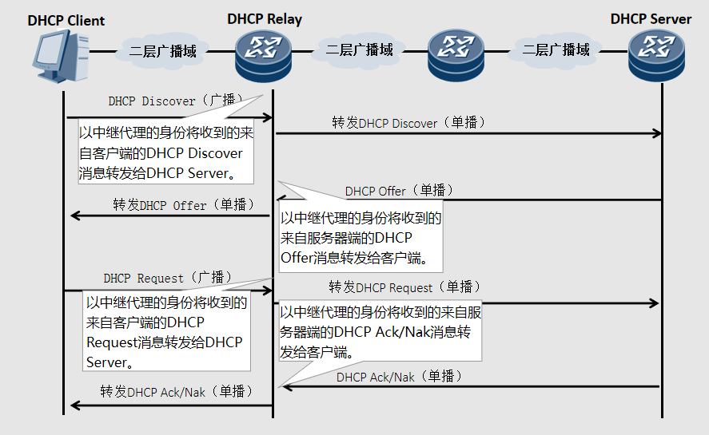
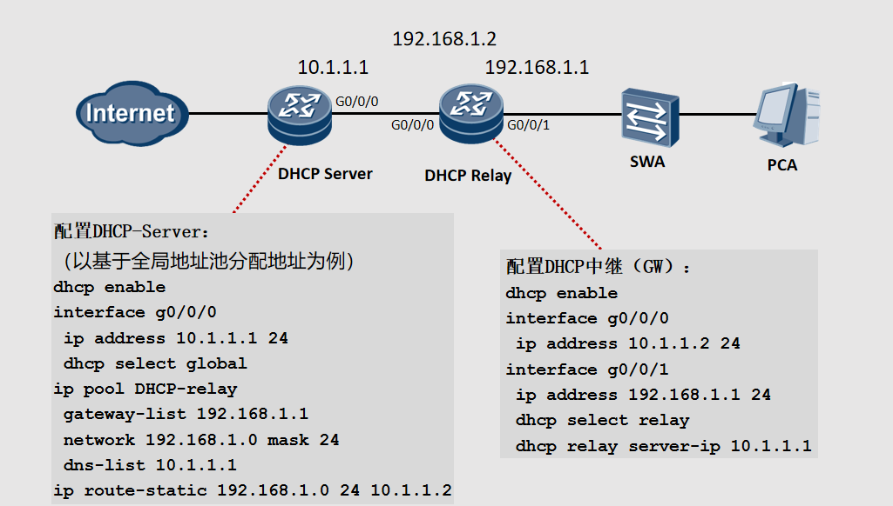
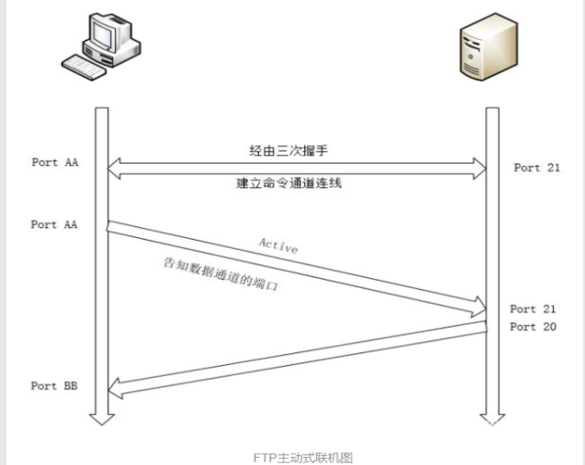
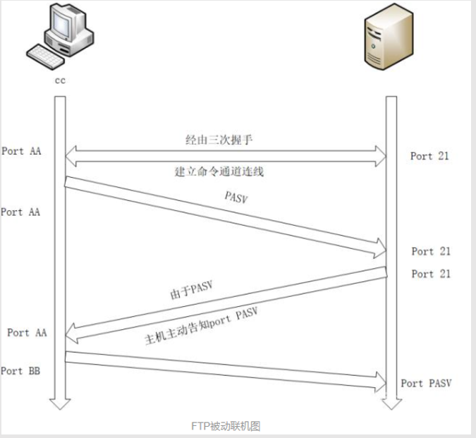

# DHCP服务器
## 概述
DHCP报文承载在UDP上。
客户端侦听的UDP目的端口号是68。
服务器、中继代理侦听的UDP端口号是67

DHCP服务器能够为大量主机分配IP地址,并能够集中管理。
## DHCP报文

DHCP客户端初次接入网络时，会发送DHCP发现报文（DHCP Discover），用于查找和定位DHCP服务器。
DHCP服务器在收到DHCP发现报文后，发送DHCP提供报文（DHCP Offer），此报文中包含IP地址等配置信息。
在DHCP客户端收到服务器发送的DHCP提供报文后，会发送DHCP请求报文（DHCP Request），另外在DHCP客户端获取IP地址并重启后，同样也会发送DHCP请求报文，用于确认分配的IP地址等配置信息。DHCP客户端获取的IP地址租期快要到期时，也发送DHCP请求报文向服务器申请延长IP地址租期。
收到DHCP客户端发送的DHCP请求报文后，DHCP服务器会回复DHCP确认报文（DHCP ACK）。客户端收到DHCP确认报文后，会将获取的IP地址等信息进行配置和使用。
如果DHCP服务器收到DHCP-REQUEST报文后，没有找到相应的租约记录，则发送DHCP-NAK报文作为应答，告知DHCP客户端无法分配合适IP地址。
DHCP客户端通过发送DHCP释放报文（DHCP Release）来释放IP地址。收到DHCP释放报文后，DHCP服务器可以把该IP地址分配给其他DHCP客户端。
## DHCP工作原理


DHCP采用了Client/Server模型；DHCP Client需要从DHCP Server那里获得各种网络配置参数，这个过程是通过DHCP Client与DHCP Server之间交互各种DHCP消息来实现的。DHCP消息是封装在UDP报文中的，DHCP Server使用端口号67来接收DHCP消息，DHCP Client使用端口号68来接收DHCP消息。本课程中，我们主要关心DHCP Client是如何获得自己的IP地址的。
如图所展示的是DHCP Client通过DHCP来申请获取自己的IP地址的基本过程，这一过程包含了四个阶段：
发现阶段：
发现阶段也就是PC上的DHCP Client寻找DHCP Server的阶段。PC上的DHCP Client开始运行后，会以广播的方式发送一个DHCP Discover消息。
需要说明的是，图中所示的二层广播域中除了路由器R上运行了DHCP Server外，可能还有其它设备也运行了DHCP Server。如果是这样，那么所有这些DHCP Server都会接收到PC发送的DHCP Discover消息，也都会对所收到的DHCP Discover消息做出回应。
提供阶段
提供阶段也就是DHCP Server向DHCP Client提供IP地址的阶段，每一个接收到DHCP Discover消息的DHCP Server（包括路由器R上运行的DHCP Server）都会从自己维护的地址池中选择一个合适的IP地址，并通过DHCP Offer消息将这个IP地址发送给DHCP Client。DHCP Server是以单播的方式来发送DHCP Offer消息的。	
请求阶段
在请求阶段中，PC上的DHCP Client会在若干个收到的Offer（即若干个收到的DHCP Offer消息）中根据某种原则来确定出自己将要接受哪一个Offer。通常情况下，DHCP Client会接受它所收到的第一个Offer（即最先收到的那个DHCP Offer消息）。图中，假设PC最先收到的DHCP Offer消息是来自路由器R。于是，PC上的DHCP Client会以广播方式发送一个DHCP Request消息，其意图就是向路由器R上的DHCP Server提出请求，希望获取到该DHCP Server发送给自己的DHCP Offer消息中所提供的那个IP地址。注意，这个DHCP Request消息中携带有R上的DHCP Server的标识（称为Server Identifier），表示PC上的DHCP Client只愿意接受R上的DHCP Server所给出的Offer。
显然，该二层广播域中所有的DHCP Server都会接收到PC上的DHCP Client发送的DHCP Request消息。R上的DHCP Server收到并分析了该DHCP Request消息后，会明白PC已经愿意接受自己的Offer了。其他的DHCP Server收到并分析了该DHCP Request消息后，会明白PC拒绝了自己的Offer。于是，这些DHCP Server就会收回自己当初给予PC的Offer。也就是说，当初准备提供给PC使用的IP地址现在可以用来分配给别的设备使用了。
确认阶段
在确认阶段，R上的DHCP Server会向PC上的DHCP Client发送一个DHCP Ack消息。注意，由于种种原因，R上的DHCP Server也可能会向PC上的DHCP Client发送一个DHCP Nak消息。如果PC接收到了DHCP Nak消息，就说明这次获取IP地址的尝试失败了。在这种情况下，PC只能重新回到发现阶段来开始新一轮的IP地址申请过程。
## DHCP地址池
ARG3系列路由器支持两种地址池：全局地址池和接口地址池。

ARG3系列路由器和X7系列交换机都可以作为DHCP服务器，为主机等设备分配IP地址。DHCP服务器的地址池是用来定义分配给主机的IP地址范围，有两种形式。
接口地址池为连接到同一网段的主机或终端分配IP地址。可以在服务器的接口下执行dhcp select interface命令，配置DHCP服务器采用接口地址池的DHCP服务器模式为客户端分配IP地址。
全局地址池为所有连接到DHCP服务器的终端分配IP地址。可以在服务器的接口下执行dhcp select global命令，配置DHCP服务器采用全局地址池的DHCP服务器模式为客户端分配IP地址。
接口地址池的优先级比全局地址池高。配置了全局地址池后，如果又在接口上配置了地址池，客户端将会从接口地址池中获取IP地址。在X7系列交换机上，只能在VLANIF逻辑接口上配置接口地址池。
# DHCP接口地址池配置


```
DHCP Server配置基于接口的地址分配方式，只会响应该接口接收的DHCP请求；配置基于全局地址池的地址分配方式，可以响应所有端口接收的DHCP请求。
dhcp enable      //使能DHCP功能，在配置DHCP服务器时必须先执行该命令，才能配置DHCP的其他功能并生效
ip pool HW       //设置一个名为HW的全局地址池
gateway-list 192.168.1.1       //设置分配的网关IP
network 192.168.1.0 mask 255.255.255.0     //设置分配的地址网段
excluded-ip-address 192.168.1.2     //设置不参与自动分配的IP地址范围
lease day 3 hour 0 minute 0            //设置地址池中IP地址的租用有效期限，默认1天
dns-list 192.168.1.2                         //设置分配的DNS服务器地址
interface GigabitEthernet0/0/0
ip address 192.168.1.1 255.255.255.0 
dhcp dhcp select global    //接口下使能全局方式分配地址
interface g0/0/0
ip address 192.168.1.1 24
dhcp select interface                                           //使能接口分配地址方式且关联接口地址池
dhcp server dns-list 192.168.1.2                         //指定分配的DNS服务器地址
dhcp server excluded-ip-address 192.168.1.2    //配置接口地址池中不参与自动分配的IP地址范围
dhcp server lease day 2 hour 0 minute 0          //配置接口地址池中IP地址的租用有效期，默认1天

```

## DHCP Relay产生背景
随着网络规模的扩大，网络中就会出现用户处于不同网段的情况

```
从前面的描述中可知，DHCP Discover、DHCP Offer等消息都是以广播报文的方式发送的，也就是说，DHCP Client和DHCP Server必须在同一个二层广播域中才能接收到彼此发送的DHCP消息。DHCP消息无法跨越二层广播域传递。
一个实际的IP网络通常都包含了多个二层广播域，如果需要部署DHCP，那么可以有两种方法：
方法一：在每一个二层广播域中都部署一个DHCP Server（代价太大，现实中一般不推荐此方法）。
方法二：部署一个DHCP Server来同时为多个二层广播域中的DHCP Client服务，这就需要引入DHCP Relay。

```
## DHCP Relay工作原理

```
DHCP Relay的基本作用就是专门在DHCP Client和DHCP Server之间进行DHCP消息的中转。
如图所示，DHCP Client利用DHCP Relay来从DHCP Server那里获取IP地址等配置参数时，DHCP Relay必须与DHCP Client位于同一个二层广播域，但DHCP Server可以与DHCP Relay位于同一个二层广播域，也可以与DHCP Relay位于不同的二层广播域。DHCP Client与DHCP Relay之间是以广播方式交换DHCP消息的，但DHCP Relay与DHCP Server之间是以单播方式交换DHCP消息的（这就意味着，DHCP Relay必须事先知道DHCP Server的IP地址）。
```
## DHCP Relay配置与实现

```
配置DHCP-Server：                                          //DHCP服务器可以采用全局地址分配或者接口地址分配，此处以全局地址池分配地址为例
dhcp enable                               
ip pool DHCP-relay                                 //"DHCP-relay"仅为DHCP地址池名称
ip route-static 192.168.1.0 24 10.1.1.2   //由于中继后的DHCP报文是一个源地址为192.168.1.1的单播报文，需要有回去的路由，当前为了简单，使用静态路由完成，正常网络内可以配置IGP使得地址能够通信
配置DHCP中继（GW）：
dhcp server group DHCP                    //配置DHCP服务器组名
dhcp-server 10.1.1.1                            //设定DHCP服务器地址
dhcp enable                                         //中继设备也需要开启DHCP，否则后面接口下的命令不能使能
interface g0/0/1                                  //进入连接客户端的接口
ip address 192.168.1.1 24 
dhcp select relay                                //启动DHCP Relay功能
dhcp relay server-select DHCP          //设定DHCP Relay要使用的服务器组
```
# WEB服务器
**目前最主流的Web服务器是Apache、 Nginx 、IIS、Tomcat**

# DNS服务器
DNS( Domain Name System)是“域名系统”的英文缩写，是一种组织成域层次结构的计算机和网络服务命名系统，它用于TCP/IP网络，它所提供的服务是用来将主机名和域名转换为IP地址的工作
# FTP服务器
FTP服务器默认使用TCP协议的20、21端口与客户端进行通信。21端口用于建立控制连接，并传输FTP指令。20端口用于建立数据连接，传输数据流。


根据FTP服务器在建立数据连接过程中的主、被动关系，FTP数据连接分为主动模式和被动模式。
主动模式：由服务器主动发起数据连接；

FTP主动模式连接


```
1：建立命令通道的联机

如图所示，客户端会随机取一个大于1024以上的端口(port AA)来与FTP服务器端的port21达成联机，这个过程为三次握手，达成联机后用户便可以对FTP下达指令，包括查询文件名、下载、上传等指令；

2：通知FTP服务器端使用Actvive且告知连接的端口

FTP服务器的21端口用于命令的下达，但当涉及数据流传输，就需要另外一个联机。当客户在需要数据的情况下，会告知服务器用什么方式联机，如果是主动式(Active)，客户端随机启用一个端口(port BB)，通过命令通道告知FTP服务器，等待FTP服务器联机；

3：FTP服务器主动向客户端联机：

FTP服务器由命令通道了解客户端的需求后，主动由20端口向客户端的port BB进行三次握手联机。此时FTP与客户端建立两条联机，分别用于命令的下达和数据的传递。

注意：数据流通道是在有数据传输的行为时才会建立的通道，并不是一开始连接到FTP服务器就建立的；

```


被动模式：服务器被动等待数据连接；

FTP被动模式连接

```
1：用户与服务器建立命令信道：

与主动联机图第一步相同；

2：客户端发出PASV联机请求：

当有使用数据信道的指令时，客户端可透过命令通道发出PASV的被动联机要求，并等待服务器回应；

3：FTP服务器启动数据端口，通知客户端

如果FTP服务器能够处理被动式联机，此时FTP服务器先启动一个随机或者自定义某一范围的端口监听。然后FTP服务器通过命令通道告知客户端启动的端口(port PASV)，等待客户端联机；

4：客户端随机取用大于1024的端口进行联机：

客户端随机取用一个大于1024的端口号来对FTP的port PASV进行三次握手联机。此时FTP与客户端建立两条联机，分别用于命令的下达和数据的传递
```

