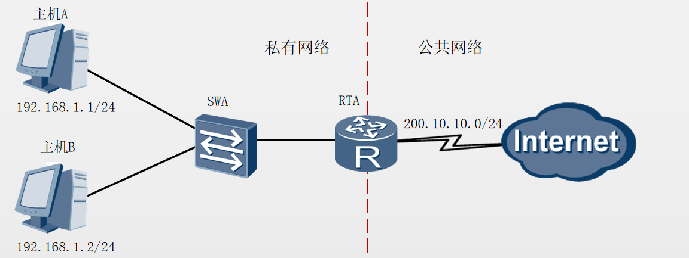
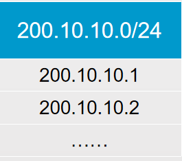
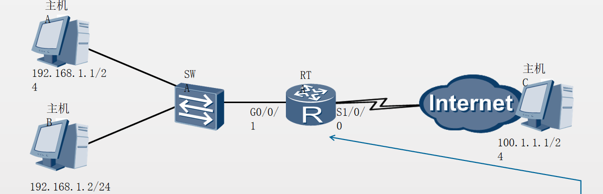
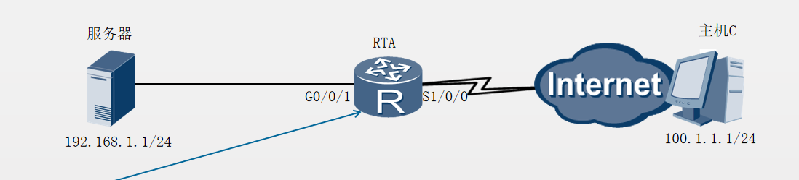

网络地址转换技术NAT（Network Address Translation）主要用于实现位于内部网络的主机访问外部网络的功能。当局域网内的主机需要访问外部网络时，通过NAT技术可以将其私网地址转换为公网地址，并且多个私网用户可以共用一个公网地址，这样既可保证网络互通，又节省了公网地址。
# 应用场景

企业或家庭所使用的网络为私有网络，使用的是私有地址；
运营商维护的网络为公共网络，使用的是公有地址。私有地址不能在公网中路由。
NAT一般部署在连接内网和外网的网关设备上。
# 静态NAT（一对一）
静态NAT实现了私有地址和公有地址的一对一映射。
一个公网IP只会分配给唯一且固定的内网主机。
# 动态NAT（一对一）

动态NAT基于地址池来实现私有地址和公有地址的转换。
# NAPT(一对多)
网络地址端口转换NAPT允许多个内部地址映射到同一个公有地址的不同端口。
# Easy IP
Easy IP允许将多个内部地址映射到网关出接口地址。
# NAT服务器
通过配置NAT服务器,可以使外网用户访问内网服务器。
# 静态NAT配置（只能做ip的一对一映射，不映射端口）

```
[RTA]interface GigabitEthernet0/0/1
[RTA-GigabitEthernet0/0/1]ip address 192.168.1.254 24
[RTA-GigabitEthernet0/0/1]interface Serial1/0/0
[RTA-Serial1/0/0]ip address 200.10.10.2 24
[RTA-Serial1/0/0]nat static global 200.10.10.1 inside 192.168.1.1
[RTA-Serial1/0/0]nat static global 200.10.10.3 inside 192.168.1.2

nat static  global { global-address} inside {host-address } 命令用于创建静态NAT。
global参数用于配置外部公网地址。
inside参数用于配置内部私有地址。

配置验证
[RTA]display nat static 
  Static Nat Information:
  Interface  : Serial1/0/0
    Global IP/Port     : 202.10.10.1/---- 
    Inside IP/Port     : 192.168.1.1/----
……
 Global IP/Port     : 202.10.10.2/---- 
    Inside IP/Port     : 192.168.1.2/----
……

  Total :    2
```

# 动态NAT配置
```
[RTA]nat address-group 1 200.10.10.1 200.10.10.200 
[RTA]acl 2000
[RTA-acl-basic-2000]rule 5 permit source 192.168.1.0 0.0.0.255
[RTA-acl-basic-2000]quit
[RTA]interface serial1/0/0
[RTA-Serial1/0/0]nat outbound 2000 address-group 1 no-pat

nat outbound命令用来将一个访问控制列表ACL和一个地址池关联起来，表示ACL中规定的地址可以使用地址池进行地址转换。ACL用于指定一个规则，用来过滤特定流量。后续将会介绍有关ACL的详细信息。
nat address-group命令用来配置NAT地址池。
本示例中使用nat outbound命令将ACL 2000与待转换的192.168.1.0/24网段的流量关联起来，并使用地址池1（address-group 1）中的地址进行地址转换。no-pat表示只转换数据报文的地址而不转换端口信息。

配置验证
[RTA]display nat address-group 1
 NAT Address-Group Information:
 --------------------------------------
 Index   Start-address      End-address
 1       200.10.10.1        200.10.10.200

[RTA]display nat outbound 
 NAT Outbound Information:
 ----------------------------------------------------------------
 Interface          Acl     Address-group/IP/Interface      Type
 ----------------------------------------------------------------
 Serial1/0/0       2000                        1         no-pat
 ----------------------------------------------------------------
  Total : 1
display nat address-group group-index命令用来查看NAT地址池配置信息。
命令display nat outbound用来查看动态NAT配置信息。
可以用这两条命令验证动态NAT的详细配置。在本示例中，指定接口Serial1/0/0与ACL关联在一起，并定义了用于地址转换的地址池1。参数no-pat说明没有进行端口地址转换。

本例要求通过ACL来实现主机A和主机B分别使用不同的公网地址池来进行NAT转换。


[RTA]nat address-group 1 202.110.10.8 202.110.10.15 
[RTA]nat address-group 2 202.115.60.1 202.115.60.30
[RTA]acl 2000
[RTA-acl-basic-2000]rule permit source 192.168.1.0 0.0.0.255
[RTA-acl-basic-2000]acl 2001
[RTA-acl-basic-2001]rule permit source 192.168.2.0 0.0.0.255
[RTA-acl-basic-2001]interface GigabitEthernet0/0/0
[RTA-GigabitEthernet0/0/0]nat outbound 2000 address-group 1 
[RTA-GigabitEthernet0/0/0]nat outbound 2001 address-group 2

执行nat outbound <acl-number> address-group <address-group number>命令，可以将NAT与ACL绑定。
本示例中，私网192.168.1.0/24将使用地址池220.110.10.8-220.110.10.15进行地址转换，私网192.168.2.0/24将使用地址池202.115.60.1-202.115.60.30进行地址转换。

```
# Easy IP配置

```
[RTA]acl 2000
[RTA-acl-basic-2000]rule 5 permit source 192.168.1.0 0.0.0.255
[RTA-acl-basic-2000]quit
[RTA]interface serial1/0/0
[RTA-Serial1/0/0]nat outbound 2000


nat outbound acl-number命令用来配置Easy-IP地址转换。Easy IP的配置与动态NAT的配置类似，需要定义ACL和nat outbound命令，主要区别是Easy IP不需要配置地址池，所以nat outbound命令中不需要配置参数address-group。
在本示例中，命令nat outbound 2000表示对ACL 2000定义的地址段进行地址转换，并且直接使用Serial1/0/0接口的IP地址作为NAT转换后的地址。
配置验证


[RTA]display nat outbound 
 NAT Outbound Information:
 ---------------------------------------------------------------------
 Interface         Acl     Address-group/IP/Interface      Type
 ---------------------------------------------------------------------
 Serial1/0/0       2000      200.10.10.1                  easyip  
 ---------------------------------------------------------------------
  Total : 1


命令display nat outbound用于查看命令nat outbound的配置结果。
Address-group/IP/Interface表项表明接口和ACL已经关联成功，type表项表明Easy IP已经配置成功。

```
# NAT服务器配置


```
[RTA]interface GigabitEthernet0/0/1
[RTA-GigabitEthernet0/0/1]ip address 192.168.1.254 24
[RTA-GigabitEthernet0/0/1]interface Serial1/0/0
[RTA-Serial1/0/0]ip address 200.10.10.2 24
[RTA-Serial1/0/0]nat server protocol tcp global 202.10.10.1 www inside 192.168.1.1 8080


nat server [ protocol {protocol-number | icmp | tcp | udp} global { global-address | current-interface global-port} inside {host-address host-port } vpn-instance vpn-instance-name acl acl-number description description ]命令用来定义一个内部服务器的映射表，外部用户可以通过公网地址和端口来访问内部服务器。
参数protocol指定一个需要地址转换的协议；
参数global-address指定需要转换的公网地址；
参数inside指定内网服务器的地址。
[R1-GigabitEthernet0/0/1]nat server protocol tcp global current-interface telnet
 inside 192.168.16.1 telnet

配置验证
[RTA]display nat server 
  Nat Server Information:
  Interface  : Serial1/0/0
    Global IP/Port     : 202.10.10.1/80(www) 
    Inside IP/Port     : 192.168.1.1/8080
    Protocol : 6(tcp)   
    VPN instance-name  : ----                            
    Acl number         : ----
    Description : ----

  Total :    1


display nat server命令用于查看详细的NAT服务器配置结果。
可以通过此命令验证地址转换的接口、全局和内部IP地址以及关联的端口号。在本示例中，全局地址202.10.10.1和关联的端口号80（www）分别被转换成内部服务器地址192.168.1.1和端口号8080。


```


## 哪种NAT转换允许服务器既能被内部访问又能被外部访问？
通过NAT内部服务器配置，将公网地址与一个私网服务器地址绑定，在地址转换后，外网主机便可以通过公有地址访问内网服务器。同时，私网地址用户可以通过服务器的私网地址访问内网服务器
 ## NAPT有什么功能和特点？
NAPT是基于端口的转换，而不是基于IP地址的转换。NAPT允许多个内部地址映射到同一个公有地址的不同端口。


