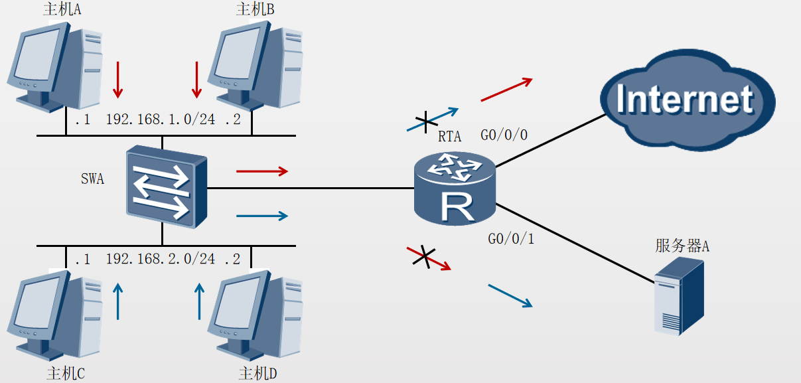
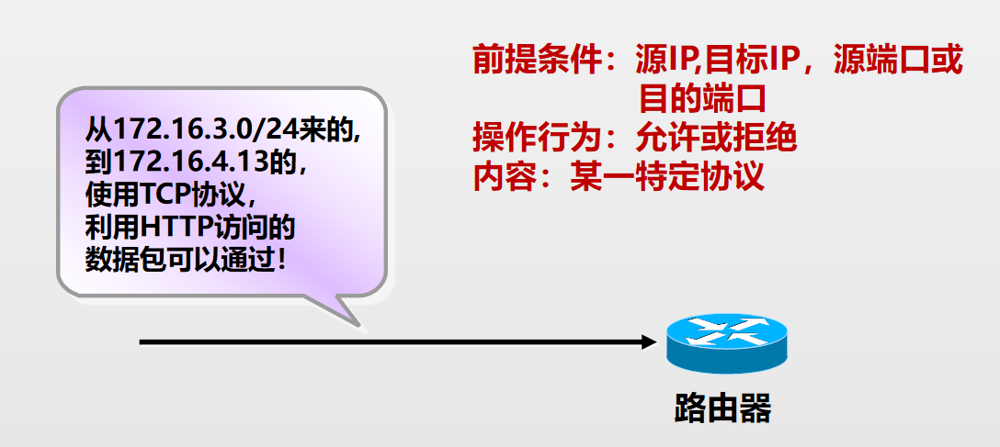
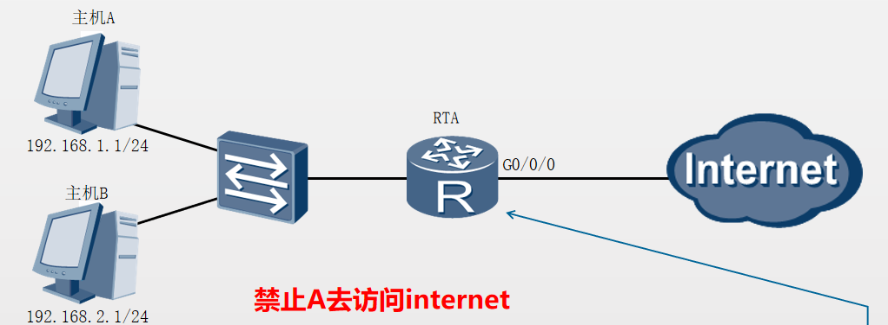

访问控制列表ACL（Access Control List）可以定义一系列不同的规则，设备根据这些规则对数据包进行分类，并针对不同类型的报文进行不同的处理，从而可以实现对网络访问行为的控制、限制网络流量、提高网络性能、防止网络攻击等等。

# ACL基本用途


ACL可以通过定义规则来允许或拒绝流量的通过。

# ACL分类

|     |     |     |
| --- | --- | --- |
| 分类  | 编号范围 | 匹配  |
| 基本ACL | 2000-2999 | 源ip |
| 高级ACL | 3000-3999 | ip 端口 协议 |
| 二层ACL | 4000-4999 | mac 以太网帧协议类型 |

# 基本ACL
基本访问控制列表只使用源地址进行过滤，表明是允许还是拒绝。


# 高级ACL
高级访问控制列表使用更多的信息描述数据包，表明是允许还是拒绝。
例如

# ACL规则
每个ACL可以包含多个规则，RTA根据规则来对数据流量进行过滤。
```
acl 2000
rule 5 deny source 192.168.1.0 0.0.0.255
rule 10 deny source 192.168.2.0 0.0.0.255
rule 15 deny source 172.16.0.0 0.0.0.255
默认是允许 如果匹配到不允许 拦截流量


规则一：ACL匹配顺序自上而下。

规则二：基本ACL放在离目的近的地方，高级ACL放在离源近的地方。

规则三：ACL不能过滤由路由器自己产生的数据

规则四：先创建ACL，然后应用到端口上

规则五：ACL中应把具有严格限制条件的语句放在前面。

规则六：每个端口、每个方向、每条协议只能对应一条ACL

```
# ACL配置
## 基本ACL配置
```
第一步：使用acl命令创建基本ACL
   [huawei]acl 2xxx
   [huawei-acl-basic-2xxx]rule 5 permit source x.x.x.x    x.x.x.x
第二步：使用命令把ACL应用到接口
   [huawei-GigabitEthernet0/0/0]traffic-filter 
   {inbound/outbound}  acl 2xxx 


匹配主机流量：access-list 1 permit/deny host X.X.X.X
匹配任意流量：access-list 1 permit/deny 0.0.0.0 255.255.255.255 (any)
删除ACL：no access-list access-list-number
查看ACL：show access-list
	show ip int f0/0
	
	
```

```
	
[RTA]acl 2000
[RTA-acl-basic-2000]rule deny source 192.168.1.0 0.0.0.255
[RTA]interface GigabitEthernet 0/0/0
[RTA-GigabitEthernet 0/0/0]traffic-filter outbound acl 2000

acl [ number ] 命令用来创建一个ACL，并进入ACL视图。
rule [ rule-id ] { deny | permit }  source { source-address source-wildcard | any } 命令用来增加或修改ACL的规则。deny用来指定拒绝符合条件的数据包，permit用来指定允许符合条件的数据包，source用来指定ACL规则匹配报文的源地址信息，any表示任意源地址。
traffic-filter { inbound | outbound }acl{ acl-number }命令用来在接口上配置基于ACL对报文进行过滤。

配置确认
[RTA]display acl 2000
 Basic ACL 2000, 1 rule
 Acl's step is 5
rule 5 deny source 192.168.1.0 0.0.0.255

[RTA]display  traffic-filter applied-record 
 -----------------------------------------------------------
 Interface                   Direction  AppliedRecord       
 -----------------------------------------------------------
 GigabitEthernet0/0/0        outbound   acl 2000
 -----------------------------------------------------------


```
## 高级ACL配置
### 流程
```
第一步：使用acl命令创建扩展访问控制列表
   [huawei]acl 3xxx
   [huawei-acl-adv-3xxx]rule 5 deny ip  source x.x.x.x 
  x.x.x.x  destination x.x.x.x x.x.x.x
第二步，使用命令将扩展访问控制列表应用到某接口
  [huawei-GigabitEthernet0/0/0]traffic-filter 
  {inbound/outbound}  acl 3xxx 
```
### 参数
```
list—a number between 100 and 199
protocol—ip, tcp, udp, icmp, igrp, eigrp, ospf and etc…….
	ip = any internet protocol	 (see note below)
source—ip address
source-mask—wildcard-mask of address bits that must match. 0s indicate bits that must match, 1s are "don't care".
destination—ip address
destination-mask—wildcard-mask
operator—lt, gt, eq, neq
operand—a port number or application name (i.e. “23” or “telnet”)
established-only allow established tcp session coming in (ack or rst bit must be set)
log-generates a console message when a packet matches the access-list statement

```
### 实例
```
[RTA]acl 3000
[RTA-acl-adv-3000]rule deny tcp source 192.168.1.0 0.0.0.255 destination 172.16.10.1 0.0.0.0 destination-port eq 21
[RTA-acl-adv-3000]rule deny tcp source 192.168.2.0 0.0.0.255 destination 172.16.10.2 0.0.0.0 
[RTA-acl-adv-3000]rule permit ip
[RTA-GigabitEthernet 0/0/0]traffic-filter outbound acl 3000
配置验证
[RTA]display acl 3000
Advanced ACL 3000, 3 rules
Acl's step is 5
rule 5 deny tcp source 192.168.1.0 0.0.0.255 destination 172.16.10.1 0 destination-port eq sftp 
rule 10 deny tcp source 192.168.2.0 0.0.0.255 destination 172.16.10.2 0 
rule 15 permit ip 

 [RTA]display  traffic-filter applied-record 
 -----------------------------------------------------------
 Interface                   Direction  AppliedRecord       
 -----------------------------------------------------------
 GigabitEthernet0/0/0        outbound   acl 3000
 ------
 ```
 
 ## 查看ACL
 ```
[huawei]display acl all
[huawei]display acl   number

 ```
 # 控制vty访问(用户登录)
## 流程
 使用基本访问列表语句
用 acl 命令应用访问列表
在所有vty通道上设置相同的限制条件
## 配置
```
[huawei]acl 2000----创建acl
[huawei-acl-basic-2000]rule 5 deny source  1.1.1.0 0.0.0.255
[huawei-acl-basic-2000]rule 10 permit source any
[huawei]user-interface 0 4-----在vty链路下指明方向
[huawei-ui-vty0-4]authentication-mode password
[huawei-ui-vty0-4]acl 2000 inbound

```


