# 路由原理

路由：把数据从一个子网转发到另一个子网 / 把数据从源地址按照一定路径发送到目的地址。

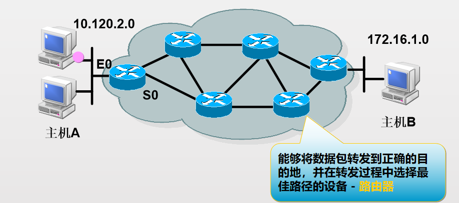

## 路由的功能

要完成不同子网间数据的转发，路由器要依靠两个功能模块：一个功能模块是路由：也就是如何建立并维持路由表，正确描述网络拓扑。一个功能模块是数据转发：也就是说路由器如何根据建立的路由表，把收到的IP包从正确的接口转发出去。

路由设备：路由器、三层交换机、防火墙。

路由器具有以下组件：CPU、主板、RAM、ROM

路由器拥有已分配了 IP 地址的网络适配器。

路由器根据路由表转发数据包。

路由器可以有以下两种类型的端口：

控制台：用于连接管理终端

网络：不同的 LAN 或 WAN 的介质端口

## 路由表

路由信息存储在路由表中

路由表是路由器转发数据的依据

查看路由表：dis ip routing-table

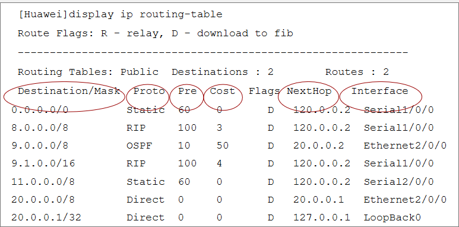

内容：路由条目获取来源+路由条目网络号+下一条or出接口

## 路由条目来源

- 直连路由

通过接口识别到的直连邻居设备

接口配置IP，该接口的物理层和数据链路层UP

- 静态路由

使用静态路由命令手工配置，是单向的

- 动态路由

通过动态路由协议学习

- RIP、OSPF、IS-IS、BGP

## 最长掩码原则（偏向 更加详细的地址）

路由表中如果有多个匹配目的网络的路由条目，则路由器会选择掩码最长的条目

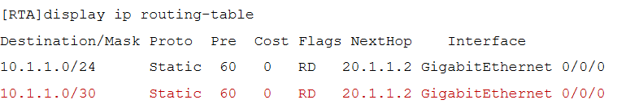

## 管理距离（优先级）

管理距离用来定义路由来源的优先级别。

取值范围：0~255的整数值。

AD值越低，表示路由来源的优先级越高。

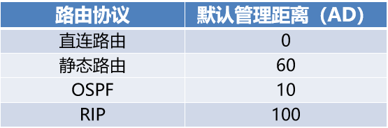

## 度量值（Metric）

度量值是指路由协议用来分配到达远程网络的路由开销的值。

对于同一种路由协议，当有多条路经通往同一目的网络时，路由协议使用度量值来确定最佳路径。

度量值越低，路径越优先。

不同路由协议计算度量值的方法不同，不具有可比性。

跳数、带宽、负载、延迟、可靠性、开销。

可以根据需要人为修改，影响路由优选

## 路由优先

到达同一个目标网络可能有多个路由源、多条路径

网络号相同、子网掩码相同

只有最佳路由才会进入路由表

路由选路原则

管理距离越小越优先

度量值越小越优先

不同路由协议的度量值不具备可比性

## 负载均衡

关于同一个目标网络的多条路由出现在路由表
在转发去往该目的地的报文时，会依次通过这些路径发送。
同一个路由源
管理距离和度量值相等
基于源或者基于源、目标IP对等因素负载均衡

## 数据转发

控制平面建立和维护路由表
数据平面查找路由表，转发数据

基于目标IP，按照最长匹配原则查找路由表，找到转发，找不到丢弃。
转发数据之前必须基于出口链路完成数据链路层封装。
路由器的行为是逐跳的，到目标网络的沿路径每个路由器都必须有关于目标的路由。

## 路由表的维护

路由条目在维持在路由表中的条件
下一跳或者本地出口可用
直连路由和静态路由通过监视接口维持路由
动态路由通过维持邻居关系维持路由条目，邻居失效，相关路由失效

## 收敛

指某一特定系统中的所有路由器对网络拓扑结构有了一致的看法

# 路由选择原理

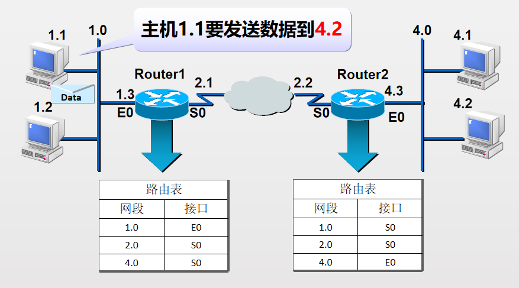
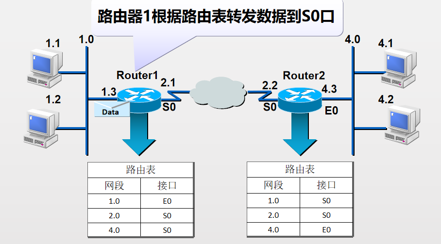
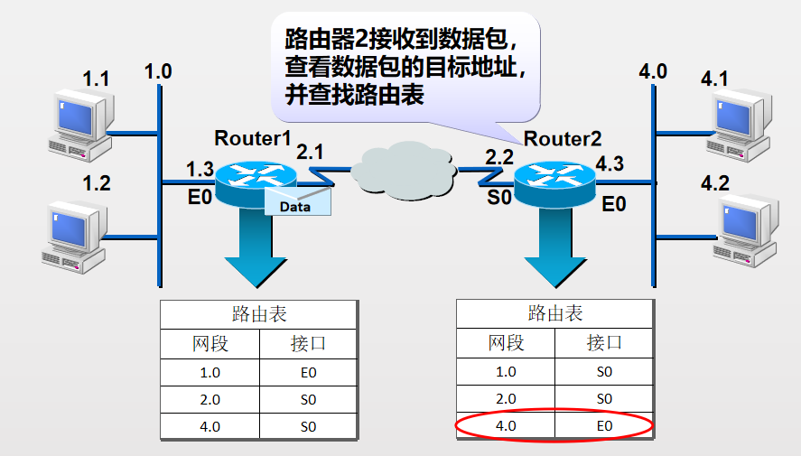
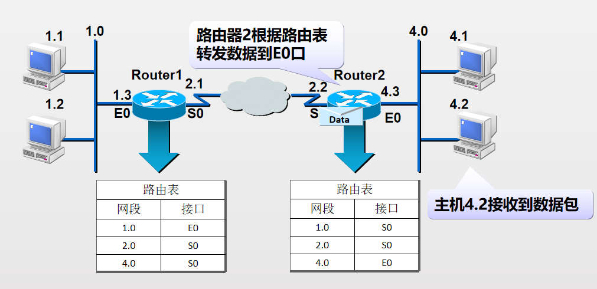

# 静态路由

## 静态路由配置

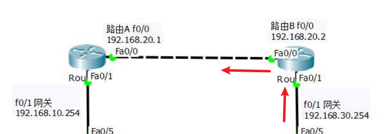
ip route 192.168.30.0 255.255.255.0 192.168.20.2

## 负载分担

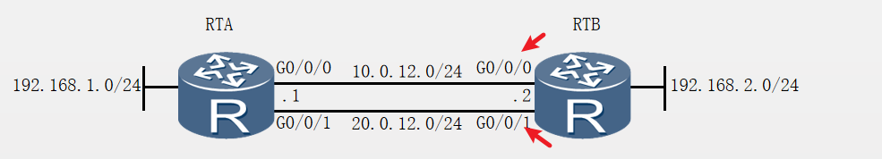
\[RTB\]ip route-static 192.168.1.0 255.255.255.0 10.0.12.1
\[RTB\]ip route-static 192.168.1.0 255.255.255.0 20.0.12.1
这些具有相同的目的网络和掩码、优先级和度量值的路由条目称为等价路由
静态路由支持到达同一目的地的等价负载分担

## 配置验证

display ip routing-table
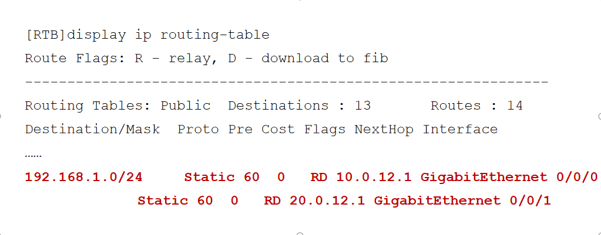

## 路由备份

浮动静态路由在网络中主路由失效的情况下，会加入到路由表并承担数据转发业务

在配置多条静态路由时，可以修改静态路由的优先级，使一条静态路由的优先级高于其他静态路由，从而实现静态路由的备份，也叫浮动静态路由
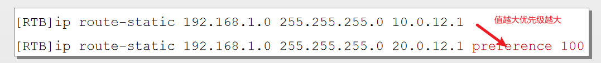
## 配置验证
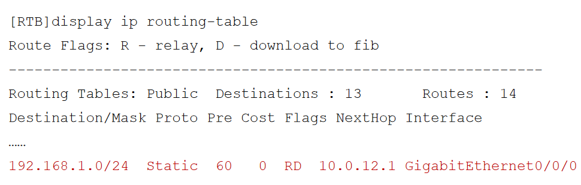
在主链路正常情况下，只有主路由会出现在路由表中。
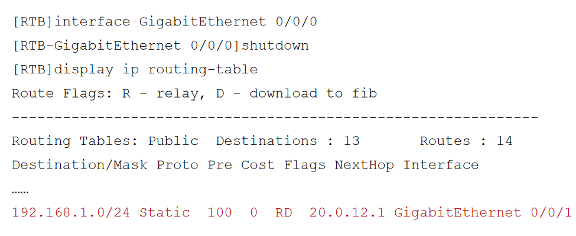
在主链路出现故障时，浮动静态路由会被激活并加入到路由表中，承担数据转发业务
## 缺省路由 
[RTA]ip route-static 0.0.0.0 0.0.0.0 10.0.12.2 
[RTA]ip route-static 0.0.0.0 0 10.0.12.2 GigabitEthernet 0/0/0 
缺省路由也叫默认路由，是目的地址和掩码都为全0的特殊路由，优先级最低。优先级60
如果报文的目的地址无法匹配路由表中的任何一项，路由器将选择依照缺省路由来转发报文。
配置验证
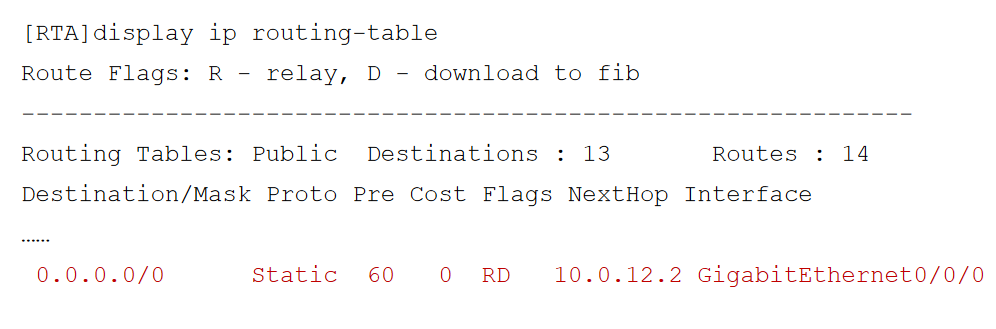
